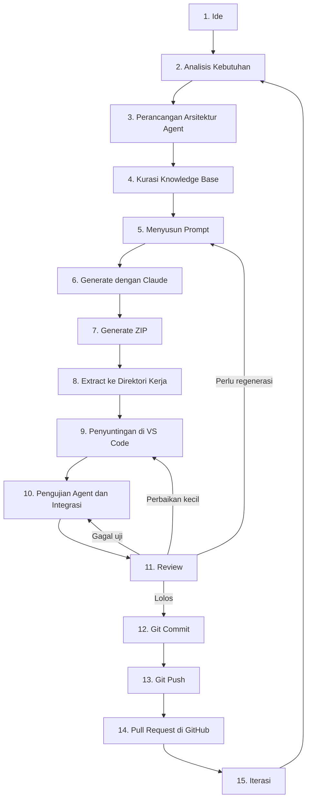
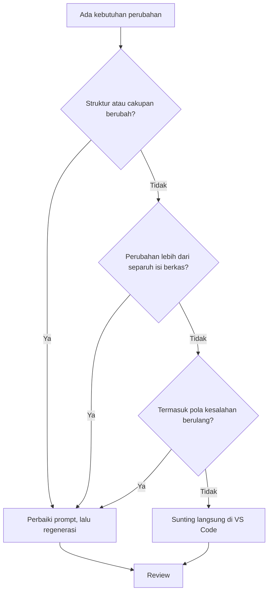
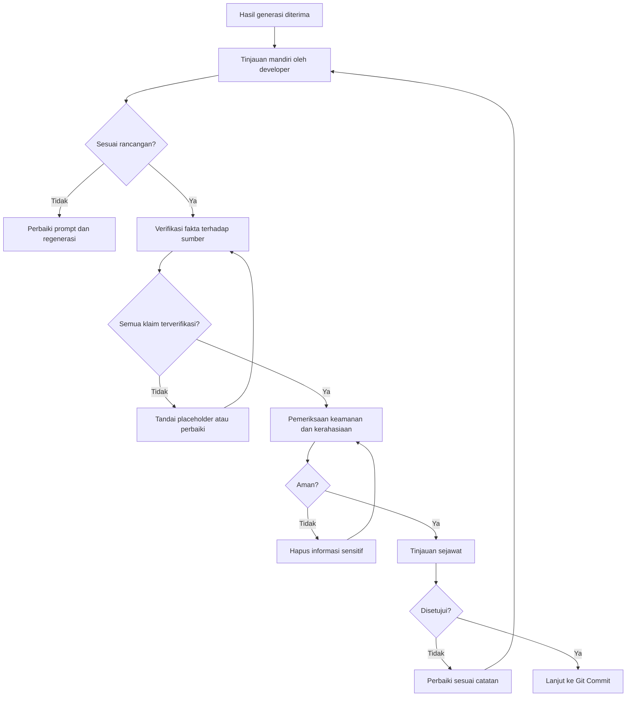

# Panduan Alur Pengembangan Project AI Multi-Agent dan Second Brain

Dokumen ini adalah panduan resmi alur pengembangan (*development workflow*) untuk project **AI Multi-Agent** dan **Second Brain** perusahaan.

| Atribut | Keterangan |
|---|---|
| Jenis dokumen | Panduan resmi alur pengembangan |
| Ruang lingkup | Project AI Multi-Agent dan Second Brain |
| Pembaca | AI Engineer, Developer, Business Excellence Center, Repository Maintainer, mahasiswa magang |
| Dokumen terkait | `development-workflow.md` (standar alur pengembangan repository) |
| Status dokumen | `[Perlu dilengkapi: status pengesahan]` |
| Versi dan tanggal berlaku | `[Perlu dilengkapi: nomor versi dan tanggal berlaku]` |
| Pemilik dokumen | `[Perlu dilengkapi: unit atau jabatan pemilik dokumen]` |

> **Catatan mengenai placeholder.** Bagian yang ditandai `[Perlu dilengkapi: ...]` adalah informasi khusus organisasi yang belum tersedia pada saat dokumen ini disusun. Bagian tersebut wajib dilengkapi oleh pemilik dokumen dan **tidak boleh diisi dengan asumsi**.

> **Catatan mengenai cakupan tahapan.** Rangkaian tahapan pada dokumen ini dikembangkan dari alur baku repository, kemudian diperluas dengan tiga tahapan khas project Multi-Agent dan Second Brain, yaitu Perancangan Arsitektur Agent, Kurasi Knowledge Base, serta Pengujian Agent dan Integrasi. Jika perusahaan telah menetapkan rangkaian tahapan resmi yang berbeda, dokumen ini menyesuaikan dengan ketetapan tersebut.

---

## Daftar Isi

1. [Tujuan Development Workflow](#1-tujuan-development-workflow)
2. [Konsep Dasar: Multi-Agent dan Second Brain](#2-konsep-dasar-multi-agent-dan-second-brain)
3. [Peta Alur Pengembangan](#3-peta-alur-pengembangan)
4. [Penjelasan Setiap Tahapan](#4-penjelasan-setiap-tahapan)
5. [Peran dan Tanggung Jawab](#5-peran-dan-tanggung-jawab)
6. [Standar Penggunaan Claude sebagai Generator Project](#6-standar-penggunaan-claude-sebagai-generator-project)
7. [Standar Penulisan Prompt](#7-standar-penulisan-prompt)
8. [Kapan Menggunakan Claude dan Kapan Mengedit di VS Code](#8-kapan-menggunakan-claude-dan-kapan-mengedit-di-vs-code)
9. [Proses Review Hasil Generate Claude](#9-proses-review-hasil-generate-claude)
10. [Standar Git Commit](#10-standar-git-commit)
11. [Standar Git Push](#11-standar-git-push)
12. [Checklist Sebelum Push ke GitHub](#12-checklist-sebelum-push-ke-github)
13. [Best Practice Pengembangan Repository](#13-best-practice-pengembangan-repository)
14. [Kesalahan Umum dan Solusinya](#14-kesalahan-umum-dan-solusinya)
15. [Glosarium](#15-glosarium)

---

## 1. Tujuan Development Workflow

Alur pengembangan ini ditetapkan untuk mencapai enam tujuan berikut.

| No | Tujuan | Penjelasan |
|---:|---|---|
| 1 | Keterlacakan | Setiap perubahan dapat ditelusuri dari ide, prompt, hasil generasi, hingga *commit* di GitHub. |
| 2 | Konsistensi mutu | Semua kontributor mengikuti standar yang sama, tanpa bergantung pada gaya kerja perorangan. |
| 3 | Kendali atas keluaran AI | Hasil generasi Claude diperlakukan sebagai draf yang wajib ditinjau, bukan hasil akhir. |
| 4 | Kejujuran informasi | Isi knowledge base dan dokumentasi berbasis sumber yang sah, bukan hasil karangan. |
| 5 | Keamanan informasi | Kredensial dan dokumen rahasia tidak pernah masuk ke repository maupun ke dalam prompt. |
| 6 | Kemudahan alih pengetahuan | Anggota baru, termasuk mahasiswa magang, dapat memahami cara kerja tim dalam waktu singkat. |

### 1.1 Manfaat bagi Setiap Kelompok Pembaca

| Kelompok pembaca | Manfaat utama |
|---|---|
| AI Engineer | Standar perancangan agent, penulisan prompt, dan pengujian antar-agent. |
| Developer | Standar penyuntingan, *commit*, *push*, dan tinjauan kode. |
| Business Excellence Center | Kepastian bahwa proses pengembangan terdokumentasi dan dapat diaudit. |
| Repository Maintainer | Dasar objektif untuk meninjau dan menyetujui *pull request*. |
| Mahasiswa magang | Panduan langkah demi langkah untuk mulai berkontribusi secara aman. |

---

## 2. Konsep Dasar: Multi-Agent dan Second Brain

Bagian ini menjelaskan dua konsep utama yang menjadi objek pengembangan. Penjelasan ditujukan bagi pembaca yang belum memiliki latar belakang teknis mendalam.

### 2.1 AI Multi-Agent

**AI Multi-Agent** adalah sistem yang terdiri atas beberapa agent AI, yang masing-masing memiliki peran dan batas kewenangan berbeda, serta bekerja sama untuk menyelesaikan tugas yang lebih besar.

Sebagai ilustrasi, satu agent bertugas mencari informasi pada dokumen, agent kedua menyusun ringkasan, dan agent ketiga memeriksa mutu hasil. Pembagian peran tersebut membuat setiap agent lebih mudah diuji dan diperbaiki dibandingkan satu agent tunggal yang menangani semua pekerjaan.

**Implikasi terhadap alur pengembangan:** perancangan arsitektur agent menjadi tahapan tersendiri, dan pengujian tidak berhenti pada masing-masing agent, tetapi juga mencakup interaksi antar-agent.

### 2.2 Second Brain

**Second Brain** adalah kumpulan pengetahuan organisasi yang tertata sedemikian rupa sehingga dapat dicari, dirujuk, dan digunakan kembali, baik oleh manusia maupun oleh agent AI.

**Implikasi terhadap alur pengembangan:** mutu keluaran sistem sangat bergantung pada mutu knowledge base. Oleh sebab itu, kurasi dokumen ditetapkan sebagai tahapan wajib, bukan pekerjaan sampingan.

> **Peringatan.** Dokumen yang kedaluwarsa, berstatus draf, atau tidak berwenang dipublikasikan tidak boleh dimasukkan ke dalam knowledge base. Kesalahan pada tahap kurasi akan menurunkan mutu semua sistem.

---

## 3. Peta Alur Pengembangan

### 3.1 Alur Utama



### 3.2 Alur Pengambilan Keputusan Claude atau VS Code



### 3.3 Sifat Alur

Alur bersifat **iteratif**, bukan sekali jalan. Tahap Review memiliki empat kemungkinan keluaran: lolos ke tahap *commit*, kembali ke penyuntingan untuk perbaikan kecil, kembali ke pengujian jika ada kegagalan uji, atau kembali ke penyusunan prompt jika hasil menyimpang secara mendasar.

---

## 4. Penjelasan Setiap Tahapan

### 4.1 Ringkasan Tahapan

| No | Tahapan | Tujuan | Keluaran |
|---:|---|---|---|
| 1 | Ide | Menangkap gagasan agent atau perbaikan | Catatan ide atau *issue* |
| 2 | Analisis Kebutuhan | Memastikan kebutuhan nyata dan terukur | Daftar kebutuhan dan kriteria keberhasilan |
| 3 | Perancangan Arsitektur Agent | Menetapkan peran, batas, dan interaksi antar-agent | Rancangan arsitektur |
| 4 | Kurasi Knowledge Base | Menyiapkan sumber pengetahuan yang sah | Daftar dokumen terkurasi |
| 5 | Menyusun Prompt | Menerjemahkan rancangan menjadi instruksi | Prompt final tersimpan |
| 6 | Generate dengan Claude | Menghasilkan draf project | Draf agent atau skill |
| 7 | Generate ZIP | Mengemas hasil secara utuh | Berkas ZIP |
| 8 | Extract | Menempatkan hasil ke direktori kerja | Folder project lokal |
| 9 | Penyuntingan di VS Code | Menyesuaikan hasil dengan standar repository | Berkas tersunting |
| 10 | Pengujian Agent dan Integrasi | Memastikan agent berperilaku sesuai rancangan | Laporan hasil uji |
| 11 | Review | Memastikan kelayakan sebelum masuk riwayat | Keputusan tinjauan |
| 12 | Git Commit | Merekam perubahan secara bermakna | *Commit* lokal |
| 13 | Git Push | Mengirim perubahan ke *remote* | Perubahan pada *branch* |
| 14 | Pull Request | Meminta tinjauan dan penggabungan | *Pull request* |
| 15 | Iterasi | Menindaklanjuti masukan | Kebutuhan siklus berikutnya |

### 4.2 Tahap 1 — Ide

**Tujuan.** Mencatat gagasan agent baru, penambahan kemampuan, atau perbaikan sebelum gagasan tersebut hilang.

**Kegiatan pokok:**
1. Merumuskan masalah yang hendak diselesaikan dalam satu hingga dua kalimat.
2. Menetapkan siapa pengguna yang akan memperoleh manfaat.
3. Memeriksa apakah sudah ada agent atau skill serupa di dalam repository.
4. Mencatat ide pada kanal pelacakan yang berlaku.

`[Perlu dilengkapi: kanal resmi pencatatan ide, misalnya GitHub Issues atau papan kerja tim]`

### 4.3 Tahap 2 — Analisis Kebutuhan

**Tujuan.** Memastikan gagasan benar-benar dibutuhkan, memiliki batas yang jelas, dan dapat diuji.

**Kegiatan pokok:**
1. Menetapkan tujuan, target pengguna, dan tingkat pengetahuan pengguna.
2. Mengidentifikasi sumber pengetahuan yang tersedia dan yang belum tersedia.
3. Menetapkan kriteria keberhasilan yang dapat diuji secara objektif.
4. Menandai informasi yang belum tersedia sebagai placeholder.

> **Tips.** Kriteria keberhasilan sebaiknya dirumuskan dalam bentuk pertanyaan uji yang konkret, misalnya "agent menjawab pertanyaan yang jawabannya tidak tersedia dengan mengakui keterbatasan, bukan dengan mengarang".

### 4.4 Tahap 3 — Perancangan Arsitektur Agent

**Tujuan.** Menetapkan pembagian peran antar-agent sebelum satu baris instruksi pun ditulis.

**Kegiatan pokok:**
1. Menetapkan jumlah agent dan peran masing-masing.
2. Menetapkan batas kewenangan setiap agent, termasuk hal yang tidak boleh dilakukan.
3. Menetapkan pola interaksi dan alur penyerahan pekerjaan antar-agent.
4. Menetapkan agent mana yang berwenang mengakses knowledge base tertentu.
5. Menetapkan struktur folder project.

**Prinsip perancangan:**

| Prinsip | Penjelasan |
|---|---|
| Peran tunggal | Setiap agent memiliki satu tanggung jawab utama yang jelas. |
| Batas eksplisit | Kewenangan dan larangan dinyatakan secara tertulis. |
| Antarmuka sederhana | Pertukaran informasi antar-agent dijaga sesederhana mungkin. |
| Dapat diuji sendiri | Setiap agent dapat diuji tanpa bergantung pada agent lain. |

### 4.5 Tahap 4 — Kurasi Knowledge Base

**Tujuan.** Menyiapkan sumber pengetahuan yang sah, mutakhir, dan berwenang digunakan.

**Kegiatan pokok:**
1. Mengumpulkan dokumen yang relevan dengan kebutuhan.
2. Memverifikasi versi, status, dan masa berlaku setiap dokumen.
3. Memastikan kewenangan penggunaan dokumen sesuai klasifikasi kerahasiaan.
4. Mencatat perbedaan jika ada dokumen yang saling bertentangan, tanpa menentukan sendiri dokumen mana yang benar.
5. Menyusun penamaan berkas yang konsisten dan mudah dikenali.

**Kriteria kelayakan dokumen:**

- [ ] Dokumen adalah versi terbaru.
- [ ] Status dokumen jelas, diutamakan yang telah disahkan.
- [ ] Kewenangan penggunaan telah dipastikan.
- [ ] Penamaan berkas jelas dan konsisten.
- [ ] Dokumen kedaluwarsa telah dikeluarkan dari kumpulan.

`[Perlu dilengkapi: kebijakan klasifikasi kerahasiaan dokumen dan pihak yang berwenang memberikan persetujuan penggunaan]`

### 4.6 Tahap 5 — Menyusun Prompt

**Tujuan.** Menerjemahkan rancangan menjadi instruksi yang menghasilkan keluaran konsisten.

Standar rinci diuraikan pada [Bagian 7](#7-standar-penulisan-prompt).

### 4.7 Tahap 6 — Generate dengan Claude

**Tujuan.** Menghasilkan draf project berdasarkan prompt yang telah disusun.

**Kegiatan pokok:**
1. Menjalankan prompt final.
2. Memeriksa kesesuaian keluaran terhadap rancangan, bukan sekadar kerapian tampilan.
3. Meminta perbaikan atas bagian yang menyimpang sebelum melanjutkan.

Standar rinci diuraikan pada [Bagian 6](#6-standar-penggunaan-claude-sebagai-generator-project).

### 4.8 Tahap 7 — Generate ZIP

**Tujuan.** Mengemas hasil agar dapat dipindahkan ke lingkungan kerja lokal secara utuh.

**Kegiatan pokok:**
1. Memastikan struktur di dalam ZIP telah benar.
2. Memastikan berkas instruksi utama berada pada akar folder project.
3. Memastikan tidak ada berkas sementara atau berkas rahasia yang ikut terkemas.

### 4.9 Tahap 8 — Extract ke Direktori Kerja

**Tujuan.** Menempatkan hasil generasi pada lokasi kerja yang benar.

**Kegiatan pokok:**
1. Mengekstrak berkas ke direktori kerja repository.
2. Memeriksa kelengkapan berkas setelah ekstraksi.
3. Memindahkan atau menghapus berkas ZIP agar tidak ikut terlacak oleh Git.

### 4.10 Tahap 9 — Penyuntingan di VS Code

**Tujuan.** Menyesuaikan hasil generasi dengan standar repository.

**Kegiatan pokok:**
1. Menyesuaikan penamaan, indentasi, dan format berkas.
2. Melengkapi placeholder jika sumber informasinya telah tersedia.
3. Menyelaraskan istilah dengan berkas lain di dalam repository.

Ketentuan mengenai batas penyuntingan manual diuraikan pada [Bagian 8](#8-kapan-menggunakan-claude-dan-kapan-mengedit-di-vs-code).

### 4.11 Tahap 10 — Pengujian Agent dan Integrasi

**Tujuan.** Memastikan setiap agent berperilaku sesuai rancangan, baik secara mandiri maupun saat bekerja sama.

**Jenis pengujian:**

| Jenis pengujian | Sasaran | Contoh sasaran uji |
|---|---|---|
| Uji fungsi per agent | Perilaku satu agent | Ketepatan jawaban faktual |
| Uji batas kewenangan | Kepatuhan pada larangan | Agent menolak permintaan di luar cakupan |
| Uji kejujuran | Penanganan informasi kosong | Agent mengakui informasi tidak tersedia |
| Uji integrasi | Interaksi antar-agent | Penyerahan pekerjaan berjalan sesuai rancangan |
| Uji ketahanan | Premis keliru dan pertanyaan ambigu | Agent meminta klarifikasi, bukan berasumsi |

**Kategori pertanyaan uji yang dianjurkan:**

1. Pertanyaan faktual.
2. Pertanyaan prosedural.
3. Pertanyaan ambigu.
4. Pertanyaan yang jawabannya tidak tersedia.
5. Pertanyaan di luar cakupan.
6. Pertanyaan yang mengandung asumsi keliru.

**Kriteria penilaian:** akurasi, relevansi, kejelasan, kelengkapan, penggunaan sumber, konsistensi, kejujuran, dan keamanan.

> **Peringatan.** Kegagalan pada uji kejujuran, yaitu agent mengarang jawaban, adalah temuan berkategori berat. Perubahan tidak boleh dilanjutkan ke tahap *commit* sebelum temuan tersebut diperbaiki.

### 4.12 Tahap 11 — Review

**Tujuan.** Memastikan hasil layak dimasukkan ke dalam riwayat repository.

Standar rinci diuraikan pada [Bagian 9](#9-proses-review-hasil-generate-claude).

### 4.13 Tahap 12 sampai 14 — Git Commit, Git Push, dan Pull Request

**Tujuan.** Merekam, mengirim, dan meminta tinjauan atas perubahan.

Standar rinci diuraikan pada [Bagian 10](#10-standar-git-commit), [Bagian 11](#11-standar-git-push), dan [Bagian 12](#12-checklist-sebelum-push-ke-github).

### 4.14 Tahap 15 — Iterasi

**Tujuan.** Menindaklanjuti masukan dan hasil pengujian untuk siklus berikutnya.

**Kegiatan pokok:**
1. Mengumpulkan masukan dari peninjau dan pengguna.
2. Mencatat temuan sebagai kebutuhan baru.
3. Memperbarui dokumentasi jika perilaku agent berubah.
4. Memperbaiki prompt agar iterasi berikutnya menghasilkan keluaran yang lebih baik.

---

## 5. Peran dan Tanggung Jawab

### 5.1 Tanggung Jawab Umum Developer

Developer adalah **penanggung jawab akhir** atas semua perubahan yang dikirimkan, termasuk bagian yang dihasilkan oleh Claude. Penggunaan alat bantu AI tidak mengurangi tanggung jawab tersebut.

### 5.2 Matriks Tanggung Jawab per Tahapan

| Tahapan | AI Engineer | Developer | Repository Maintainer | Mahasiswa Magang |
|---|---|---|---|---|
| Ide | Mengusulkan | Mengusulkan | Menampung | Mengusulkan |
| Analisis Kebutuhan | Memimpin | Mendukung | Meninjau | Mengamati dan mencatat |
| Perancangan Arsitektur Agent | Memimpin | Mendukung | Meninjau | Mengamati |
| Kurasi Knowledge Base | Mendukung | Menjalankan | Memverifikasi kewenangan | Mendukung dengan pendampingan |
| Menyusun Prompt | Memimpin | Menjalankan | — | Menyusun draf dengan pendampingan |
| Generate dan Extract | Menjalankan | Menjalankan | — | Menjalankan dengan pendampingan |
| Penyuntingan di VS Code | Menjalankan | Memimpin | — | Menjalankan perubahan kecil |
| Pengujian Agent | Memimpin | Menjalankan | Meninjau hasil | Menjalankan uji dasar |
| Review | Menjalankan | Menjalankan | Menyetujui | Mengusulkan perbaikan |
| Commit dan Push | Menjalankan | Menjalankan | — | Menjalankan pada *branch* kerja |
| Pull Request | Mengajukan | Mengajukan | Menyetujui atau menolak | Mengajukan dengan pendampingan |
| Iterasi | Memimpin | Menjalankan | Memantau | Mendukung |

### 5.3 Ketentuan Khusus bagi Mahasiswa Magang

1. Semua kontribusi dilakukan pada *branch* kerja, tidak pernah langsung pada *branch* utama.
2. Setiap *pull request* memerlukan pendampingan dan persetujuan dari pembimbing.
3. Akses terhadap dokumen internal mengikuti kewenangan yang diberikan secara resmi.
4. Pertanyaan mengenai keabsahan atau kerahasiaan dokumen wajib disampaikan kepada pembimbing sebelum dokumen digunakan.

`[Perlu dilengkapi: nama peran pembimbing magang dan mekanisme pemberian akses]`

### 5.4 Peran Business Excellence Center

Business Excellence Center berkepentingan memastikan proses pengembangan selaras dengan standar proses bisnis perusahaan dan dapat diaudit. Keterlibatannya berfokus pada kesesuaian proses dan dokumentasi, bukan pada keputusan teknis harian.

`[Perlu dilengkapi: bentuk keterlibatan resmi Business Excellence Center dalam alur persetujuan]`

---

## 6. Standar Penggunaan Claude sebagai Generator Project

### 6.1 Kedudukan Claude

Claude berkedudukan sebagai **generator draf**. Claude tidak berkedudukan sebagai pengambil keputusan teknis, penentu kebijakan, maupun pemilik mutu akhir.

### 6.2 Ketentuan Penggunaan

| No | Ketentuan |
|---:|---|
| 1 | Semua keluaran diperlakukan sebagai draf yang wajib dibaca secara menyeluruh. |
| 2 | Klaim faktual yang bersumber dari dokumen wajib diverifikasi terhadap dokumen aslinya. |
| 3 | Informasi yang tidak dapat diverifikasi ditandai sebagai placeholder. |
| 4 | Kredensial, token, dan kunci akses dilarang dimasukkan ke dalam prompt. |
| 5 | Dokumen rahasia hanya digunakan sesuai kewenangan yang sah. |
| 6 | Prompt final disimpan agar hasil dapat direproduksi dan ditelusuri. |
| 7 | Keluaran yang menyimpang dari rancangan diperbaiki melalui perbaikan prompt, bukan melalui penyuntingan manual berskala besar. |

### 6.3 Batas Penggunaan

Claude **tidak digunakan** untuk:

1. Menetapkan kebijakan perusahaan atau keputusan manajemen.
2. Menghasilkan angka, tanggal, nama dokumen, atau nama pejabat yang tidak bersumber.
3. Memberikan persetujuan atas nama unit atau pimpinan mana pun.
4. Menyelesaikan pertentangan antar-dokumen secara sepihak.

---

## 7. Standar Penulisan Prompt

### 7.1 Struktur Prompt yang Dianjurkan

Prompt yang baik memuat tujuh unsur berikut.

| Unsur | Isi | Contoh rumusan |
|---|---|---|
| Konteks | Latar belakang dan lingkup pekerjaan | "Repository berisi kumpulan agent untuk kebutuhan internal." |
| Peran | Kedudukan yang diminta | "Bertindaklah sebagai penyusun dokumentasi teknis." |
| Tugas | Pekerjaan yang diminta | "Susun instruksi agent peninjau dokumen." |
| Sumber | Dokumen yang boleh dirujuk | "Gunakan hanya dokumen yang dilampirkan." |
| Batasan | Larangan yang mengikat | "Jangan mengarang nomor dokumen dan nama pejabat." |
| Format keluaran | Struktur hasil yang diharapkan | "Hasilkan satu berkas Markdown dengan enam bagian." |
| Kriteria mutu | Tolok ukur keberhasilan | "Setiap klaim faktual disertai nama dokumen sumber." |

### 7.2 Prinsip Penulisan Prompt

1. **Spesifik lebih baik daripada panjang.** Instruksi yang tegas lebih bermanfaat daripada uraian yang bertele-tele.
2. **Nyatakan larangan secara eksplisit.** Hal yang tidak boleh dilakukan perlu disebutkan, tidak cukup diasumsikan.
3. **Tetapkan format keluaran.** Struktur hasil disebutkan secara rinci agar tidak perlu dirapikan berulang kali.
4. **Sertakan kriteria mutu.** Prompt yang memuat tolok ukur memudahkan penilaian pada tahap Review.
5. **Gunakan istilah yang konsisten** dengan istilah pada repository.
6. **Perbaiki prompt secara bertahap.** Setiap temuan pada tahap Review menjadi bahan perbaikan prompt.

### 7.3 Contoh Prompt

**Contoh yang dianjurkan:**

```text
Konteks: Repository internal berisi kumpulan agent AI untuk kebutuhan dokumentasi.
Peran: Bertindaklah sebagai penyusun instruksi agent.
Tugas: Susun instruksi untuk agent yang bertugas meringkas dokumen proses.
Sumber: Gunakan hanya dokumen yang saya lampirkan sebagai dasar fakta.
Batasan:
- Jangan mengarang nomor dokumen, tanggal, nama orang, atau kebijakan.
- Tandai informasi yang belum tersedia dengan [Perlu dilengkapi: ...].
Format keluaran: Satu berkas Markdown dengan bagian Identitas, Cakupan,
Langkah Kerja, Batasan, dan Contoh.
Kriteria mutu: Setiap klaim faktual menyebutkan nama dokumen sumber.
```

**Contoh yang harus dihindari:**

```text
Tolong buatkan agent yang bagus untuk dokumentasi perusahaan.
```

Prompt tersebut tidak memuat konteks, sumber, batasan, format keluaran, maupun kriteria mutu, sehingga hasilnya tidak dapat diprediksi dan tidak dapat direproduksi.

### 7.4 Penyimpanan Prompt

Prompt final disimpan bersama project agar dapat ditelusuri dan digunakan kembali.

`[Perlu dilengkapi: lokasi baku penyimpanan prompt di dalam repository, misalnya direktori khusus prompt]`

---

## 8. Kapan Menggunakan Claude dan Kapan Mengedit di VS Code

### 8.1 Gunakan Claude untuk Regenerasi

- Struktur project secara keseluruhan tidak sesuai rancangan.
- Cakupan agent berubah secara mendasar.
- Sebagian besar isi perlu ditulis ulang.
- Ditemukan pola kesalahan yang berulang di banyak bagian.
- Diperlukan pembuatan berkas baru dalam jumlah banyak dengan pola serupa.

### 8.2 Cukup Sunting Langsung di VS Code

- Perbaikan ejaan, tanda baca, dan tata bahasa.
- Penyesuaian format, indentasi, dan penamaan berkas.
- Perubahan kecil pada satu atau dua bagian yang isinya sudah benar.
- Pelengkapan placeholder ketika sumber informasinya telah tersedia.
- Penyelarasan istilah dengan berkas lain.
- Perbaikan mendesak dengan cakupan sempit dan risiko rendah.

### 8.3 Ketentuan Ambang

| Perkiraan cakupan perubahan | Tindakan yang dianjurkan |
|---|---|
| Kurang dari 20 persen isi berkas | Sunting langsung di VS Code |
| 20 sampai 50 persen isi berkas | Pertimbangkan keduanya; utamakan penyuntingan bila perubahan terpusat pada satu bagian |
| Lebih dari 50 persen isi berkas | Perbaiki prompt, lalu regenerasi |

> **Tips.** Jika kesalahan yang sama ditemukan pada lebih dari satu berkas, hal tersebut menandakan kelemahan pada prompt. Perbaikan sebaiknya dilakukan pada prompt agar tidak berulang pada iterasi berikutnya.

---

## 9. Proses Review Hasil Generate Claude

### 9.1 Alur Review



### 9.2 Tahapan Review

**Tahap pertama: tinjauan mandiri.** Developer membaca semua keluaran dan memeriksa kesesuaiannya terhadap rancangan serta kriteria keberhasilan.

**Tahap kedua: verifikasi fakta.** Setiap klaim faktual dicocokkan dengan dokumen sumber. Klaim yang tidak dapat diverifikasi ditandai sebagai placeholder atau dihapus.

**Tahap ketiga: pemeriksaan keamanan.** Berkas diperiksa untuk memastikan tidak memuat kredensial, data pribadi, atau dokumen rahasia.

**Tahap keempat: tinjauan sejawat.** Anggota tim lain meninjau perubahan melalui *pull request*.

### 9.3 Daftar Periksa Review

| Aspek | Pertanyaan kunci |
|---|---|
| Kesesuaian | Apakah hasil menjawab kebutuhan pada tahap analisis? |
| Struktur | Apakah struktur berkas sesuai rancangan arsitektur? |
| Kejujuran isi | Apakah ada informasi yang dikarang atau tidak bersumber? |
| Penggunaan sumber | Apakah klaim faktual menyebutkan dokumen sumbernya? |
| Konsistensi | Apakah istilah, gaya bahasa, dan penomoran konsisten? |
| Hasil pengujian | Apakah semua kategori uji telah dijalankan dan lolos? |
| Keamanan | Apakah bebas kredensial, data pribadi, dan dokumen rahasia? |
| Keterbacaan | Apakah dapat dipahami anggota tim lain tanpa penjelasan tambahan? |

### 9.4 Kategori Temuan

| Kategori | Contoh temuan | Tindakan |
|---|---|---|
| Berat | Informasi dikarang, kredensial tersisip, agent melanggar batas kewenangan | Wajib diperbaiki sebelum *commit* |
| Sedang | Struktur menyimpang, klaim tidak bersumber, uji integrasi gagal | Diperbaiki pada iterasi berjalan |
| Ringan | Kesalahan ejaan, format tidak konsisten | Dapat diperbaiki langsung saat penyuntingan |

---

## 10. Standar Git Commit

### 10.1 Prinsip

1. Satu *commit* mewakili satu perubahan logis yang utuh.
2. Perubahan yang tidak berkaitan dipisahkan ke dalam *commit* berbeda.
3. *Commit* dibuat setelah tahap Review, bukan sebelumnya.
4. Berkas yang tidak perlu dilacak tidak dimasukkan ke dalam *commit*.

### 10.2 Format Pesan Commit

```
<tipe>(<cakupan>): <ringkasan perubahan>

<penjelasan opsional mengenai alasan perubahan>
```

| Unsur | Ketentuan |
|---|---|
| Tipe | Diisi salah satu tipe pada tabel 10.3 |
| Cakupan | Nama agent atau area yang diubah, ditulis huruf kecil |
| Ringkasan | Maksimal 72 karakter, kalimat perintah, tanpa titik di akhir |
| Penjelasan | Menjelaskan alasan perubahan, bukan mengulang daftar berkas |

### 10.3 Tipe Commit

| Tipe | Penggunaan |
|---|---|
| `feat` | Menambah agent atau kemampuan baru |
| `fix` | Memperbaiki kesalahan pada agent yang sudah ada |
| `docs` | Menambah atau memperbarui dokumentasi |
| `refactor` | Merapikan struktur tanpa mengubah perilaku |
| `style` | Perubahan format yang tidak mengubah isi |
| `chore` | Pekerjaan penunjang, misalnya pembaruan konfigurasi |
| `test` | Menambah atau memperbarui pengujian agent |
| `knowledge` | Menambah atau memperbarui isi knowledge base |

### 10.4 Contoh Pesan Commit

Contoh yang dianjurkan:

```
feat(agent-reviewer): tambah agent peninjau mutu dokumen

Agent bertugas memeriksa kelengkapan sumber pada dokumen hasil
generasi sebelum masuk tahap commit.
```

```
knowledge(second-brain): perbarui dokumen proses versi terbaru
```

```
fix(agent-summarizer): perbaiki penanganan pertanyaan di luar cakupan
```

Contoh yang harus dihindari:

| Pesan | Alasan tidak sesuai |
|---|---|
| `update` | Tidak menjelaskan apa pun |
| `fix bug` | Tidak menyebutkan bagian yang diperbaiki |
| `hasil generate claude` | Menjelaskan asal berkas, bukan isi perubahan |
| `perubahan banyak` | Menandakan *commit* yang seharusnya dipecah |

---

## 11. Standar Git Push

### 11.1 Ketentuan

1. *Push* dilakukan hanya setelah semua butir pada [Bagian 12](#12-checklist-sebelum-push-ke-github) terpenuhi.
2. *Push* dilakukan ke *branch* kerja, tidak langsung ke *branch* utama.
3. Riwayat yang telah dibagikan ke *remote* tidak ditulis ulang secara paksa.
4. Konflik diselesaikan secara lokal, lalu diverifikasi hasilnya sebelum dikirim ulang.

### 11.2 Penamaan Branch

| Jenis pekerjaan | Pola penamaan | Contoh |
|---|---|---|
| Agent atau fitur baru | `feat/<nama-agent>` | `feat/agent-reviewer` |
| Perbaikan | `fix/<ringkas-masalah>` | `fix/batas-kewenangan` |
| Dokumentasi | `docs/<topik>` | `docs/development-workflow` |
| Knowledge base | `knowledge/<topik>` | `knowledge/proses-internal` |

`[Perlu dilengkapi: nama branch utama yang berlaku serta kebijakan branch protection dan jumlah persetujuan yang diperlukan]`

### 11.3 Urutan Perintah yang Dianjurkan

```bash
git status                 # periksa berkas yang berubah
git diff                   # tinjau isi perubahan
git add <berkas>           # tambahkan berkas secara selektif
git commit -m "docs(workflow): tambah standar penulisan prompt"
git pull --rebase          # selaraskan dengan remote
git push origin <branch>   # kirim ke remote
```

Penambahan berkas dilakukan secara selektif. Penggunaan `git add .` tanpa pemeriksaan sebelumnya tidak dianjurkan karena berisiko menyertakan berkas yang tidak dikehendaki.

---

## 12. Checklist Sebelum Push ke GitHub

Semua butir berikut wajib terpenuhi sebelum perubahan dikirim ke *remote*.

**Kelengkapan dan mutu isi**

- [ ] Perubahan menjawab kebutuhan yang ditetapkan pada tahap Analisis Kebutuhan.
- [ ] Semua berkas hasil generasi telah dibaca dan ditinjau.
- [ ] Tidak ada informasi yang dikarang, termasuk nomor dokumen, tanggal, nama, jabatan, dan kebijakan.
- [ ] Klaim faktual telah diverifikasi terhadap dokumen sumber.
- [ ] Informasi yang belum tersedia ditandai dengan placeholder yang jelas.
- [ ] Istilah, gaya bahasa, dan penomoran konsisten dengan berkas lain.

**Arsitektur dan pengujian**

- [ ] Struktur project sesuai rancangan arsitektur agent.
- [ ] Batas kewenangan setiap agent tertulis secara eksplisit.
- [ ] Semua kategori pertanyaan uji telah dijalankan.
- [ ] Agent mengakui keterbatasan ketika informasi tidak tersedia.
- [ ] Uji integrasi antar-agent telah dijalankan dan hasilnya sesuai rancangan.
- [ ] Tidak ada temuan berkategori berat yang belum diperbaiki.

**Knowledge base**

- [ ] Dokumen yang ditambahkan adalah versi terbaru dan berstatus jelas.
- [ ] Kewenangan penggunaan dokumen telah dipastikan.
- [ ] Perbedaan antar-dokumen dijelaskan tanpa menentukan sendiri mana yang benar.

**Keamanan**

- [ ] Tidak ada kredensial, token, kunci akses, atau kata sandi.
- [ ] Tidak ada data pribadi maupun dokumen rahasia yang tidak berwenang dipublikasikan.
- [ ] Berkas sementara, berkas ZIP, dan direktori kerja lokal tidak ikut dilacak.

**Git**

- [ ] `git status` telah diperiksa dan hanya berkas yang dikehendaki yang masuk.
- [ ] `git diff` telah ditinjau untuk memastikan tidak ada perubahan yang tidak disengaja.
- [ ] Pesan *commit* mengikuti format pada [Bagian 10](#10-standar-git-commit).
- [ ] *Commit* telah dipecah secara logis jika mencakup lebih dari satu perubahan.
- [ ] *Branch* tujuan sudah benar.
- [ ] Prompt final telah disimpan bersama perubahan.

---

## 13. Best Practice Pengembangan Repository

| Praktik | Alasan |
|---|---|
| Rancang arsitektur sebelum menyusun prompt | Rancangan yang jelas menghasilkan keluaran yang jauh lebih akurat. |
| Tetapkan batas kewenangan agent secara tertulis | Batas yang eksplisit mencegah agent bertindak di luar cakupan. |
| Kurasi knowledge base sebelum menambah kemampuan | Mutu keluaran mengikuti mutu sumber pengetahuan. |
| Simpan prompt final bersama project | Hasil dapat direproduksi dan prompt dapat diperbaiki bertahap. |
| Lakukan *commit* kecil dan sering | Memudahkan penelusuran dan pengembalian perubahan. |
| Tinjau `git diff` sebelum *commit* | Mencegah berkas dan perubahan yang tidak disengaja ikut terkirim. |
| Perbaiki prompt, bukan hanya keluarannya | Perbaikan pada prompt bermanfaat bagi semua iterasi berikutnya. |
| Uji agent sebelum dipublikasikan | Memastikan agent benar-benar berperilaku sesuai rancangan. |
| Jalankan uji kejujuran pada setiap iterasi | Mencegah agent mengarang jawaban saat informasi tidak tersedia. |
| Perbarui dokumentasi pada *commit* yang sama | Dokumentasi kedaluwarsa lebih menyesatkan daripada tidak ada dokumentasi. |
| Gunakan placeholder secara konsisten | Menjaga kejujuran isi dan memudahkan pelengkapan di kemudian hari. |
| Pisahkan perubahan format dari perubahan isi | Memudahkan peninjau memahami substansi perubahan. |
| Dampingi kontributor baru pada iterasi pertama | Mempercepat pemahaman standar dan menurunkan risiko kesalahan. |

---

## 14. Kesalahan Umum dan Solusinya

### 14.1 Kesalahan pada Penggunaan AI

| Kesalahan | Dampak | Solusi |
|---|---|---|
| Melakukan *commit* atas hasil Claude tanpa ditinjau | Informasi keliru masuk ke repository | Jalankan semua tahapan Review pada Bagian 9 |
| Menganggap keluaran Claude sebagai fakta resmi | Referensi umum berubah menjadi kebijakan semu | Verifikasi setiap klaim terhadap dokumen sumber |
| Menulis prompt yang terlalu umum | Hasil tidak dapat diprediksi dan tidak dapat direproduksi | Gunakan struktur prompt pada Bagian 7 |
| Menyunting manual dalam jumlah besar | Hasil tidak konsisten dan prompt tidak pernah membaik | Perbaiki prompt, lalu regenerasi |
| Menyertakan kredensial di dalam prompt | Risiko keamanan yang serius | Gunakan mekanisme penyimpanan rahasia yang berlaku |
| Tidak menyimpan prompt final | Hasil tidak dapat direproduksi dan tidak dapat ditelusuri | Simpan prompt bersama project |

### 14.2 Kesalahan pada Arsitektur dan Knowledge Base

| Kesalahan | Dampak | Solusi |
|---|---|---|
| Satu agent menangani terlalu banyak peran | Sulit diuji dan sulit diperbaiki | Pecah menjadi beberapa agent dengan peran tunggal |
| Batas kewenangan tidak tertulis | Agent bertindak di luar cakupan | Nyatakan larangan secara eksplisit dalam instruksi |
| Memasukkan dokumen kedaluwarsa | Agent merujuk informasi yang tidak berlaku | Verifikasi versi dan status sebelum kurasi |
| Menentukan sendiri dokumen mana yang benar saat terjadi pertentangan | Keputusan tanpa dasar kewenangan | Jelaskan perbedaannya dan serahkan kepada pemilik dokumen |
| Melengkapi placeholder dengan asumsi | Informasi keliru dianggap fakta resmi | Biarkan sebagai placeholder hingga sumber tersedia |
| Melewatkan uji integrasi antar-agent | Kegagalan baru terdeteksi setelah dipakai pengguna | Jalankan uji integrasi pada setiap iterasi |

### 14.3 Kesalahan pada Praktik Git

| Kesalahan | Dampak | Solusi |
|---|---|---|
| Menggunakan `git add .` tanpa pemeriksaan | Berkas sementara atau rahasia ikut terkirim | Periksa `git status`, lalu tambahkan secara selektif |
| Menulis pesan *commit* yang tidak bermakna | Riwayat sulit ditelusuri | Gunakan format pada Bagian 10 |
| Menggabungkan banyak perubahan dalam satu *commit* | Sulit ditinjau dan sulit dikembalikan | Pecah menjadi beberapa *commit* logis |
| Melakukan *push* langsung ke *branch* utama | Perubahan belum tertinjau masuk ke jalur utama | Gunakan *branch* kerja dan *pull request* |
| Menulis ulang riwayat yang telah dibagikan | Mengganggu pekerjaan anggota tim lain | Buat *commit* perbaikan baru |
| Menunda pembaruan dokumentasi | Dokumentasi tidak mencerminkan perilaku agent | Perbarui dokumentasi pada *commit* yang sama |

---

## 15. Glosarium

| Istilah | Penjelasan |
|---|---|
| **Agent** | Asisten berbasis AI yang bekerja mengikuti instruksi dan sumber pengetahuan yang ditetapkan. |
| **AI Multi-Agent** | Sistem yang terdiri atas beberapa agent dengan peran berbeda yang bekerja sama menyelesaikan satu tugas besar. |
| **Branch** | Jalur pengembangan terpisah di dalam Git yang memungkinkan pekerjaan berjalan tanpa mengganggu jalur utama. |
| **Commit** | Rekaman satu satuan perubahan pada riwayat Git. |
| **Conventional commit** | Konvensi penulisan pesan *commit* dengan tipe dan cakupan yang baku. |
| **Iterasi** | Siklus perbaikan berulang berdasarkan masukan dan hasil pengujian. |
| **Knowledge base** | Kumpulan dokumen terkurasi yang menjadi sumber pengetahuan agent. |
| **Kurasi** | Proses memilih, memverifikasi, dan menata dokumen sebelum digunakan. |
| **Placeholder** | Penanda `[Perlu dilengkapi: ...]` untuk informasi yang belum tersedia. |
| **Prompt** | Instruksi tertulis yang diberikan kepada Claude untuk menghasilkan keluaran. |
| **Pull request** | Usulan penggabungan perubahan dari satu *branch* ke *branch* lain, disertai proses tinjauan. |
| **Push** | Pengiriman *commit* dari repository lokal ke repository *remote*. |
| **Rebase** | Penyelarasan riwayat lokal terhadap riwayat *remote*. |
| **Remote** | Repository yang tersimpan di server, dalam hal ini GitHub. |
| **Second Brain** | Kumpulan pengetahuan organisasi yang tertata agar dapat dicari, dirujuk, dan digunakan kembali. |
| **Uji integrasi** | Pengujian yang menilai interaksi antar-agent, bukan perilaku satu agent secara terpisah. |

---

**Pemeliharaan dokumen.** Dokumen ini diperbarui setiap kali terjadi perubahan pada standar alur pengembangan. Usulan perubahan diajukan melalui mekanisme yang berlaku pada repository.

`[Perlu dilengkapi: pemilik dokumen, peninjau, dan jadwal peninjauan berkala]`
