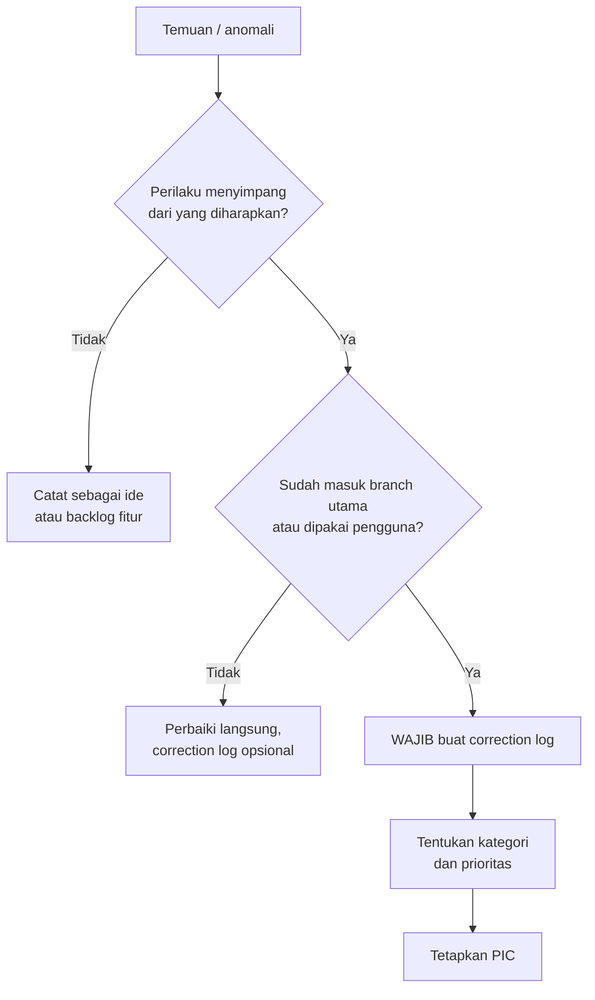
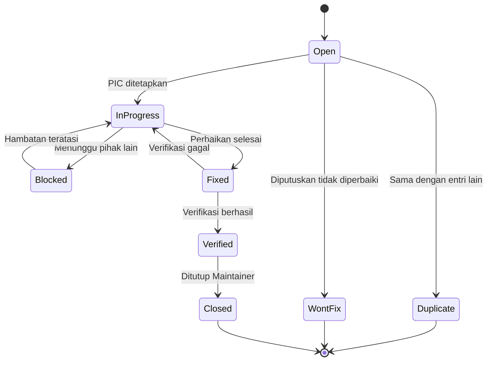
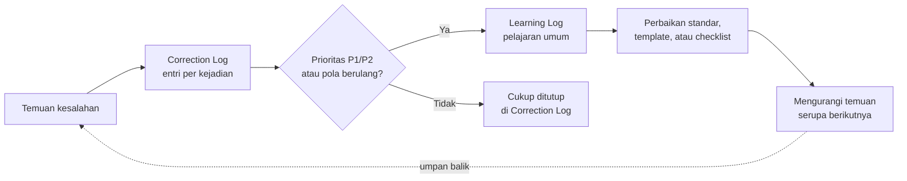

# Correction Log

**Dokumen Standar Pencatatan Koreksi Repository Agen AI**

| Atribut | Keterangan |
|---|---|
| Nama dokumen | `correction-log.md` |
| Versi | 1.0 |
| Tanggal berlaku | 21 Juli 2026 |
| Pemilik dokumen | Repository Maintainer |
| Pembaca sasaran | Developer, AI Engineer, Repository Maintainer, Business Excellence Center (BEC), mahasiswa magang |
| Status | Standar internal repository |

> [!NOTE]
> Dokumen ini adalah standar pencatatan koreksi pada tingkat repository. Dokumen ini **bukan** kebijakan resmi perusahaan dan tidak menggantikan pedoman, SOP, atau instruksi kerja yang diterbitkan oleh Business Excellence Center. Jika ada pertentangan dengan dokumen resmi BEC, dokumen resmi BEC yang berlaku.

---

## Daftar Isi

1. [Tujuan Correction Log](#1-tujuan-correction-log)
2. [Kapan Correction Log Harus Dibuat](#2-kapan-correction-log-harus-dibuat)
3. [Penanggung Jawab Pengisian](#3-penanggung-jawab-pengisian)
4. [Kategori Kesalahan](#4-kategori-kesalahan)
5. [Prioritas Masalah](#5-prioritas-masalah)
6. [Status Penyelesaian](#6-status-penyelesaian)
7. [Format Pencatatan](#7-format-pencatatan)
8. [Prosedur Pelaporan](#8-prosedur-pelaporan)
9. [Prosedur Verifikasi](#9-prosedur-verifikasi)
10. [Prosedur Penutupan Masalah](#10-prosedur-penutupan-masalah)
11. [Hubungan dengan Learning Log](#11-hubungan-dengan-learning-log)
12. [Best Practice Pencatatan](#12-best-practice-pencatatan)
13. [Kesalahan yang Harus Dihindari](#13-kesalahan-yang-harus-dihindari)
14. [Template Tabel Correction Log](#14-template-tabel-correction-log)
15. [Contoh Correction Log](#15-contoh-correction-log)
16. [Glosarium](#16-glosarium)

---

## 1. Tujuan Correction Log

Correction log adalah catatan resmi semua kesalahan, koreksi, bug, dan perbaikan yang ditemukan selama proses pengembangan Agen AI, Skill Claude, maupun dokumentasi repository.

Tujuan penyusunan correction log adalah sebagai berikut.

1. **Menyediakan jejak audit (audit trail).** Setiap perubahan yang lahir dari sebuah kesalahan dapat ditelusuri kembali: apa yang salah, mengapa terjadi, siapa yang memperbaiki, dan kapan selesai.
2. **Mencegah pengulangan kesalahan yang sama.** Kesalahan yang tercatat dapat dicari kembali sebelum tim mengambil keputusan desain yang serupa.
3. **Mempercepat proses onboarding.** Anggota tim baru dan mahasiswa magang dapat memahami titik rawan repository tanpa harus mengulang kesalahan pendahulunya.
4. **Menjadi dasar perbaikan proses.** Pola kesalahan yang berulang menjadi masukan untuk perbaikan standar, template, atau alur kerja repository.
5. **Memisahkan fakta dari ingatan.** Penyebab masalah dicatat pada saat masalah masih segar, bukan direkonstruksi berbulan-bulan kemudian.
6. **Menjadi bahan pelaporan.** Ringkasan correction log dapat digunakan sebagai bahan laporan periodik mengenai kualitas dan kestabilan repository.

> [!NOTE]
> Correction log bersifat **faktual dan tidak menyalahkan individu** (*blameless*). Fokus pencatatan adalah pada proses dan sistem yang memungkinkan kesalahan terjadi, bukan pada penilaian kinerja perorangan.

---

## 2. Kapan Correction Log Harus Dibuat

Correction log **wajib** dibuat jika ditemukan salah satu kondisi berikut.

- [ ] Agen AI menghasilkan jawaban yang salah, mengarang informasi (*halusinasi*), atau menyebut dokumen yang tidak ada.
- [ ] Skill Claude tidak terpanggil (*tidak triggered*) padahal seharusnya terpanggil, atau sebaliknya terpanggil pada konteks yang tidak relevan.
- [ ] Ada pertentangan antara isi skill, persona, dan dokumen sumber.
- [ ] Ditemukan bug pada skrip, otomatisasi, alur kerja CI, atau proses build repository.
- [ ] Dokumentasi tidak sesuai dengan perilaku sistem yang sebenarnya.
- [ ] Ada tautan rusak, nama berkas salah, atau struktur folder yang tidak konsisten.
- [ ] Keluaran agent melanggar batasan wewenang yang telah ditetapkan pada persona.
- [ ] Ditemukan potensi kebocoran informasi internal, kredensial, atau data yang bersifat rahasia.
- [ ] Terjadi regresi, yaitu fungsi yang sebelumnya berjalan menjadi tidak berjalan setelah perubahan.
- [ ] Pengguna internal melaporkan keluhan atas keluaran agent.

Correction log **tidak perlu** dibuat untuk kondisi berikut.

- Penambahan fitur baru yang direncanakan (gunakan mekanisme *issue* atau *backlog*).
- Perubahan gaya penulisan, format, atau tata letak yang tidak mengubah makna.
- Eksperimen yang belum masuk ke *branch* utama dan belum memengaruhi pengguna.
- Preferensi pribadi yang belum disepakati sebagai standar bersama.

### Diagram Alur Penentuan



---

## 3. Penanggung Jawab Pengisian

| Peran | Tanggung jawab utama |
|---|---|
| **Pelapor (Reporter)** | Membuat entri awal correction log: ID, tanggal, deskripsi masalah, dampak, dan bukti pendukung. Siapa pun boleh menjadi pelapor. |
| **PIC (Person in Charge)** | Melakukan analisis penyebab, menuliskan solusi, menjalankan perbaikan, dan memperbarui status hingga `Fixed`. |
| **AI Engineer** | Menangani masalah pada persona, prompt, *triggering* skill, kualitas jawaban, dan evaluasi agent. |
| **Developer** | Menangani masalah pada skrip, otomatisasi, integrasi, struktur berkas, dan alur kerja CI. |
| **Repository Maintainer** | Memverifikasi perbaikan, memutuskan penutupan entri, menjaga konsistensi penomoran ID, dan melakukan reviu berkala. |
| **Business Excellence Center (BEC)** | Memberikan klarifikasi atas isi dokumen proses bisnis jika kesalahan berkaitan dengan substansi dokumen resmi. BEC bukan pelaksana perbaikan teknis. |
| **Mahasiswa magang** | Boleh menjadi pelapor dan boleh ditetapkan sebagai PIC untuk masalah berprioritas `P3` atau `P4` dengan pendampingan. Tidak berwenang menutup entri. |

> [!WARNING]
> Penutupan entri (status `Closed`) hanya boleh dilakukan oleh Repository Maintainer atau pihak yang secara tertulis ditunjuk olehnya. PIC tidak boleh menutup entrinya sendiri.

---

## 4. Kategori Kesalahan

| Kode | Kategori | Cakupan | Contoh |
|---|---|---|---|
| `AGT` | Agent Behaviour | Perilaku agent yang tidak sesuai persona atau batasan wewenang | Agent memberikan persetujuan atas nama manajemen |
| `HAL` | Halusinasi / Akurasi | Informasi yang dikarang atau tidak berdasar dokumen | Agent menyebut nomor SOP yang tidak ada |
| `SKL` | Skill / Triggering | Skill tidak terpanggil, salah terpanggil, atau saling bertabrakan | Dua skill dengan deskripsi tumpang tindih |
| `PRM` | Prompt / Persona | Instruksi ambigu, kontradiktif, atau tidak lengkap pada persona | Persona melarang dan memerintahkan hal yang sama |
| `DOC` | Dokumentasi | Isi dokumentasi tidak sesuai perilaku nyata sistem | README menyebut perintah yang sudah dihapus |
| `REP` | Struktur Repository | Penamaan, struktur folder, tautan, dan konsistensi berkas | Tautan relatif rusak setelah folder dipindahkan |
| `SCR` | Skrip / Otomatisasi | Bug pada skrip, *build*, atau alur kerja CI | Skrip validasi gagal pada berkas berspasi |
| `DAT` | Data / Sumber | Dokumen sumber usang, ganda, atau berkonflik | Dua versi pedoman dengan isi berbeda |
| `SEC` | Keamanan / Kerahasiaan | Potensi kebocoran data, kredensial, atau informasi internal | Kunci API tertinggal pada berkas contoh |
| `UX` | Pengalaman Pengguna | Keluaran benar namun sulit dipahami atau tidak sesuai format | Jawaban terlalu panjang untuk pertanyaan sederhana |

---

## 5. Prioritas Masalah

| Prioritas | Nama | Kriteria | Target respons | Target penyelesaian |
|---|---|---|---|---|
| `P1` | Kritis | Agent memberi informasi yang berpotensi menyesatkan keputusan, atau ada risiko kebocoran data | Segera (≤ 2 jam kerja) | ≤ 1 hari kerja |
| `P2` | Tinggi | Fungsi utama tidak berjalan, atau kesalahan akurasi yang berulang | ≤ 1 hari kerja | ≤ 3 hari kerja |
| `P3` | Sedang | Fungsi berjalan namun ada penyimpangan yang mengganggu | ≤ 3 hari kerja | ≤ 10 hari kerja |
| `P4` | Rendah | Ketidaksempurnaan kecil, kosmetik, atau perbaikan redaksional | Terjadwal | Pada siklus perawatan berikutnya |

> [!WARNING]
> Semua temuan berkategori `SEC` (Keamanan/Kerahasiaan) ditetapkan minimal sebagai `P1` tanpa memandang besar kecilnya dampak yang terlihat. Detail teknis kebocoran **tidak boleh** dituliskan pada correction log; cukup rujuk nomor tiket internal.

---

## 6. Status Penyelesaian

| Status | Arti | Siapa yang menetapkan |
|---|---|---|
| `Open` | Masalah tercatat, belum ditindaklanjuti | Pelapor |
| `In Progress` | Sedang dianalisis atau diperbaiki | PIC |
| `Blocked` | Perbaikan tertahan menunggu pihak atau informasi lain | PIC |
| `Fixed` | Perbaikan selesai dikerjakan, menunggu verifikasi | PIC |
| `Verified` | Perbaikan telah diuji dan terbukti berhasil | Repository Maintainer |
| `Closed` | Entri ditutup secara resmi | Repository Maintainer |
| `Won't Fix` | Diputuskan tidak diperbaiki, disertai alasan tertulis | Repository Maintainer |
| `Duplicate` | Sama dengan entri lain, dirujuk ke ID asal | Repository Maintainer |

### Diagram Siklus Status



---

## 7. Format Pencatatan

### 7.1 Aturan Penomoran ID

Format ID: `CL-<KATEGORI>-<YYYYMM>-<NNN>`

- `CL` — penanda tetap *Correction Log*.
- `<KATEGORI>` — kode kategori tiga huruf (lihat Bagian 4).
- `<YYYYMM>` — tahun dan bulan pembuatan entri.
- `<NNN>` — nomor urut tiga digit dalam bulan tersebut, dimulai dari `001`.

Contoh: `CL-HAL-202607-003` adalah entri halusinasi ketiga pada Juli 2026.

> [!NOTE]
> Nomor ID **tidak pernah digunakan ulang**, bahkan jika entri berstatus `Duplicate` atau `Won't Fix`. Nomor yang telah terpakai bersifat permanen.

### 7.2 Aturan Penulisan Isi

| Kolom | Aturan penulisan |
|---|---|
| Deskripsi masalah | Tulis gejala yang teramati, bukan dugaan penyebab. Sertakan langkah reproduksi bila ada. |
| Penyebab | Diisi setelah analisis selesai. Jika belum diketahui, tulis `Dalam analisis`. |
| Dampak | Nyatakan siapa yang terpengaruh dan seberapa luas. |
| Solusi | Tulis tindakan konkret yang dilakukan, bukan rencana umum. |
| PIC | Gunakan nama peran dan inisial, bukan nama lengkap pribadi. |
| Tanggal | Format `YYYY-MM-DD`. |

### 7.3 Lokasi Berkas

```
repository-root/
├── docs/
│   ├── correction-log.md      <- dokumen ini
│   ├── learning-log.md
│   └── ...
├── skills/
└── README.md
```

---

## 8. Prosedur Pelaporan

**Jawaban singkat:** temuan dicatat oleh pelapor dalam bentuk entri baru berstatus `Open`, lengkap dengan bukti, lalu diteruskan kepada Repository Maintainer untuk penetapan PIC.

**Tahapan:**

1. **Konfirmasi ulang temuan.** Ulangi langkah yang menimbulkan masalah setidaknya satu kali untuk memastikan bahwa masalah dapat direproduksi.
2. **Cari duplikat.** Telusuri correction log dengan kata kunci terkait. Jika entri serupa telah ada, tambahkan catatan pada entri tersebut alih-alih membuat entri baru.
3. **Tentukan kategori dan prioritas awal.** Prioritas awal bersifat usulan dan dapat disesuaikan oleh Repository Maintainer.
4. **Buat ID baru** sesuai aturan penomoran pada Bagian 7.1.
5. **Isi baris tabel** pada bagian [Contoh Correction Log](#15-contoh-correction-log) atau pada tabel aktif repository, dengan status `Open`.
6. **Lampirkan bukti.** Cuplikan keluaran, pesan galat, atau tangkapan layar disimpan pada folder pendukung dan dirujuk dari kolom deskripsi.
7. **Beri tahu Repository Maintainer** melalui kanal komunikasi tim.

**Checklist pelapor:**

- [ ] Masalah dapat direproduksi
- [ ] Tidak ada entri duplikat
- [ ] ID mengikuti format baku
- [ ] Kategori dan prioritas terisi
- [ ] Bukti pendukung tersedia dan tidak memuat informasi rahasia
- [ ] Status ditulis `Open`

> [!WARNING]
> Jangan menempelkan isi dokumen internal, kredensial, atau data pribadi ke dalam kolom bukti. Rujuk nama dokumen dan nomor halaman saja.

---

## 9. Prosedur Verifikasi

**Jawaban singkat:** verifikasi dilakukan oleh pihak yang berbeda dari PIC, dengan mengulang skenario asli dan setidaknya satu skenario terkait untuk memastikan tidak ada regresi.

**Tahapan:**

1. **Ulangi skenario asli.** Jalankan langkah reproduksi yang tercatat pada kolom deskripsi masalah.
2. **Uji skenario batas.** Uji variasi terdekat dari skenario asli, misalnya pertanyaan dengan susunan kata berbeda untuk masalah *triggering* skill.
3. **Periksa regresi.** Pastikan perbaikan tidak merusak perilaku lain yang sebelumnya berjalan.
4. **Periksa kesesuaian dokumentasi.** Jika perbaikan mengubah perilaku, pastikan dokumentasi terkait ikut diperbarui.
5. **Catat hasil verifikasi.** Tulis tanggal dan nama pemverifikasi.
6. **Tetapkan status.** `Verified` bila berhasil, atau kembalikan ke `In Progress` disertai catatan kegagalan.

**Checklist verifikator:**

- [ ] Verifikator bukan PIC yang melakukan perbaikan
- [ ] Skenario asli tidak lagi menimbulkan masalah
- [ ] Setidaknya dua skenario variasi telah diuji
- [ ] Tidak ditemukan regresi pada fungsi terkait
- [ ] Dokumentasi terkait telah selaras
- [ ] Hasil verifikasi tercatat

---

## 10. Prosedur Penutupan Masalah

**Jawaban singkat:** entri ditutup oleh Repository Maintainer setelah status `Verified` tercapai, semua berkas terkait telah masuk ke *branch* utama, dan pelajaran yang relevan telah dipindahkan ke learning log.

**Tahapan:**

1. **Pastikan status `Verified`.** Entri berstatus `Fixed` tidak boleh langsung ditutup.
2. **Pastikan perubahan telah tergabung** ke *branch* utama repository.
3. **Periksa kelengkapan kolom.** Semua kolom wajib terisi, termasuk penyebab, solusi, dan tanggal penyelesaian.
4. **Evaluasi nilai pembelajaran.** Jika entri mengandung pelajaran yang berlaku umum, buat entri padanan pada `learning-log.md` dan rujuk silang ID-nya.
5. **Ubah status menjadi `Closed`** dan isi tanggal penyelesaian.
6. **Sertakan pada rekapitulasi periodik** untuk keperluan pelaporan.

**Kriteria entri boleh ditutup:**

- [ ] Status `Verified` telah tercapai
- [ ] Perubahan telah tergabung ke *branch* utama
- [ ] Semua kolom wajib terisi tanpa placeholder
- [ ] Rujukan silang ke learning log telah dibuat bila relevan
- [ ] Tanggal penyelesaian terisi
- [ ] Repository Maintainer telah menyetujui penutupan

> [!NOTE]
> Entri yang ditutup **tidak boleh dihapus**. Correction log bersifat *append-only*: koreksi terhadap entri lama dilakukan dengan menambahkan catatan, bukan menghapus riwayat.

---

## 11. Hubungan Correction Log dengan Learning Log

Correction log dan learning log adalah dua dokumen yang saling melengkapi namun memiliki fungsi berbeda.

| Aspek | Correction Log | Learning Log |
|---|---|---|
| Fokus | Kejadian tunggal yang salah | Pelajaran yang berlaku umum |
| Sifat | Reaktif, dipicu oleh temuan | Reflektif, disarikan dari beberapa temuan |
| Pertanyaan pokok | "Apa yang salah dan bagaimana diperbaiki?" | "Apa yang kita pelajari dan bagaimana mencegahnya?" |
| Satuan entri | Satu masalah, satu ID | Satu prinsip atau pola |
| Waktu penulisan | Saat masalah ditemukan | Saat masalah ditutup atau saat reviu periodik |
| Siklus hidup | Ditutup setelah selesai | Tetap berlaku dan disempurnakan |
| Pembaca utama | Developer dan AI Engineer | Semua tim, termasuk anggota baru |

**Aturan keterkaitan:**

1. Setiap entri correction log berprioritas `P1` atau `P2` **wajib** dievaluasi apakah menghasilkan entri learning log.
2. Entri learning log yang lahir dari correction log **wajib** mencantumkan ID correction log asalnya.
3. Tiga entri correction log dengan penyebab serupa **wajib** disarikan menjadi satu entri learning log dan menjadi usulan perbaikan standar.
4. Learning log **tidak** memuat detail teknis satu kejadian; detail tersebut tetap berada di correction log.



---

## 12. Best Practice Pencatatan

1. **Catat pada hari yang sama.** Ingatan mengenai konteks memudar dengan cepat; entri yang ditulis terlambat cenderung kehilangan detail penyebab.
2. **Pisahkan gejala dari penyebab.** Kolom deskripsi berisi apa yang teramati; kolom penyebab berisi hasil analisis. Keduanya tidak boleh tertukar.
3. **Gunakan bahasa yang dapat dipahami pembaca nonteknis.** Correction log dibaca pula oleh BEC dan mahasiswa magang.
4. **Sertakan langkah reproduksi.** Satu kalimat "ketik pertanyaan X, agent menjawab Y" jauh lebih bernilai daripada "jawaban agent salah".
5. **Satu masalah, satu entri.** Menggabungkan beberapa masalah dalam satu entri menyulitkan pelacakan status.
6. **Tulis solusi secara konkret.** "Deskripsi skill diperketat dengan menambahkan kata kunci pemicu" lebih berguna daripada "sudah diperbaiki".
7. **Gunakan penyebab akar, bukan penyebab permukaan.** Telusuri hingga setidaknya dua tingkat pertanyaan "mengapa".
8. **Rujuk berkas dan baris secara spesifik.** Cantumkan nama berkas dan bagian yang diubah.
9. **Perbarui status secara berkala.** Entri berstatus `In Progress` lebih dari dua minggu perlu ditinjau ulang.
10. **Lakukan reviu bulanan.** Repository Maintainer meninjau semua entri terbuka dan menyarikan pola berulang.
11. **Jaga nada dokumen tetap objektif.** Hindari kalimat yang menilai kemampuan individu.
12. **Konsisten pada format.** Format yang seragam memungkinkan pencarian dan rekapitulasi otomatis.

---

## 13. Kesalahan yang Harus Dihindari

> [!WARNING]
> Praktik berikut membuat correction log kehilangan nilainya sebagai catatan resmi.

| Kesalahan | Mengapa bermasalah | Yang seharusnya dilakukan |
|---|---|---|
| Menulis deskripsi yang kabur, misalnya "agent error" | Tidak dapat direproduksi maupun diverifikasi | Tulis gejala, langkah reproduksi, dan keluaran yang diharapkan |
| Menghapus entri yang sudah ditutup | Menghilangkan jejak audit | Tambahkan catatan koreksi, jangan hapus |
| Menggabungkan banyak masalah dalam satu ID | Status menjadi tidak akurat | Pecah menjadi beberapa entri |
| Membiarkan kolom penyebab kosong saat ditutup | Kesalahan yang sama akan berulang | Isi penyebab sebelum status `Verified` |
| PIC memverifikasi pekerjaannya sendiri | Bias konfirmasi; cacat serupa terlewat | Verifikasi oleh pihak berbeda |
| Menempelkan kredensial atau data internal sebagai bukti | Risiko kebocoran informasi | Rujuk nama dokumen dan nomor tiket saja |
| Menuliskan nama individu disertai penilaian | Melanggar prinsip *blameless* | Gunakan peran dan inisial; fokus pada proses |
| Menunda pencatatan hingga akhir sprint | Detail penyebab hilang | Catat pada hari yang sama |
| Menandai `Fixed` sebelum perubahan tergabung | Status tidak mencerminkan kondisi sebenarnya | Tandai `Fixed` setelah perubahan benar-benar diterapkan |
| Menyalin solusi generik seperti "sudah diperbaiki" | Tidak dapat dipelajari kembali | Tulis tindakan konkret yang dilakukan |
| Membuat entri baru untuk masalah yang sudah tercatat | Data menjadi ganda dan menyesatkan | Telusuri duplikat sebelum membuat entri |
| Mencampur permintaan fitur ke dalam correction log | Mengaburkan pengukuran kualitas | Gunakan mekanisme backlog untuk fitur |

---

## 14. Template Tabel Correction Log

### 14.1 Template Ringkas (tabel utama)

```markdown
| ID | Tanggal | Skill/Folder Terkait | Deskripsi Masalah | Penyebab | Dampak | Solusi | Status | PIC | Tanggal Penyelesaian |
|---|---|---|---|---|---|---|---|---|---|
| CL-XXX-YYYYMM-NNN | YYYY-MM-DD | nama-skill / path/folder | Gejala yang teramati dan langkah reproduksi | Penyebab akar hasil analisis | Pihak yang terdampak dan luas dampaknya | Tindakan konkret yang dilakukan | Open / In Progress / Blocked / Fixed / Verified / Closed | Peran-Inisial | YYYY-MM-DD |
```

### 14.2 Template Rinci (untuk masalah `P1` dan `P2`)

```markdown
### CL-XXX-YYYYMM-NNN — <Judul Singkat Masalah>

| Field | Isi |
|---|---|
| ID | CL-XXX-YYYYMM-NNN |
| Tanggal ditemukan | YYYY-MM-DD |
| Pelapor | Peran-Inisial |
| Skill/Folder terkait | |
| Kategori | AGT / HAL / SKL / PRM / DOC / REP / SCR / DAT / SEC / UX |
| Prioritas | P1 / P2 / P3 / P4 |
| Status | |
| PIC | |
| Tanggal penyelesaian | YYYY-MM-DD |
| Verifikator | Peran-Inisial |
| Rujukan learning log | LL-YYYYMM-NNN atau "tidak ada" |

**Deskripsi masalah**
<Gejala yang teramati.>

**Langkah reproduksi**
1.
2.
3.

**Hasil yang diharapkan**
<Perilaku yang seharusnya.>

**Hasil aktual**
<Perilaku yang terjadi.>

**Penyebab akar**
<Hasil analisis.>

**Dampak**
<Pihak terdampak dan luas dampak.>

**Solusi yang diterapkan**
<Tindakan konkret, berkas yang diubah.>

**Catatan verifikasi**
<Skenario yang diuji dan hasilnya.>
```

---

## 15. Contoh Correction Log

Contoh berikut adalah ilustrasi berdasarkan situasi umum pengembangan repository Agen AI. Contoh ini bersifat **ilustratif** dan bukan catatan kejadian resmi.

### 15.1 Tabel Rekapitulasi

| ID | Tanggal | Skill/Folder Terkait | Deskripsi Masalah | Penyebab | Dampak | Solusi | Status | PIC | Tanggal Penyelesaian |
|---|---|---|---|---|---|---|---|---|---|
| CL-SKL-202606-001 | 2026-06-03 | `skills/bec-persona` | Pertanyaan "apa tugas pokok kompartemen?" tidak memicu skill bec-persona; agent menjawab dengan pengetahuan umum | Deskripsi skill tidak memuat variasi istilah "tugas pokok dan fungsi" dan "Tupoksi", sehingga tidak cocok dengan kata kunci pengguna | Jawaban tidak berbasis dokumen internal; berpotensi menyesatkan pengguna nonteknis | Deskripsi skill diperluas dengan sinonim dan singkatan internal, kemudian diuji dengan 12 variasi pertanyaan | Closed | AI Engineer-RS | 2026-06-05 |
| CL-HAL-202606-002 | 2026-06-11 | `skills/bec-persona` | Agent menyebut "SOP No. 04/BEC/2024" sebagai dasar jawaban, padahal dokumen tersebut tidak ada dalam Project Knowledge | Persona belum memuat larangan eksplisit untuk membuat nomor dokumen; agent melengkapi pola penomoran yang terlihat wajar | Risiko tinggi: pengguna dapat mengutip nomor dokumen fiktif dalam korespondensi resmi | Ditambahkan aturan larangan mengarang nomor dokumen, nama PIC, dan tahapan persetujuan pada persona; ditambahkan kalimat baku ketika informasi tidak ditemukan | Closed | AI Engineer-RS | 2026-06-12 |
| CL-REP-202606-003 | 2026-06-18 | `docs/` | Semua tautan relatif pada `README.md` menuju dokumentasi mengembalikan halaman tidak ditemukan | Folder `documentation/` diganti nama menjadi `docs/` tanpa memperbarui tautan yang merujuknya | Pembaca baru dan mahasiswa magang tidak dapat mengakses panduan onboarding | Semua tautan diperbarui; ditambahkan skrip pemeriksa tautan pada alur kerja CI | Closed | Developer-AP | 2026-06-19 |
| CL-PRM-202607-001 | 2026-07-02 | `skills/bec-persona` | Agent memberikan kalimat "permohonan Anda disetujui" pada pertanyaan mengenai alur persetujuan dokumen | Persona memuat instruksi untuk "membantu proses persetujuan" tanpa membedakan antara menjelaskan alur dan memberikan persetujuan | Pelanggaran batasan wewenang; agent bertindak seolah mewakili manajemen | Instruksi diperjelas menjadi "menjelaskan tahapan persetujuan" disertai larangan tegas memberikan persetujuan atas nama pihak mana pun | Closed | AI Engineer-RS | 2026-07-03 |
| CL-SCR-202607-002 | 2026-07-09 | `scripts/validate-skills.sh` | Skrip validasi skill gagal dengan pesan `unexpected token` ketika nama folder skill mengandung spasi | Variabel path pada skrip tidak diapit tanda kutip, sehingga nama berkas terpecah pada karakter spasi | Alur kerja CI gagal seluruhnya; tiga *pull request* tertahan selama satu hari | Semua variabel path diapit tanda kutip ganda; ditambahkan kasus uji berisi nama folder berspasi | Closed | Developer-AP | 2026-07-09 |
| CL-DOC-202607-003 | 2026-07-14 | `docs/onboarding.md` | Panduan onboarding menginstruksikan menjalankan perintah `npm run seed` yang sudah tidak tersedia | Perintah dihapus pada pembaruan struktur proyek, namun dokumentasi tidak ikut diperbarui | Dua mahasiswa magang terhambat sekitar tiga jam pada hari pertama | Bagian instalasi ditulis ulang mengikuti perintah yang berlaku; ditambahkan butir "perbarui dokumentasi" pada checklist *pull request* | Closed | Repo Maintainer-DL | 2026-07-15 |
| CL-DAT-202607-004 | 2026-07-17 | `knowledge/pedoman/` | Dua berkas pedoman proses bisnis dengan isi berbeda memiliki judul yang sama; agent mengutip keduanya secara bergantian | Versi lama tidak dipindahkan ke folder arsip ketika versi baru diunggah | Jawaban agent tidak konsisten antar sesi; pengguna kehilangan kepercayaan pada keluaran | Versi lama dipindahkan ke `knowledge/arsip/` disertai penanda tahun pada nama berkas; ditambahkan aturan penamaan berversi | Verified | AI Engineer-RS | 2026-07-20 |
| CL-UX-202607-005 | 2026-07-20 | `skills/bec-persona` | Pertanyaan sederhana "apa kepanjangan BEC?" dijawab dengan uraian enam paragraf beserta tabel | Persona hanya memuat format jawaban prosedural, tanpa aturan penyesuaian panjang jawaban | Pengguna menilai agent bertele-tele; keluaran sulit dibaca pada perangkat bergerak | Ditambahkan aturan penyesuaian format: pertanyaan definisi dijawab satu hingga dua kalimat, format terstruktur hanya untuk pertanyaan prosedural | In Progress | AI Engineer-RS | — |

### 15.2 Contoh Entri Rinci

#### CL-HAL-202606-002 — Agent mengarang nomor SOP

| Field | Isi |
|---|---|
| ID | CL-HAL-202606-002 |
| Tanggal ditemukan | 2026-06-11 |
| Pelapor | Repo Maintainer-DL |
| Skill/Folder terkait | `skills/bec-persona` |
| Kategori | HAL — Halusinasi / Akurasi |
| Prioritas | P1 — Kritis |
| Status | Closed |
| PIC | AI Engineer-RS |
| Tanggal penyelesaian | 2026-06-12 |
| Verifikator | Repo Maintainer-DL |
| Rujukan learning log | LL-202606-002 |

**Deskripsi masalah**

Ketika ditanya mengenai dasar prosedur pengajuan perubahan proses bisnis, agent menjawab dengan mengutip "SOP No. 04/BEC/2024". Penelusuran pada Project Knowledge menunjukkan bahwa dokumen dengan nomor tersebut tidak tersedia.

**Langkah reproduksi**

1. Ajukan pertanyaan: "Apa dasar prosedur pengajuan perubahan proses bisnis?"
2. Perhatikan bagian "Dokumen terkait" pada jawaban agent.
3. Bandingkan nomor dokumen yang disebut dengan daftar berkas pada folder `knowledge/`.

**Hasil yang diharapkan**

Agent menyebutkan nama berkas yang benar-benar ada, atau menyatakan bahwa informasi belum ditemukan dalam dokumen yang tersedia.

**Hasil aktual**

Agent menyebut nomor SOP yang tidak ada pada dokumen mana pun, dengan nada penyampaian yang meyakinkan.

**Penyebab akar**

Persona telah memuat larangan umum untuk tidak mengarang informasi, namun belum menyebut secara eksplisit kategori informasi yang paling rawan dikarang, yaitu nomor dokumen, nama PIC, jabatan, batas waktu, dan tahapan persetujuan. Karena pola penomoran dokumen internal bersifat teratur, model melengkapi pola tersebut sebagai bentuk jawaban yang terlihat wajar.

**Dampak**

Pengguna nonteknis berpotensi mengutip nomor dokumen fiktif dalam korespondensi resmi atau nota dinas. Dampak dinilai kritis karena menyentuh kredibilitas informasi yang dikeluarkan atas nama unit kerja.

**Solusi yang diterapkan**

1. Menambahkan daftar larangan eksplisit pada persona untuk kategori informasi rawan.
2. Menetapkan kalimat baku yang harus digunakan ketika informasi tidak ditemukan.
3. Menambahkan sepuluh kasus uji berisi pertanyaan yang jawabannya sengaja tidak tersedia dalam Project Knowledge.

**Catatan verifikasi**

Sepuluh kasus uji dijalankan pada 2026-06-12. Semua kasus menghasilkan kalimat baku "informasi belum ditemukan" tanpa penyebutan nomor dokumen. Diuji pula lima pertanyaan yang jawabannya tersedia, untuk memastikan agent tidak menjadi terlalu berhati-hati; kelima pertanyaan dijawab dengan benar disertai nama berkas yang tepat.

### 15.3 Rekapitulasi Berdasarkan Kategori

| Kategori | Jumlah entri | Ditutup | Terbuka |
|---|---|---|---|
| SKL — Skill / Triggering | 1 | 1 | 0 |
| HAL — Halusinasi / Akurasi | 1 | 1 | 0 |
| REP — Struktur Repository | 1 | 1 | 0 |
| PRM — Prompt / Persona | 1 | 1 | 0 |
| SCR — Skrip / Otomatisasi | 1 | 1 | 0 |
| DOC — Dokumentasi | 1 | 1 | 0 |
| DAT — Data / Sumber | 1 | 0 | 1 |
| UX — Pengalaman Pengguna | 1 | 0 | 1 |
| **Total** | **8** | **6** | **2** |

---

## 16. Glosarium

| Istilah | Penjelasan |
|---|---|
| **Correction log** | Catatan resmi kesalahan, koreksi, bug, dan perbaikan pada repository. |
| **Learning log** | Catatan pelajaran yang disarikan dari kesalahan agar tidak berulang. |
| **Halusinasi** | Kondisi ketika model bahasa menghasilkan informasi yang terdengar meyakinkan namun tidak berdasar pada sumber. |
| **Triggering** | Mekanisme pemanggilan otomatis sebuah skill berdasarkan kecocokan konteks percakapan dengan deskripsi skill. |
| **Persona** | Kumpulan instruksi yang menetapkan identitas, gaya komunikasi, cakupan, dan batasan wewenang sebuah agen AI. |
| **Penyebab akar (root cause)** | Penyebab paling mendasar yang, jika diperbaiki, mencegah masalah terulang. |
| **Regresi** | Kondisi ketika fungsi yang sebelumnya berjalan menjadi tidak berjalan setelah suatu perubahan. |
| **PIC** | *Person in Charge*, pihak yang bertanggung jawab menyelesaikan suatu entri. |
| **Blameless** | Pendekatan pencatatan yang berfokus pada perbaikan proses, bukan pada penilaian individu. |
| **Append-only** | Sifat dokumen yang hanya boleh ditambah, tidak boleh dihapus riwayatnya. |
| **CI** | *Continuous Integration*, proses otomatis yang memeriksa dan menguji perubahan sebelum digabungkan. |
| **Project Knowledge** | Kumpulan dokumen sumber yang menjadi rujukan utama jawaban agen AI. |

---

## Catatan Penutup

Correction log hanya bernilai jika diisi secara konsisten dan tepat waktu. Dokumen ini menetapkan standar minimum; setiap tim dapat menambahkan kolom atau kategori sesuai kebutuhan, sepanjang struktur ID, status, dan prosedur verifikasi tetap dipertahankan agar rekapitulasi antar periode tetap dapat dibandingkan.

Pengguna dokumen ini wajib mematuhi kebijakan keamanan dan kerahasiaan informasi yang berlaku ketika mencatat temuan yang bersumber dari dokumen internal.

---

*Versi 1.0 — 21 Juli 2026 — Repository Maintainer*
