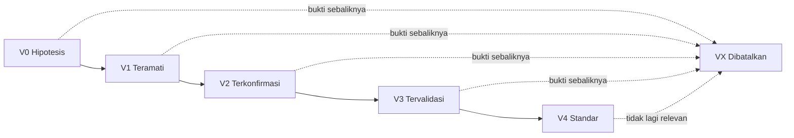
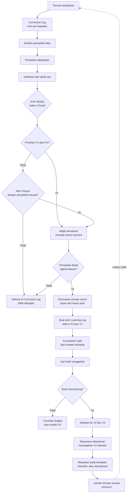

# Learning Log

**Dokumen Standar Pencatatan Pembelajaran Repository AI Multi-Agent**

| Atribut | Keterangan |
|---|---|
| Nama dokumen | `learning-log.md` |
| Versi | 1.0 |
| Tanggal berlaku | 21 Juli 2026 |
| Pemilik dokumen | Repository Maintainer |
| Dokumen pasangan | `correction-log.md` v1.0 |
| Pembaca sasaran | Developer, AI Engineer, Repository Maintainer, Business Excellence Center (BEC), mahasiswa magang |
| Status | Standar internal repository |

> [!NOTE]
> Dokumen ini adalah standar pencatatan pembelajaran pada tingkat repository. Dokumen ini **bukan** kebijakan resmi perusahaan dan tidak menggantikan pedoman, SOP, atau instruksi kerja yang diterbitkan oleh Business Excellence Center. Jika ada pertentangan dengan dokumen resmi BEC, dokumen resmi BEC yang berlaku.

---

## Daftar Isi

1. [Tujuan Learning Log](#1-tujuan-learning-log)
2. [Kapan Learning Log Harus Diperbarui](#2-kapan-learning-log-harus-diperbarui)
3. [Penanggung Jawab Pengisian](#3-penanggung-jawab-pengisian)
4. [Sumber Pembelajaran](#4-sumber-pembelajaran)
5. [Kategori Pembelajaran](#5-kategori-pembelajaran)
6. [Tingkat Validasi Pembelajaran](#6-tingkat-validasi-pembelajaran)
7. [Format Pencatatan](#7-format-pencatatan)
8. [Prosedur Validasi Pembelajaran](#8-prosedur-validasi-pembelajaran)
9. [Hubungan Learning Log dengan Correction Log](#9-hubungan-learning-log-dengan-correction-log)
10. [Cara Mengubah Hasil Koreksi Menjadi Lesson Learned](#10-cara-mengubah-hasil-koreksi-menjadi-lesson-learned)
11. [Best Practice Pendokumentasian Pembelajaran](#11-best-practice-pendokumentasian-pembelajaran)
12. [Kesalahan yang Harus Dihindari](#12-kesalahan-yang-harus-dihindari)
13. [Template Tabel Learning Log](#13-template-tabel-learning-log)
14. [Contoh Learning Log](#14-contoh-learning-log)
15. [Glosarium](#15-glosarium)

---

## 1. Tujuan Learning Log

Learning log adalah catatan resmi semua pembelajaran, pengalaman, best practice, dan hasil evaluasi yang diperoleh selama proses pengembangan Agen AI, Skill Claude, dokumentasi, maupun repository.

Jika correction log menjawab pertanyaan *"apa yang salah dan bagaimana diperbaiki?"*, maka learning log menjawab pertanyaan *"apa yang kita pelajari dan bagaimana agar tidak terulang?"*.

Tujuan penyusunan learning log adalah sebagai berikut.

1. **Mengubah kejadian tunggal menjadi pengetahuan yang berlaku umum.** Satu bug hanyalah kejadian; pola dari beberapa bug adalah pengetahuan.
2. **Mencegah pengulangan kesalahan pada konteks yang berbeda.** Pelajaran yang baik dapat diterapkan pada skill lain yang belum pernah mengalami masalah serupa.
3. **Mempercepat pengambilan keputusan desain.** Tim tidak perlu memperdebatkan ulang persoalan yang telah diselesaikan sebelumnya.
4. **Menjadi materi onboarding yang hidup.** Anggota baru dan mahasiswa magang memperoleh konteks pengembangan tanpa harus menelusuri semua riwayat perubahan.
5. **Menjadi dasar penyempurnaan standar.** Pelajaran yang telah tervalidasi menjadi masukan bagi perbaikan template, checklist, dan pedoman internal.
6. **Melestarikan pengetahuan ketika terjadi pergantian personel.** Pengetahuan yang hanya tersimpan dalam ingatan individu akan hilang bersama kepergiannya.
7. **Mendokumentasikan keberhasilan, bukan hanya kegagalan.** Pendekatan yang terbukti efektif juga perlu dicatat agar dapat direplikasi.

> [!NOTE]
> Learning log bersifat **kumulatif dan hidup**. Berbeda dengan correction log yang entrinya ditutup setelah masalah selesai, entri learning log tetap berlaku dan disempurnakan seiring bertambahnya bukti pendukung.

---

## 2. Kapan Learning Log Harus Diperbarui

Learning log **wajib** diperbarui pada kondisi berikut.

- [ ] Sebuah entri correction log berprioritas `P1` atau `P2` ditutup.
- [ ] Tiga atau lebih entri correction log memiliki penyebab akar yang serupa.
- [ ] Sebuah keputusan desain arsitektur multi-agent diambil, baik yang diterima maupun yang ditolak.
- [ ] Sebuah eksperimen prompt, persona, atau strategi *triggering* memberikan hasil yang jelas, baik berhasil maupun gagal.
- [ ] Selesai dilakukan evaluasi berkala terhadap kualitas jawaban agent.
- [ ] Terjadi kegagalan koordinasi antaragent pada arsitektur multi-agent.
- [ ] Ditemukan pendekatan yang secara konsisten memperbaiki kualitas keluaran.
- [ ] Selesai dilakukan reviu bulanan repository oleh Repository Maintainer.
- [ ] Ada umpan balik pengguna internal yang mengungkap asumsi keliru pada perancangan agent.
- [ ] Sebuah pustaka, model, atau alat bantu baru diadopsi maupun ditinggalkan.

Learning log **tidak perlu** diperbarui untuk kondisi berikut.

- Perbaikan sekali jalan yang bersifat sangat spesifik dan tidak dapat digeneralisasi.
- Pengetahuan umum yang telah tersedia luas pada dokumentasi resmi pihak ketiga.
- Preferensi pribadi yang belum diuji dan belum disepakati bersama.
- Catatan progres pekerjaan harian; gunakan mekanisme laporan berkala.

### Ritme Pembaruan

| Peristiwa pemicu | Tenggat pencatatan |
|---|---|
| Penutupan correction log `P1` | Pada hari yang sama |
| Penutupan correction log `P2` | ≤ 3 hari kerja |
| Keputusan desain arsitektur | ≤ 2 hari kerja setelah keputusan |
| Hasil eksperimen prompt atau persona | ≤ 5 hari kerja |
| Reviu bulanan repository | Pada akhir siklus reviu |

---

## 3. Penanggung Jawab Pengisian

| Peran | Tanggung jawab utama |
|---|---|
| **Kontributor pembelajaran** | Menuliskan entri awal berstatus `Hipotesis`. Siapa pun anggota tim boleh menjadi kontributor. |
| **PIC pembelajaran** | Memelihara entri, mengumpulkan bukti pendukung, dan mengusulkan kenaikan tingkat validasi. |
| **AI Engineer** | Bertanggung jawab atas pembelajaran mengenai persona, prompt, *triggering*, orkestrasi antaragent, dan evaluasi kualitas jawaban. |
| **Developer** | Bertanggung jawab atas pembelajaran mengenai arsitektur teknis, skrip, integrasi, kinerja, dan alur kerja CI. |
| **Repository Maintainer** | Memvalidasi entri, menaikkan atau menurunkan tingkat validasi, mencegah duplikasi, dan memimpin reviu bulanan. |
| **Business Excellence Center (BEC)** | Memberikan klarifikasi substansi proses bisnis jika pembelajaran menyentuh isi dokumen resmi, dan menilai kelayakan pembelajaran untuk diangkat menjadi standar yang lebih luas. |
| **Mahasiswa magang** | Boleh menjadi kontributor dan sangat dianjurkan mencatat hambatan yang dialami selama onboarding, karena hambatan tersebut adalah indikator kelemahan dokumentasi. |

> [!WARNING]
> Kenaikan tingkat validasi menjadi `Standar` hanya boleh ditetapkan oleh Repository Maintainer. Kontributor tidak berwenang menyatakan pembelajarannya sendiri sebagai standar repository.

---

## 4. Sumber Pembelajaran

Pembelajaran dapat berasal dari berbagai sumber. Setiap entri wajib mencantumkan sumbernya agar pembaca dapat menilai kekuatan bukti.

| Kode | Sumber | Penjelasan | Kekuatan bukti |
|---|---|---|---|
| `SRC-COR` | Correction log | Pelajaran yang disarikan dari kesalahan yang telah diperbaiki dan diverifikasi | Tinggi |
| `SRC-EXP` | Eksperimen terkendali | Pengujian A/B pada prompt, persona, atau konfigurasi agent | Tinggi |
| `SRC-EVL` | Evaluasi berkala | Hasil pengujian kualitas jawaban dengan kumpulan kasus uji baku | Tinggi |
| `SRC-DES` | Keputusan desain | Pertimbangan dan konsekuensi dari keputusan arsitektur yang diambil | Sedang |
| `SRC-FBK` | Umpan balik pengguna | Keluhan, saran, atau pola pertanyaan dari pengguna internal | Sedang |
| `SRC-REV` | Reviu kode dan dokumen | Temuan berulang pada proses reviu antaranggota tim | Sedang |
| `SRC-ONB` | Pengalaman onboarding | Hambatan yang dialami anggota baru atau mahasiswa magang | Sedang |
| `SRC-EXT` | Rujukan eksternal | Dokumentasi resmi, publikasi, atau praktik industri | Rendah hingga sedang |
| `SRC-OBS` | Observasi tidak terstruktur | Kesan atau dugaan yang belum diuji | Rendah |

> [!WARNING]
> Pembelajaran yang bersumber dari `SRC-OBS` atau `SRC-EXT` semata **tidak boleh** langsung ditetapkan sebagai `Standar`. Sumber tersebut hanya layak berstatus `Hipotesis` hingga diperkuat oleh bukti dari lingkungan repository sendiri.

---

## 5. Kategori Pembelajaran

| Kode | Kategori | Cakupan |
|---|---|---|
| `ARC` | Arsitektur Multi-Agent | Pembagian peran antaragent, orkestrasi, batas tanggung jawab, dan pola delegasi |
| `PRM` | Prompt & Persona | Penyusunan instruksi, batasan wewenang, gaya komunikasi, dan penanganan ambiguitas |
| `SKL` | Desain Skill | Penulisan deskripsi skill, strategi *triggering*, granularitas, dan pencegahan tumpang tindih |
| `KNW` | Manajemen Pengetahuan | Pengelolaan dokumen sumber, versi, penamaan, arsip, dan prioritas rujukan |
| `EVL` | Evaluasi & Pengujian | Metode pengujian agent, penyusunan kasus uji, dan metrik kualitas jawaban |
| `DOC` | Dokumentasi | Struktur, gaya penulisan, keterbacaan, dan pemeliharaan dokumentasi |
| `PRC` | Proses & Kolaborasi | Alur kerja tim, reviu, pelaporan, penetapan tanggung jawab, dan onboarding |
| `TEC` | Teknis & Infrastruktur | Skrip, otomatisasi, CI, kinerja, biaya komputasi, dan integrasi |
| `SAF` | Keamanan & Kepatuhan | Kerahasiaan informasi, batasan wewenang agent, dan pencegahan kebocoran data |

---

## 6. Tingkat Validasi Pembelajaran

Tingkat validasi menyatakan seberapa kuat sebuah pembelajaran telah dibuktikan dan seberapa mengikat penerapannya.

| Tingkat | Nama | Kriteria | Sifat penerapan |
|---|---|---|---|
| `V0` | **Hipotesis** | Dugaan awal berdasarkan satu observasi; belum diuji | Tidak mengikat; sekadar catatan |
| `V1` | **Teramati** | Terbukti pada satu kasus nyata yang terdokumentasi | Dapat dipertimbangkan |
| `V2` | **Terkonfirmasi** | Terbukti pada dua kasus atau lebih, atau melalui satu eksperimen terkendali | Dianjurkan |
| `V3` | **Tervalidasi** | Terbukti konsisten pada tiga kasus atau lebih dan telah diverifikasi oleh pihak selain kontributor | Sangat dianjurkan |
| `V4` | **Standar** | Telah diangkat menjadi aturan repository dan tercermin pada template, checklist, atau otomatisasi | Wajib diikuti |
| `VX` | **Dibatalkan** | Terbukti keliru atau tidak lagi relevan; disertai alasan tertulis | Tidak berlaku, tetap disimpan sebagai riwayat |

### Diagram Kenaikan Tingkat Validasi



> [!NOTE]
> Tingkat validasi dapat **turun**, tidak hanya naik. Pembelajaran yang terbantah oleh bukti baru wajib diturunkan atau dibatalkan, disertai catatan alasan. Menurunkan tingkat validasi bukan tanda kegagalan, melainkan tanda dokumen yang terpelihara dengan baik.

---

## 7. Format Pencatatan

### 7.1 Aturan Penomoran ID

Format ID: `LL-<KATEGORI>-<YYYYMM>-<NNN>`

- `LL` — penanda tetap *Learning Log*.
- `<KATEGORI>` — kode kategori tiga huruf (lihat Bagian 5).
- `<YYYYMM>` — tahun dan bulan pembuatan entri.
- `<NNN>` — nomor urut tiga digit dalam bulan tersebut, dimulai dari `001`.

Contoh: `LL-PRM-202606-002` adalah pembelajaran kategori Prompt & Persona kedua pada Juni 2026.

> [!NOTE]
> Nomor ID tidak pernah digunakan ulang, termasuk untuk entri berstatus `VX — Dibatalkan`. Entri yang dibatalkan tetap disimpan karena riwayat penolakan sebuah gagasan sama bernilainya dengan riwayat penerimaannya.

### 7.2 Aturan Penulisan Isi

| Kolom | Aturan penulisan |
|---|---|
| Judul pembelajaran | Tulis sebagai pernyataan yang dapat ditindaklanjuti, bukan sekadar topik. Gunakan bentuk "Lakukan X agar Y" atau "Hindari X karena Y". |
| Latar belakang | Jelaskan konteks yang diperlukan pembaca yang tidak terlibat langsung. |
| Permasalahan | Nyatakan kesenjangan antara yang diharapkan dan yang terjadi. |
| Solusi | Tuliskan tindakan konkret yang diterapkan pada kasus asal. |
| Lesson learned | Nyatakan prinsip yang berlaku umum, terlepas dari kasus asalnya. Bagian inilah inti dokumen. |
| Dampak | Nyatakan perubahan terukur atau teramati setelah pelajaran diterapkan. |
| Status validasi | Gunakan kode `V0` hingga `V4` atau `VX`. |
| PIC | Gunakan nama peran dan inisial, bukan nama lengkap pribadi. |
| Tanggal | Format `YYYY-MM-DD`. |

### 7.3 Uji Kelayakan Judul

Sebuah judul pembelajaran dianggap layak jika memenuhi semua butir berikut.

- [ ] Dapat dipahami tanpa membaca isi entri
- [ ] Menyatakan tindakan atau prinsip, bukan sekadar topik
- [ ] Berlaku pada konteks di luar kasus asalnya
- [ ] Tidak memuat nama berkas atau nomor kasus tertentu

| Judul yang lemah | Judul yang layak |
|---|---|
| "Masalah triggering skill" | "Deskripsi skill harus memuat sinonim dan singkatan internal, bukan hanya istilah baku" |
| "Belajar tentang persona" | "Instruksi persona harus memisahkan wewenang menjelaskan dari wewenang memutuskan" |
| "Bug skrip validasi" | "Semua variabel path pada skrip shell harus diapit tanda kutip" |

### 7.4 Lokasi Berkas

```
repository-root/
├── docs/
│   ├── learning-log.md        <- dokumen ini
│   ├── correction-log.md
│   └── ...
├── skills/
├── agents/
└── README.md
```

---

## 8. Prosedur Validasi Pembelajaran

**Jawaban singkat:** pembelajaran divalidasi dengan mengumpulkan bukti dari kasus yang berbeda dari kasus asal, kemudian diperiksa oleh pihak selain kontributor sebelum tingkat validasinya dinaikkan.

**Tahapan:**

1. **Rumuskan pernyataan yang dapat diuji.** Pembelajaran yang tidak dapat dibantah oleh bukti apa pun bukanlah pembelajaran, melainkan pendapat.
2. **Kumpulkan bukti pendukung.** Rujuk ID correction log, hasil eksperimen, atau hasil evaluasi yang mendukung pernyataan tersebut.
3. **Uji pada konteks berbeda.** Terapkan pelajaran pada skill, agent, atau modul yang berbeda dari kasus asal. Pembelajaran yang hanya berlaku pada satu tempat tidak layak naik melampaui `V1`.
4. **Cari bukti yang membantah.** Telusuri kasus yang seharusnya sesuai dengan pelajaran namun ternyata tidak. Pencarian bukti sanggahan wajib dilakukan sebelum kenaikan ke `V3`.
5. **Ajukan reviu.** Kontributor mengajukan kenaikan tingkat kepada Repository Maintainer disertai daftar bukti.
6. **Tetapkan tingkat validasi.** Repository Maintainer menaikkan, mempertahankan, atau menurunkan tingkat validasi disertai catatan.
7. **Terapkan pada perangkat kerja.** Pembelajaran yang mencapai `V4` wajib tercermin pada template, checklist, deskripsi skill, atau pemeriksaan otomatis. Pembelajaran `V4` yang tidak terwujud dalam perangkat kerja akan terlupakan.

**Checklist kenaikan ke `V3 — Tervalidasi`:**

- [ ] Ada setidaknya tiga bukti terdokumentasi
- [ ] Setidaknya satu bukti berasal dari konteks berbeda dari kasus asal
- [ ] Pencarian bukti sanggahan telah dilakukan dan hasilnya dicatat
- [ ] Diperiksa oleh pihak selain kontributor
- [ ] Tidak bertentangan dengan entri learning log lain yang berstatus `V3` atau `V4`
- [ ] Judul telah lolos uji kelayakan pada Bagian 7.3

**Checklist kenaikan ke `V4 — Standar`:**

- [ ] Telah berstatus `V3` setidaknya satu siklus reviu bulanan
- [ ] Telah diwujudkan pada template, checklist, atau pemeriksaan otomatis
- [ ] Telah disosialisasikan kepada semua anggota tim
- [ ] Disetujui oleh Repository Maintainer
- [ ] Jika menyentuh substansi proses bisnis, telah dikonfirmasi kepada BEC

> [!WARNING]
> Pembelajaran yang saling bertentangan tidak boleh dibiarkan sama-sama berstatus `V3` atau `V4`. Repository Maintainer wajib menyelesaikan pertentangan tersebut dengan menetapkan batas keberlakuan masing-masing, atau menurunkan salah satunya.

---

## 9. Hubungan Learning Log dengan Correction Log

Kedua dokumen bekerja sebagai pasangan. Correction log mencatat kejadian; learning log menyarikan maknanya.

| Aspek | Correction Log | Learning Log |
|---|---|---|
| Fokus | Kejadian tunggal yang salah | Prinsip yang berlaku umum |
| Sifat | Reaktif, dipicu oleh temuan | Reflektif, disarikan dari beberapa temuan |
| Pertanyaan pokok | "Apa yang salah dan bagaimana diperbaiki?" | "Apa yang kita pelajari dan bagaimana mencegahnya?" |
| Satuan entri | Satu masalah, satu ID | Satu prinsip, satu ID |
| Siklus hidup | Ditutup setelah selesai | Tetap berlaku dan disempurnakan |
| Penanda kemajuan | Status `Open` hingga `Closed` | Tingkat validasi `V0` hingga `V4` |
| Sumber utama | Temuan lapangan | Correction log, eksperimen, evaluasi, keputusan desain |
| Nilai bagi anggota baru | Menunjukkan titik rawan | Menunjukkan cara bekerja yang benar |

**Aturan keterkaitan:**

1. Setiap entri learning log yang bersumber dari correction log **wajib** mencantumkan ID correction log asalnya pada kolom rujukan.
2. Setiap correction log berprioritas `P1` atau `P2` yang ditutup **wajib** dievaluasi kelayakannya menjadi entri learning log.
3. Tiga correction log dengan penyebab akar serupa **wajib** disarikan menjadi satu entri learning log.
4. Learning log **tidak** memuat detail teknis satu kejadian; detail tersebut tetap berada di correction log.
5. Correction log **tidak** memuat prinsip umum; prinsip tersebut dipindahkan ke learning log.

### Diagram Alur Perubahan Correction Log menjadi Learning Log



---

## 10. Cara Mengubah Hasil Koreksi Menjadi Lesson Learned

Tidak semua koreksi layak menjadi pembelajaran. Bagian ini menetapkan langkah penyaringan dan perumusannya.

### 10.1 Langkah Perumusan

1. **Ambil penyebab akar, bukan gejalanya.** Titik awal perumusan selalu kolom "penyebab" pada correction log, bukan kolom "deskripsi masalah".
2. **Naikkan tingkat keumuman.** Hilangkan nama berkas, nomor kasus, dan detail yang spesifik. Tanyakan: "berlaku pada apa lagi selain kasus ini?"
3. **Uji dengan pertanyaan pembalikan.** Jika kebalikan dari pernyataan pelajaran terdengar jelas keliru bagi siapa pun, maka pernyataan tersebut terlalu sepele untuk dicatat.
4. **Rumuskan sebagai tindakan.** Ubah dari deskripsi menjadi arahan: "lakukan X" atau "hindari Y karena Z".
5. **Tetapkan batas keberlakuan.** Nyatakan kapan pelajaran ini berlaku dan kapan tidak. Pelajaran tanpa batas keberlakuan cenderung disalahterapkan.
6. **Tetapkan wujud penerapannya.** Tentukan pada perangkat kerja apa pelajaran ini akan tertanam: template, checklist, deskripsi skill, atau pemeriksaan otomatis.

### 10.2 Uji Penyaringan

Sebuah koreksi layak diangkat menjadi lesson learned jika memenuhi setidaknya tiga dari lima butir berikut.

- [ ] Penyebab akarnya dapat terjadi pada modul, skill, atau agent lain
- [ ] Perbaikan yang dilakukan menuntut perubahan cara kerja, bukan sekadar perbaikan satu berkas
- [ ] Kesalahan serupa pernah terjadi sebelumnya
- [ ] Anggota baru berpeluang besar mengulang kesalahan yang sama
- [ ] Pelajaran dapat diwujudkan pada perangkat kerja yang bersifat mencegah

### 10.3 Contoh Transformasi

| Correction log (kejadian) | Penyebab akar | Learning log (prinsip) |
|---|---|---|
| `CL-HAL-202606-002` — Agent menyebut "SOP No. 04/BEC/2024" yang tidak ada | Persona hanya memuat larangan umum mengarang, tanpa menyebut kategori informasi yang rawan | Larangan mengarang harus dirinci per kategori informasi, karena larangan umum tidak menahan model pada informasi berpola teratur |
| `CL-SKL-202606-001` — Skill tidak terpanggil pada istilah "Tupoksi" | Deskripsi skill hanya memuat istilah baku, tanpa sinonim dan singkatan internal | Deskripsi skill harus ditulis menggunakan kosakata pengguna, bukan kosakata dokumen |
| `CL-SCR-202607-002` — Skrip gagal pada nama folder berspasi | Variabel path tidak diapit tanda kutip | Setiap masukan yang berasal dari nama berkas harus diuji dengan kasus ekstrem sebelum digabungkan |

> [!WARNING]
> Kesalahan yang paling sering terjadi pada tahap ini adalah **menyalin isi correction log tanpa menaikkan tingkat keumuman**. Entri learning log yang masih menyebut nama berkas dan nomor kasus tertentu belum menjadi pembelajaran; entri tersebut hanyalah salinan.

---

## 11. Best Practice Pendokumentasian Pembelajaran

1. **Tulis judul sebagai pernyataan, bukan topik.** Pembaca sering hanya membaca daftar judul; judul yang baik sudah menyampaikan inti pelajaran.
2. **Catat pula pendekatan yang gagal.** Mengetahui jalan buntu menghemat waktu sama besarnya dengan mengetahui jalan yang benar.
3. **Sertakan angka jika tersedia.** "Tingkat pemanggilan skill yang tepat naik dari 62 persen menjadi 94 persen" jauh lebih kuat daripada "hasilnya membaik".
4. **Nyatakan batas keberlakuan.** Pelajaran yang berlaku pada agent penjawab dokumen belum tentu berlaku pada agent perangkum.
5. **Satu prinsip, satu entri.** Menggabungkan beberapa prinsip membuat tingkat validasi menjadi tidak bermakna.
6. **Perbarui entri lama alih-alih membuat entri baru.** Bukti tambahan atas prinsip yang sama memperkuat entri yang telah ada.
7. **Tinjau ulang secara berkala.** Pembelajaran yang tidak pernah ditinjau akan menjadi usang dan justru menyesatkan.
8. **Gunakan bahasa yang dapat dipahami pembaca nonteknis.** Learning log dibaca pula oleh BEC dan mahasiswa magang.
9. **Wujudkan pelajaran pada perangkat kerja.** Pelajaran yang hanya tertulis akan terlupakan; pelajaran yang tertanam pada checklist akan bertahan.
10. **Jaga nada tetap objektif dan tidak menyalahkan.** Fokus pada proses dan sistem, bukan pada individu.
11. **Rujuk silang antar entri.** Pembelajaran jarang berdiri sendiri; kaitkan dengan entri terkait.
12. **Catat pada saat konteks masih segar.** Pelajaran yang direkonstruksi berbulan-bulan kemudian cenderung kehilangan nuansa penyebabnya.

---

## 12. Kesalahan yang Harus Dihindari

> [!WARNING]
> Praktik berikut membuat learning log berubah menjadi arsip mati yang tidak dibaca siapa pun.

| Kesalahan | Mengapa bermasalah | Yang seharusnya dilakukan |
|---|---|---|
| Menyalin correction log apa adanya | Tidak menghasilkan pengetahuan baru | Naikkan tingkat keumuman; ambil penyebab akar |
| Menulis judul berupa topik, misalnya "tentang persona" | Daftar isi menjadi tidak informatif | Tulis judul sebagai pernyataan yang dapat ditindaklanjuti |
| Menetapkan `V4 — Standar` hanya berdasar satu kasus | Standar yang rapuh akan dibantah dan merusak kepercayaan | Kumpulkan bukti dari setidaknya tiga kasus berbeda |
| Membiarkan entri usang tetap berstatus `V4` | Tim mengikuti aturan yang sudah tidak relevan | Tinjau berkala; turunkan atau tandai `VX` |
| Mencatat hanya keberhasilan | Menimbulkan gambaran menyesatkan dan menutup pelajaran dari kegagalan | Catat pula eksperimen yang gagal beserta alasannya |
| Menghapus entri yang terbukti keliru | Menghilangkan riwayat pertimbangan | Tandai `VX` disertai alasan; jangan dihapus |
| Menulis pelajaran tanpa batas keberlakuan | Pelajaran disalahterapkan pada konteks yang tidak sesuai | Nyatakan secara eksplisit kapan berlaku dan kapan tidak |
| Menyebut nama individu disertai penilaian | Melanggar prinsip pencatatan tanpa menyalahkan | Gunakan peran dan inisial; fokus pada proses |
| Membiarkan dua entri saling bertentangan pada `V3` | Tim menerima arahan yang saling berlawanan | Selesaikan pertentangan atau tetapkan batas masing-masing |
| Menumpuk pencatatan di akhir siklus | Detail penyebab hilang; entri menjadi dangkal | Catat sesuai ritme pada Bagian 2 |
| Menetapkan `V4` tanpa mewujudkannya pada perangkat kerja | Standar hanya menjadi tulisan yang tidak dijalankan | Tanam pada template, checklist, atau pemeriksaan otomatis |
| Menyalin praktik industri tanpa pengujian internal | Konteks repository berbeda dari konteks sumber | Tahan pada `V0`; naikkan setelah terbukti di lingkungan sendiri |

---

## 13. Template Tabel Learning Log

### 13.1 Template Ringkas (tabel utama)

```markdown
| ID | Tanggal | Judul Pembelajaran | Latar Belakang | Permasalahan | Solusi | Lesson Learned | Dampak | Status Validasi | PIC |
|---|---|---|---|---|---|---|---|---|---|
| LL-XXX-YYYYMM-NNN | YYYY-MM-DD | Pernyataan pelajaran yang dapat ditindaklanjuti | Konteks yang melatarbelakangi | Kesenjangan antara harapan dan kenyataan | Tindakan konkret pada kasus asal | Prinsip umum yang berlaku di luar kasus asal | Perubahan terukur setelah diterapkan | V0 / V1 / V2 / V3 / V4 / VX | Peran-Inisial |
```

### 13.2 Template Rinci (untuk pembelajaran `V3` dan `V4`)

```markdown
### LL-XXX-YYYYMM-NNN — <Judul Pembelajaran>

| Field | Isi |
|---|---|
| ID | LL-XXX-YYYYMM-NNN |
| Tanggal dicatat | YYYY-MM-DD |
| Tanggal peninjauan terakhir | YYYY-MM-DD |
| Kontributor | Peran-Inisial |
| PIC | Peran-Inisial |
| Kategori | ARC / PRM / SKL / KNW / EVL / DOC / PRC / TEC / SAF |
| Sumber pembelajaran | SRC-COR / SRC-EXP / SRC-EVL / SRC-DES / SRC-FBK / SRC-REV / SRC-ONB / SRC-EXT / SRC-OBS |
| Status validasi | V0 / V1 / V2 / V3 / V4 / VX |
| Rujukan correction log | CL-XXX-YYYYMM-NNN atau "tidak ada" |
| Rujukan learning log terkait | LL-XXX-YYYYMM-NNN atau "tidak ada" |
| Validator | Peran-Inisial |

**Latar belakang**
<Konteks yang diperlukan pembaca yang tidak terlibat langsung.>

**Permasalahan**
<Kesenjangan antara yang diharapkan dan yang terjadi.>

**Solusi yang diterapkan**
<Tindakan konkret pada kasus asal.>

**Lesson learned**
<Prinsip umum, dirumuskan lepas dari kasus asalnya.>

**Batas keberlakuan**
<Kapan pelajaran ini berlaku dan kapan tidak.>

**Bukti pendukung**
1.
2.
3.

**Bukti sanggahan yang dicari**
<Hasil penelusuran kasus yang membantah, beserta kesimpulannya.>

**Dampak**
<Perubahan terukur atau teramati setelah pelajaran diterapkan.>

**Wujud penerapan**
<Template, checklist, deskripsi skill, atau pemeriksaan otomatis tempat pelajaran ini tertanam.>
```

---

## 14. Contoh Learning Log

Contoh berikut adalah ilustrasi berdasarkan situasi umum pengembangan repository AI Multi-Agent. Contoh ini bersifat **ilustratif** dan bukan catatan kejadian resmi.

### 14.1 Tabel Rekapitulasi

| ID | Tanggal | Judul Pembelajaran | Latar Belakang | Permasalahan | Solusi | Lesson Learned | Dampak | Status Validasi | PIC |
|---|---|---|---|---|---|---|---|---|---|
| LL-SKL-202606-001 | 2026-06-05 | Deskripsi skill harus ditulis menggunakan kosakata pengguna, bukan kosakata dokumen | Repository memiliki enam skill yang bergantung pada pemanggilan otomatis berdasarkan kecocokan konteks | Skill tidak terpanggil ketika pengguna memakai singkatan internal seperti "Tupoksi", padahal deskripsi hanya memuat istilah baku "tugas pokok dan fungsi" | Deskripsi skill diperluas dengan sinonim, singkatan, dan variasi ejaan yang lazim dipakai pengguna internal | Deskripsi skill adalah antarmuka menuju kosakata pengguna, bukan ringkasan isi skill. Kumpulkan istilah nyata dari pertanyaan pengguna, lalu masukkan ke deskripsi | Tingkat pemanggilan skill yang tepat pada 40 pertanyaan uji naik dari 62 persen menjadi 94 persen | V4 | AI Engineer-RS |
| LL-PRM-202606-002 | 2026-06-12 | Larangan mengarang harus dirinci per kategori informasi, bukan dinyatakan secara umum | Persona telah memuat instruksi umum untuk tidak mengarang informasi | Agent tetap menyebut nomor SOP fiktif karena pola penomoran dokumen bersifat teratur dan mudah dilengkapi model | Ditambahkan daftar larangan eksplisit untuk nomor dokumen, nama PIC, jabatan, batas waktu, dan tahapan persetujuan, disertai kalimat baku ketika informasi tidak ditemukan | Instruksi negatif yang bersifat umum lemah terhadap informasi berpola teratur. Rinci larangan pada kategori informasi yang paling mudah ditebak polanya | Pada 10 kasus uji yang jawabannya sengaja tidak tersedia, tidak lagi muncul nomor dokumen fiktif; 5 kasus uji kontrol tetap dijawab benar | V4 | AI Engineer-RS |
| LL-ARC-202606-003 | 2026-06-24 | Agent orkestrator tidak boleh sekaligus menjadi agent penjawab | Arsitektur awal menempatkan satu agent sebagai perute permintaan sekaligus penjawab pertanyaan umum | Agent orkestrator kerap menjawab sendiri pertanyaan yang seharusnya didelegasikan, karena kedua peran bersaing dalam satu konteks instruksi | Peran dipisahkan menjadi agent perute murni tanpa kemampuan menjawab, dan agent penjawab yang tidak memiliki kemampuan merutekan | Peran yang saling bersaing dalam satu agent akan diselesaikan oleh model secara tidak terduga. Pisahkan peran yang memiliki kriteria keberhasilan berbeda ke agent yang berbeda | Delegasi yang tepat naik dari 71 persen menjadi 96 persen pada 55 permintaan uji; waktu jawab rata-rata bertambah 1,4 detik dan dinilai dapat diterima | V3 | Developer-AP |
| LL-KNW-202607-001 | 2026-07-06 | Dokumen sumber wajib diberi penanda versi pada nama berkas dan versi lama wajib diarsipkan | Folder pengetahuan diisi oleh beberapa pihak dengan waktu unggah berbeda | Dua berkas pedoman dengan judul sama namun isi berbeda menyebabkan agent mengutip keduanya secara bergantian antar sesi | Versi lama dipindahkan ke folder arsip, nama berkas diberi penanda tahun, dan ditetapkan aturan penamaan berversi | Konsistensi jawaban agent ditentukan oleh kebersihan folder sumber, bukan oleh kecanggihan instruksi. Selesaikan pertentangan pada tingkat data sebelum menambah aturan pada persona | Ketidakkonsistenan jawaban pada 20 pertanyaan berulang turun dari 6 kejadian menjadi nihil | V3 | AI Engineer-RS |
| LL-EVL-202607-002 | 2026-07-13 | Kumpulan kasus uji wajib memuat pertanyaan yang jawabannya sengaja tidak tersedia | Evaluasi kualitas agent semula hanya menggunakan pertanyaan yang jawabannya tersedia pada dokumen sumber | Evaluasi memberikan nilai tinggi meskipun agent memiliki kecenderungan mengarang, karena kecenderungan tersebut tidak pernah terpicu oleh kasus uji | Kumpulan kasus uji ditambah kategori pertanyaan tanpa jawaban, pertanyaan ambigu, dan pertanyaan di luar cakupan | Pengujian yang hanya memakai kasus yang seharusnya berhasil akan mengukur kemampuan, bukan keandalan. Sertakan kasus yang seharusnya ditolak untuk mengukur kejujuran sistem | Tiga kelemahan persona yang sebelumnya tidak terdeteksi ditemukan pada satu siklus evaluasi | V4 | Repo Maintainer-DL |
| LL-DOC-202607-003 | 2026-07-15 | Perubahan perilaku sistem dan pembaruan dokumentasi harus berada dalam satu unit perubahan | Dokumentasi onboarding dipelihara terpisah dari kode | Panduan onboarding masih menginstruksikan perintah yang telah dihapus, sehingga dua mahasiswa magang terhambat pada hari pertama | Ditambahkan butir wajib "perbarui dokumentasi terkait" pada checklist penggabungan perubahan | Dokumentasi yang diperbarui pada waktu terpisah akan tertinggal. Ikat pembaruan dokumentasi pada unit perubahan yang sama dengan perubahan perilakunya | Temuan dokumentasi usang pada reviu bulanan berikutnya turun dari 4 menjadi 1 | V3 | Repo Maintainer-DL |
| LL-PRC-202607-004 | 2026-07-18 | Hambatan yang dialami anggota baru adalah data kualitas dokumentasi, bukan kekurangan individu | Mahasiswa magang sering menyelesaikan hambatan onboarding secara mandiri tanpa melaporkannya | Kelemahan dokumentasi yang sama berulang pada setiap gelombang magang karena tidak pernah tercatat | Ditetapkan kewajiban mencatat setiap hambatan onboarding sebagai entri correction log berkategori `DOC` | Kesulitan anggota baru adalah pengukur mutu dokumentasi yang paling jujur, karena mereka belum memiliki pengetahuan tersirat yang menutupi celah dokumen | Sembilan celah dokumentasi teridentifikasi pada satu gelombang magang; waktu penyiapan lingkungan kerja turun dari sekitar 5 jam menjadi sekitar 1,5 jam | V2 | Repo Maintainer-DL |
| LL-TEC-202607-005 | 2026-07-19 | Penambahan agent baru harus disertai penilaian biaya dan waktu jawab, bukan hanya penilaian kualitas | Arsitektur multi-agent berkembang dari dua menjadi lima agent dalam dua bulan | Rantai delegasi bertingkat menyebabkan waktu jawab melampaui 20 detik pada beberapa permintaan, meskipun kualitas jawaban meningkat | Kedalaman delegasi dibatasi maksimal dua tingkat, dan ditambahkan pencatatan waktu jawab pada setiap permintaan | Penambahan agent memiliki biaya yang bersifat kumulatif dan tidak terlihat pada pengujian per agent. Ukur biaya keseluruhan rantai, bukan mutu tiap simpul | Waktu jawab persentil ke-95 turun dari 23 detik menjadi 9 detik tanpa penurunan mutu jawaban yang teramati | V2 | Developer-AP |
| LL-SAF-202607-006 | 2026-07-20 | Contoh keluaran pada dokumentasi harus menggunakan data buatan, tidak boleh menggunakan cuplikan nyata | Dokumentasi internal banyak memuat contoh keluaran agent untuk memperjelas penjelasan | Beberapa contoh diambil langsung dari sesi nyata dan memuat penggalan isi dokumen internal | Semua contoh diganti dengan data buatan yang menyerupai, disertai penandaan eksplisit bahwa contoh bersifat ilustratif | Dokumentasi cenderung tersebar lebih luas daripada perkiraan penulisnya. Perlakukan setiap contoh dalam dokumentasi sebagai berpotensi terbaca pihak luar | Semua contoh pada tiga dokumen utama telah bersih dari cuplikan nyata | V2 | Repo Maintainer-DL |

### 14.2 Contoh Entri Rinci

#### LL-ARC-202606-003 — Agent orkestrator tidak boleh sekaligus menjadi agent penjawab

| Field | Isi |
|---|---|
| ID | LL-ARC-202606-003 |
| Tanggal dicatat | 2026-06-24 |
| Tanggal peninjauan terakhir | 2026-07-18 |
| Kontributor | Developer-AP |
| PIC | Developer-AP |
| Kategori | ARC — Arsitektur Multi-Agent |
| Sumber pembelajaran | SRC-DES, SRC-EXP |
| Status validasi | V3 — Tervalidasi |
| Rujukan correction log | CL-AGT-202606-005, CL-AGT-202606-008 |
| Rujukan learning log terkait | LL-TEC-202607-005 |
| Validator | Repo Maintainer-DL |

**Latar belakang**

Arsitektur awal repository menempatkan satu agent sebagai titik masuk tunggal. Agent tersebut bertugas merutekan permintaan kepada agent khusus, sekaligus menjawab sendiri pertanyaan umum yang dianggap sederhana. Rancangan ini dipilih karena dinilai lebih hemat sumber daya dan lebih cepat.

**Permasalahan**

Agent titik masuk sering menjawab sendiri pertanyaan yang seharusnya didelegasikan kepada agent khusus. Jawaban yang dihasilkan secara mandiri tersebut tidak berbasis dokumen sumber, sehingga mutu jawabannya lebih rendah. Ketika instruksi delegasi diperketat, agent justru mendelegasikan pertanyaan sapaan sederhana dan menimbulkan penundaan yang tidak perlu.

**Solusi yang diterapkan**

1. Agent titik masuk diubah menjadi perute murni tanpa kemampuan menjawab substansi.
2. Ditambahkan agent penjawab umum sebagai salah satu tujuan delegasi.
3. Daftar tujuan delegasi ditetapkan bersifat tertutup, sehingga perute harus selalu memilih salah satu tujuan.

**Lesson learned**

Ketika satu agent diberi dua peran dengan kriteria keberhasilan yang berbeda, model akan menyelesaikan pertentangan tersebut secara tidak terduga dan tidak konsisten. Pemisahan peran ke agent yang berbeda memindahkan pertentangan dari dalam instruksi menjadi keputusan arsitektur yang eksplisit dan dapat diuji.

**Batas keberlakuan**

Berlaku pada sistem dengan tiga agent atau lebih. Pada sistem dengan dua agent, biaya tambahan pemisahan peran umumnya melampaui manfaatnya. Tidak berlaku pada peran yang memiliki kriteria keberhasilan sejenis, misalnya dua peran yang sama-sama bertugas merangkum.

**Bukti pendukung**

1. `CL-AGT-202606-005` — agent titik masuk menjawab pertanyaan prosedur tanpa merujuk dokumen.
2. `CL-AGT-202606-008` — agent titik masuk mendelegasikan sapaan sederhana sehingga menimbulkan penundaan.
3. Pengujian pada 55 permintaan: delegasi yang tepat naik dari 71 persen menjadi 96 persen.
4. Pola serupa teramati pada modul peringkas dokumen yang semula menggabungkan peran penyaring dan peringkas.

**Bukti sanggahan yang dicari**

Ditelusuri kemungkinan bahwa masalah dapat diselesaikan cukup dengan memperjelas instruksi tanpa memisahkan agent. Tiga varian instruksi diuji; varian terbaik hanya mencapai 84 persen delegasi yang tepat, masih di bawah hasil pemisahan peran. Ditelusuri pula apakah pemisahan merugikan pada sistem kecil; pada sistem dua agent, pemisahan menambah waktu jawab tanpa perbaikan mutu yang berarti. Temuan ini menjadi dasar penetapan batas keberlakuan.

**Dampak**

Delegasi yang tepat meningkat dari 71 persen menjadi 96 persen. Waktu jawab rata-rata bertambah 1,4 detik, dinilai dapat diterima oleh pengguna internal. Penambahan agent baru menjadi lebih sederhana karena hanya memerlukan pendaftaran pada daftar tujuan perute.

**Wujud penerapan**

1. Butir "peran perute dan peran penjawab terpisah" ditambahkan pada checklist reviu arsitektur.
2. Template pendefinisian agent baru memuat kolom wajib "peran tunggal yang diemban".
3. Pemeriksaan otomatis menolak definisi agent yang memuat kemampuan merutekan sekaligus menjawab.

### 14.3 Rekapitulasi Berdasarkan Kategori dan Tingkat Validasi

| Kategori | V0 | V1 | V2 | V3 | V4 | VX | Total |
|---|---|---|---|---|---|---|---|
| ARC — Arsitektur Multi-Agent | 0 | 0 | 0 | 1 | 0 | 0 | 1 |
| PRM — Prompt & Persona | 0 | 0 | 0 | 0 | 1 | 0 | 1 |
| SKL — Desain Skill | 0 | 0 | 0 | 0 | 1 | 0 | 1 |
| KNW — Manajemen Pengetahuan | 0 | 0 | 0 | 1 | 0 | 0 | 1 |
| EVL — Evaluasi & Pengujian | 0 | 0 | 0 | 0 | 1 | 0 | 1 |
| DOC — Dokumentasi | 0 | 0 | 0 | 1 | 0 | 0 | 1 |
| PRC — Proses & Kolaborasi | 0 | 0 | 1 | 0 | 0 | 0 | 1 |
| TEC — Teknis & Infrastruktur | 0 | 0 | 1 | 0 | 0 | 0 | 1 |
| SAF — Keamanan & Kepatuhan | 0 | 0 | 1 | 0 | 0 | 0 | 1 |
| **Total** | **0** | **0** | **3** | **3** | **3** | **0** | **9** |

### 14.4 Keterlacakan dengan Correction Log

| Learning Log | Correction Log asal | Kategori correction log | Prioritas |
|---|---|---|---|
| LL-SKL-202606-001 | CL-SKL-202606-001 | SKL | P2 |
| LL-PRM-202606-002 | CL-HAL-202606-002 | HAL | P1 |
| LL-ARC-202606-003 | CL-AGT-202606-005, CL-AGT-202606-008 | AGT | P2 |
| LL-KNW-202607-001 | CL-DAT-202607-004 | DAT | P2 |
| LL-EVL-202607-002 | CL-HAL-202606-002 | HAL | P1 |
| LL-DOC-202607-003 | CL-DOC-202607-003 | DOC | P3 |
| LL-PRC-202607-004 | CL-DOC-202607-003 | DOC | P3 |
| LL-TEC-202607-005 | Tidak ada; bersumber dari keputusan desain | — | — |
| LL-SAF-202607-006 | Tidak ada; bersumber dari reviu dokumen | — | — |

> [!NOTE]
> Satu entri correction log dapat melahirkan lebih dari satu pembelajaran, sebagaimana `CL-HAL-202606-002` yang melahirkan pelajaran mengenai perumusan larangan pada persona sekaligus pelajaran mengenai penyusunan kasus uji. Sebaliknya, satu pembelajaran dapat bersumber dari beberapa correction log sekaligus.

---

## 15. Glosarium

| Istilah | Penjelasan |
|---|---|
| **Learning log** | Catatan resmi pembelajaran, pengalaman, best practice, dan hasil evaluasi pengembangan repository. |
| **Correction log** | Catatan resmi kesalahan, koreksi, bug, dan perbaikan pada repository. |
| **Lesson learned** | Prinsip berlaku umum yang disarikan dari satu atau beberapa pengalaman konkret. |
| **Tingkat validasi** | Penanda kekuatan bukti dan sifat mengikat sebuah pembelajaran, dari `V0` hingga `V4`. |
| **Penyebab akar (root cause)** | Penyebab paling mendasar yang, jika diperbaiki, mencegah masalah terulang. |
| **Multi-agent** | Arsitektur yang menggunakan beberapa agen AI dengan peran berbeda dan saling berkoordinasi. |
| **Orkestrator** | Agent yang bertugas menerima permintaan dan merutekannya kepada agent lain yang sesuai. |
| **Delegasi** | Penyerahan penanganan sebuah permintaan dari satu agent kepada agent lain. |
| **Triggering** | Mekanisme pemanggilan otomatis sebuah skill berdasarkan kecocokan konteks dengan deskripsi skill. |
| **Persona** | Kumpulan instruksi yang menetapkan identitas, gaya komunikasi, cakupan, dan batasan wewenang sebuah agen AI. |
| **Halusinasi** | Kondisi ketika model bahasa menghasilkan informasi yang terdengar meyakinkan namun tidak berdasar pada sumber. |
| **Bukti sanggahan** | Bukti yang dicari secara sengaja untuk membantah sebuah pembelajaran, sebagai pengaman terhadap bias konfirmasi. |
| **Batas keberlakuan** | Penjelasan mengenai kondisi ketika sebuah pembelajaran berlaku dan ketika tidak berlaku. |
| **Blameless** | Pendekatan pencatatan yang berfokus pada perbaikan proses, bukan pada penilaian individu. |
| **Persentil ke-95** | Nilai yang melampaui 95 persen pengamatan; lazim dipakai untuk mengukur kinerja pada kondisi terburuk yang wajar. |

---

## Catatan Penutup

Learning log hanya bernilai jika dibaca sebelum keputusan diambil, bukan sekadar diisi setelah pekerjaan selesai. Repository Maintainer dianjurkan membuka learning log pada awal setiap perencanaan perubahan besar, dan mahasiswa magang dianjurkan membaca semua entri berstatus `V4` pada pekan pertama masa magangnya.

Pengguna dokumen ini wajib mematuhi kebijakan keamanan dan kerahasiaan informasi yang berlaku ketika mencatat pembelajaran yang bersumber dari dokumen internal.

---

*Versi 1.0 — 21 Juli 2026 — Repository Maintainer*
*Dokumen pasangan: `correction-log.md` v1.0*
