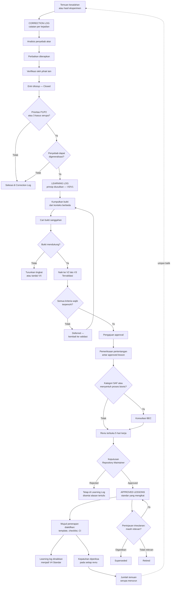

# Approved Lessons

**Repositori Resmi Pembelajaran Tervalidasi dan Berstatus Standar**

| Atribut | Keterangan |
|---|---|
| Nama dokumen | `approved-lessons.md` |
| Versi | 1.0 |
| Tanggal berlaku | 21 Juli 2026 |
| Pemilik dokumen | Repository Maintainer |
| Dokumen pasangan | `correction-log.md` v1.0, `learning-log.md` v1.0 |
| Siklus peninjauan | Triwulanan |
| Peninjauan berikutnya | 21 Oktober 2026 |
| Pembaca sasaran | Developer, AI Engineer, Repository Maintainer, Business Excellence Center (BEC), mahasiswa magang |
| Status | Standar internal repository — bersifat mengikat |

> [!WARNING]
> Semua pembelajaran dalam dokumen ini berstatus **wajib diikuti** dalam pengembangan repository. Penyimpangan terhadap approved lesson hanya diperkenankan melalui pengajuan pengecualian tertulis kepada Repository Maintainer disertai alasan dan batas waktu berlakunya.

> [!NOTE]
> Dokumen ini adalah standar pada tingkat repository. Dokumen ini **bukan** kebijakan resmi perusahaan dan tidak menggantikan pedoman, SOP, atau instruksi kerja yang diterbitkan oleh Business Excellence Center. Jika ada pertentangan dengan dokumen resmi BEC, dokumen resmi BEC yang berlaku.

---

## Daftar Isi

1. [Tujuan Approved Lessons](#1-tujuan-approved-lessons)
2. [Kriteria Pembelajaran Dapat Disetujui](#2-kriteria-pembelajaran-dapat-disetujui)
3. [Sumber Lesson Learned](#3-sumber-lesson-learned)
4. [Proses Validasi](#4-proses-validasi)
5. [Proses Approval](#5-proses-approval)
6. [Kategori Pembelajaran](#6-kategori-pembelajaran)
7. [Tingkat Prioritas](#7-tingkat-prioritas)
8. [Format Dokumentasi](#8-format-dokumentasi)
9. [Hubungan dengan Learning Log dan Correction Log](#9-hubungan-dengan-learning-log-dan-correction-log)
10. [Prosedur Pembaruan Lesson Learned](#10-prosedur-pembaruan-lesson-learned)
11. [Best Practice Pendokumentasian](#11-best-practice-pendokumentasian)
12. [Kesalahan yang Harus Dihindari](#12-kesalahan-yang-harus-dihindari)
13. [Template Dokumentasi Approved Lesson](#13-template-dokumentasi-approved-lesson)
14. [Daftar Approved Lessons](#14-daftar-approved-lessons)
15. [Rekapitulasi dan Keterlacakan](#15-rekapitulasi-dan-keterlacakan)
16. [Glosarium](#16-glosarium)

---

## 1. Tujuan Approved Lessons

Approved lessons adalah repositori resmi semua pembelajaran yang telah divalidasi, disetujui, dan ditetapkan sebagai standar dalam pengembangan Agen AI, Skill Claude, dokumentasi, maupun repository.

Ketiga dokumen dalam rangkaian ini menjawab pertanyaan yang berbeda.

| Dokumen | Pertanyaan yang dijawab |
|---|---|
| `correction-log.md` | Apa yang salah dan bagaimana diperbaiki? |
| `learning-log.md` | Apa yang kita pelajari dan bagaimana mencegahnya? |
| `approved-lessons.md` | Apa yang **wajib** kita lakukan mulai sekarang? |

Tujuan penyusunan approved lessons adalah sebagai berikut.

1. **Menetapkan aturan kerja yang mengikat.** Pembelajaran yang telah terbukti tidak lagi bersifat saran, melainkan standar yang harus dipatuhi.
2. **Menghentikan perdebatan yang berulang.** Persoalan yang telah diputuskan tidak perlu dibahas ulang pada setiap perencanaan.
3. **Menjadi rujukan tunggal saat reviu.** Reviewer memiliki dasar objektif untuk menerima atau menolak sebuah perubahan.
4. **Mempercepat onboarding secara terukur.** Anggota baru cukup mempelajari satu dokumen untuk memahami cara kerja yang berlaku.
5. **Menjadi dasar otomatisasi pemeriksaan.** Setiap approved lesson wajib memiliki wujud penerapan, sehingga kepatuhan dapat diperiksa, sebagian di antaranya secara otomatis.
6. **Menjaga konsistensi lintas agent dan lintas skill.** Standar yang sama diterapkan pada semua komponen repository.
7. **Melestarikan pengetahuan organisasi.** Pengetahuan yang telah diformalkan tidak hilang ketika terjadi pergantian personel.
8. **Menjadi bahan pertimbangan bagi BEC.** Pembelajaran yang matang pada tingkat repository dapat menjadi masukan bagi penyempurnaan proses bisnis yang lebih luas.

> [!NOTE]
> Approved lessons bersifat **selektif, bukan komprehensif**. Dokumen ini hanya memuat pembelajaran yang telah terbukti dan layak diwajibkan. Pembelajaran yang masih dalam pengujian tetap berada di `learning-log.md`. Repositori yang memuat terlalu banyak aturan wajib akan diabaikan penggunanya.

---

## 2. Kriteria Pembelajaran Dapat Disetujui

Sebuah pembelajaran hanya dapat diangkat menjadi approved lesson jika memenuhi **semua** kriteria wajib berikut.

### 2.1 Kriteria Wajib

- [ ] **Telah berstatus `V3 — Tervalidasi`** pada `learning-log.md` setidaknya satu siklus reviu bulanan.
- [ ] **Didukung setidaknya tiga bukti terdokumentasi**, dengan setidaknya satu bukti berasal dari konteks yang berbeda dari kasus asalnya.
- [ ] **Pencarian bukti sanggahan telah dilakukan** dan hasilnya dicatat secara tertulis.
- [ ] **Dapat dirumuskan sebagai tindakan**, bukan sekadar pengamatan atau deskripsi keadaan.
- [ ] **Memiliki batas keberlakuan yang jelas**, yaitu penjelasan kapan berlaku dan kapan tidak berlaku.
- [ ] **Memiliki wujud penerapan yang konkret** pada template, checklist, deskripsi skill, atau pemeriksaan otomatis.
- [ ] **Kepatuhannya dapat diperiksa** oleh pihak lain tanpa memerlukan penafsiran yang bersifat subjektif.
- [ ] **Tidak bertentangan** dengan approved lesson lain yang sedang berlaku.
- [ ] **Tidak bertentangan** dengan dokumen resmi BEC maupun kebijakan keamanan informasi.
- [ ] **Telah disosialisasikan** kepada semua anggota tim sebelum diberlakukan.

### 2.2 Kriteria Penguat

Kriteria berikut tidak bersifat wajib, namun memperkuat kelayakan sebuah pembelajaran untuk disetujui.

- [ ] Ada data kuantitatif yang menunjukkan perbaikan terukur.
- [ ] Kesalahan yang dicegah pernah berdampak pada pengguna internal.
- [ ] Pembelajaran dapat diterapkan pada lebih dari satu kategori komponen.
- [ ] Penerapannya dapat diperiksa secara otomatis tanpa campur tangan manusia.
- [ ] Ada anggota tim yang bersedia menjadi penanggung jawab pemeliharaannya.

### 2.3 Kriteria Penolakan

Pengajuan **wajib ditolak** jika ditemukan salah satu kondisi berikut.

| Kondisi | Alasan penolakan |
|---|---|
| Hanya didukung satu kasus | Belum terbukti dapat digeneralisasi |
| Masih menyebut nama berkas atau nomor kasus tertentu | Belum naik menjadi prinsip umum |
| Dirumuskan sebagai anjuran samar, misalnya "sebaiknya lebih berhati-hati" | Kepatuhannya tidak dapat diperiksa |
| Bersumber semata dari praktik industri tanpa pengujian internal | Konteks repository berbeda dari konteks sumber |
| Bertentangan dengan approved lesson yang berlaku | Menimbulkan arahan yang saling berlawanan |
| Tidak memiliki wujud penerapan | Akan terlupakan dan menjadi aturan mati |
| Memuat penilaian atas kinerja individu | Melanggar prinsip pencatatan tanpa menyalahkan |

---

## 3. Sumber Lesson Learned

Semua approved lesson berasal dari `learning-log.md`. Namun learning log sendiri memperoleh pembelajaran dari beragam sumber, dan kekuatan sumber tersebut memengaruhi kelayakan pengajuan.

| Kode | Sumber | Kekuatan bukti | Dapat langsung diajukan? |
|---|---|---|---|
| `SRC-COR` | Correction log yang telah ditutup dan diverifikasi | Tinggi | Ya, jika kriteria terpenuhi |
| `SRC-EXP` | Eksperimen terkendali dengan pembanding | Tinggi | Ya, jika kriteria terpenuhi |
| `SRC-EVL` | Evaluasi berkala dengan kumpulan kasus uji baku | Tinggi | Ya, jika kriteria terpenuhi |
| `SRC-DES` | Keputusan desain arsitektur beserta konsekuensinya | Sedang | Ya, jika disertai bukti hasil penerapan |
| `SRC-FBK` | Umpan balik pengguna internal | Sedang | Perlu diperkuat sumber lain |
| `SRC-REV` | Temuan berulang pada reviu kode dan dokumen | Sedang | Perlu diperkuat sumber lain |
| `SRC-ONB` | Hambatan yang dialami anggota baru dan mahasiswa magang | Sedang | Perlu diperkuat sumber lain |
| `SRC-EXT` | Dokumentasi resmi pihak ketiga atau praktik industri | Rendah hingga sedang | Tidak; wajib diuji di lingkungan sendiri |
| `SRC-OBS` | Observasi tidak terstruktur | Rendah | Tidak |

> [!WARNING]
> Pembelajaran yang hanya bersumber dari `SRC-EXT` atau `SRC-OBS` **tidak boleh** disetujui menjadi approved lesson, seberapa pun meyakinkan sumber aslinya. Praktik yang berhasil pada organisasi lain belum tentu sesuai dengan konteks, skala, dan dokumen sumber repository ini.

---

## 4. Proses Validasi

Validasi adalah tahap pembuktian, dilakukan pada `learning-log.md` sebelum pengajuan approval. Tahap ini dipimpin oleh PIC pembelajaran.

**Tahapan:**

1. **Rumuskan pernyataan yang dapat diuji.** Pembelajaran yang tidak dapat dibantah oleh bukti apa pun bukan pembelajaran, melainkan pendapat.
2. **Kumpulkan bukti pendukung.** Rujuk ID correction log, hasil eksperimen, atau hasil evaluasi. Minimal tiga bukti.
3. **Uji pada konteks berbeda.** Terapkan pada skill, agent, atau modul yang berbeda dari kasus asal.
4. **Cari bukti sanggahan secara aktif.** Telusuri kasus yang seharusnya sesuai namun ternyata tidak. Hasil penelusuran wajib dicatat, termasuk jika tidak ditemukan sanggahan.
5. **Tetapkan batas keberlakuan** berdasarkan temuan pada langkah 3 dan 4.
6. **Rancang wujud penerapan.** Tentukan pada perangkat kerja apa pembelajaran akan tertanam.
7. **Uji keterperiksaan.** Minta pihak lain menilai satu contoh perubahan menggunakan rumusan pembelajaran tersebut. Jika penilaiannya berbeda dari penilaian PIC, rumusan masih terlalu kabur.
8. **Naikkan status menjadi `V3 — Tervalidasi`** pada learning log.

**Checklist penyelesaian validasi:**

- [ ] Pernyataan pembelajaran dapat diuji dan dapat dibantah
- [ ] Ada minimal tiga bukti terdokumentasi
- [ ] Minimal satu bukti berasal dari konteks berbeda
- [ ] Pencarian bukti sanggahan telah dilakukan dan dicatat
- [ ] Batas keberlakuan telah ditetapkan
- [ ] Rancangan wujud penerapan telah tersedia
- [ ] Uji keterperiksaan menghasilkan penilaian yang seragam
- [ ] Status `V3` telah ditetapkan pada learning log

---

## 5. Proses Approval

Approval adalah tahap pemberlakuan, dilakukan oleh Repository Maintainer bersama pihak terkait.

### 5.1 Tahapan Approval

1. **Pengajuan.** PIC pembelajaran mengajukan entri `V3` disertai berkas bukti dan rancangan wujud penerapan.
2. **Pemeriksaan kelengkapan.** Repository Maintainer memeriksa pemenuhan semua kriteria wajib pada Bagian 2.1.
3. **Pemeriksaan pertentangan.** Repository Maintainer menelusuri approved lesson yang berlaku untuk memastikan tidak ada arahan yang berlawanan.
4. **Konsultasi khusus.** Untuk pembelajaran berkategori `SAF` atau yang menyentuh substansi proses bisnis, dilakukan konfirmasi kepada Business Excellence Center.
5. **Reviu terbuka.** Rancangan diedarkan kepada semua anggota tim selama lima hari kerja untuk memperoleh keberatan atau masukan.
6. **Penyelesaian keberatan.** Setiap keberatan wajib dijawab secara tertulis, baik diterima maupun ditolak.
7. **Keputusan.** Repository Maintainer menetapkan salah satu dari: `Approved`, `Approved with Conditions`, `Deferred`, atau `Rejected`.
8. **Pemberlakuan.** Wujud penerapan diaktifkan pada template, checklist, atau pemeriksaan otomatis.
9. **Sosialisasi.** Approved lesson diumumkan kepada semua anggota tim beserta tanggal mulai berlakunya.
10. **Pencatatan.** Entri dimasukkan ke dokumen ini, dan status pada learning log dinaikkan menjadi `V4 — Standar`.

### 5.2 Status Approval

| Status | Arti | Tindak lanjut |
|---|---|---|
| `Approved` | Disetujui dan berlaku penuh | Wujud penerapan diaktifkan |
| `Approved with Conditions` | Disetujui dengan syarat atau batas keberlakuan tertentu | Syarat dicantumkan pada entri |
| `Deferred` | Ditunda; bukti belum memadai | Kembali ke tahap validasi |
| `Rejected` | Ditolak disertai alasan tertulis | Tetap berada di learning log |
| `Superseded` | Digantikan oleh approved lesson yang lebih baru | Dirujuk ke ID penggantinya |
| `Retired` | Tidak lagi relevan | Disimpan sebagai riwayat |

### 5.3 Kewenangan Approver

| Kategori pembelajaran | Approver | Konsultasi wajib |
|---|---|---|
| `ARC`, `TEC` | Repository Maintainer | Developer senior |
| `PRM`, `SKL`, `EVL` | Repository Maintainer | AI Engineer senior |
| `KNW`, `DOC`, `PRC` | Repository Maintainer | — |
| `SAF` | Repository Maintainer | Business Excellence Center |

> [!WARNING]
> PIC pembelajaran **tidak boleh** menjadi approver atas pengajuannya sendiri. Jika Repository Maintainer adalah PIC pengajuan, kewenangan approval dilimpahkan kepada anggota senior lain yang ditunjuk secara tertulis.

---

## 6. Kategori Pembelajaran

| Kode | Kategori | Cakupan |
|---|---|---|
| `ARC` | Arsitektur Multi-Agent | Pembagian peran antaragent, orkestrasi, batas tanggung jawab, pola delegasi |
| `PRM` | Prompt & Persona | Penyusunan instruksi, batasan wewenang, gaya komunikasi, penanganan ambiguitas |
| `SKL` | Desain Skill | Deskripsi skill, strategi pemanggilan, granularitas, pencegahan tumpang tindih |
| `KNW` | Manajemen Pengetahuan | Dokumen sumber, versi, penamaan, arsip, prioritas rujukan |
| `EVL` | Evaluasi & Pengujian | Metode pengujian agent, kasus uji, metrik kualitas jawaban |
| `DOC` | Dokumentasi | Struktur, gaya penulisan, keterbacaan, pemeliharaan |
| `PRC` | Proses & Kolaborasi | Alur kerja tim, reviu, pelaporan, onboarding |
| `TEC` | Teknis & Infrastruktur | Skrip, otomatisasi, CI, kinerja, biaya komputasi |
| `SAF` | Keamanan & Kepatuhan | Kerahasiaan informasi, batasan wewenang agent, pencegahan kebocoran |

---

## 7. Tingkat Prioritas

Prioritas menyatakan seberapa mengikat sebuah approved lesson dan bagaimana perlakuan terhadap penyimpangannya.

| Prioritas | Nama | Sifat | Perlakuan atas penyimpangan |
|---|---|---|---|
| `A1` | **Kritis** | Wajib mutlak; menyangkut keandalan informasi atau keamanan | Perubahan ditolak; tidak ada pengecualian tanpa persetujuan tertulis Repository Maintainer dan BEC |
| `A2` | **Tinggi** | Wajib; menyangkut mutu keluaran atau kestabilan sistem | Perubahan ditolak sampai diperbaiki, atau disertai pengecualian bertenggat |
| `A3` | **Sedang** | Wajib dengan kelonggaran; menyangkut efisiensi dan keterpeliharaan | Diberi catatan pada reviu; wajib diperbaiki pada siklus berikutnya |
| `A4` | **Rendah** | Dianjurkan kuat; menyangkut kerapian dan konsistensi | Diberi catatan; perbaikan bersifat opsional |

> [!WARNING]
> Semua approved lesson berkategori `SAF` ditetapkan minimal berprioritas `A1`. Pengecualian atas lesson `A1` wajib memiliki tenggat waktu dan tidak boleh bersifat permanen.

---

## 8. Format Dokumentasi

### 8.1 Aturan Penomoran ID

Format ID: `AL-<KATEGORI>-<NNN>`

- `AL` — penanda tetap *Approved Lesson*.
- `<KATEGORI>` — kode kategori tiga huruf (lihat Bagian 6).
- `<NNN>` — nomor urut tiga digit dalam kategori tersebut, dimulai dari `001`.

Contoh: `AL-PRM-002` adalah approved lesson kedua pada kategori Prompt & Persona.

> [!NOTE]
> Berbeda dengan correction log dan learning log, ID approved lesson **tidak memuat unsur waktu**. Approved lesson bersifat berlaku terus-menerus, sehingga penomoran berbasis bulan akan menyesatkan. Tanggal persetujuan dicatat pada kolom tersendiri. Nomor ID tidak pernah digunakan ulang, termasuk untuk entri berstatus `Retired` atau `Superseded`.

### 8.2 Elemen Wajib Setiap Entri

| Elemen | Keterangan |
|---|---|
| ID Lesson | Sesuai aturan penomoran |
| Judul | Pernyataan yang dapat ditindaklanjuti, bukan topik |
| Tanggal disetujui | Format `YYYY-MM-DD` |
| Latar belakang | Konteks bagi pembaca yang tidak terlibat langsung |
| Permasalahan | Kesenjangan antara yang diharapkan dan yang terjadi |
| Solusi | Tindakan konkret pada kasus asal |
| Lesson learned | Prinsip umum, lepas dari kasus asalnya |
| Dampak | Perubahan terukur atau teramati |
| Rekomendasi | Arahan tindakan bagi pembaca ke depan |
| Status approval | `Approved` / `Approved with Conditions` / `Superseded` / `Retired` |
| Approver | Peran dan inisial |
| Prioritas | `A1` hingga `A4` |
| Batas keberlakuan | Kapan berlaku dan kapan tidak |
| Wujud penerapan | Perangkat kerja tempat lesson tertanam |
| Rujukan | ID learning log dan correction log asal |

### 8.3 Aturan Penulisan

1. Judul ditulis sebagai kalimat perintah atau pernyataan normatif.
2. Kolom "Lesson learned" tidak boleh memuat nama berkas atau nomor kasus tertentu.
3. Kolom "Rekomendasi" ditulis dalam bentuk daftar tindakan yang dapat diperiksa.
4. Nama pihak ditulis sebagai peran dan inisial, bukan nama lengkap pribadi.
5. Angka hasil pengukuran dicantumkan jika tersedia, disertai ukuran sampelnya.
6. Semua contoh keluaran menggunakan data buatan, bukan cuplikan sesi nyata.

### 8.4 Lokasi Berkas

```
repository-root/
├── docs/
│   ├── approved-lessons.md     <- dokumen ini
│   ├── learning-log.md
│   ├── correction-log.md
│   └── ...
├── agents/
├── skills/
└── README.md
```

---

## 9. Hubungan dengan Learning Log dan Correction Log

Ketiga dokumen membentuk satu rangkaian pematangan pengetahuan, dari kejadian menuju standar.

| Aspek | Correction Log | Learning Log | Approved Lessons |
|---|---|---|---|
| Isi | Kejadian salah | Prinsip yang diusulkan | Standar yang berlaku |
| Sifat | Reaktif | Reflektif | Normatif |
| Keterikatan | Tidak mengikat | Anjuran | **Wajib diikuti** |
| Penanda kemajuan | `Open` hingga `Closed` | `V0` hingga `V4` | `Approved` hingga `Retired` |
| Siklus hidup | Ditutup setelah selesai | Berkembang | Berlaku hingga digantikan |
| Peninjauan | Bulanan | Bulanan | Triwulanan |
| Volume ideal | Banyak | Sedang | **Sedikit dan terpilih** |
| Penanggung jawab akhir | Repository Maintainer | Repository Maintainer | Repository Maintainer bersama BEC untuk kategori `SAF` |

**Aturan keterkaitan:**

1. Setiap approved lesson **wajib** mencantumkan ID learning log asalnya.
2. Setiap approved lesson **wajib** dapat ditelusuri hingga ke correction log atau bukti eksperimen yang mendasarinya.
3. Sebuah pembelajaran **tidak boleh** langsung masuk ke approved lessons tanpa melewati learning log.
4. Entri learning log yang telah disetujui dinaikkan statusnya menjadi `V4 — Standar` dan dirujuk silang ke ID approved lesson-nya.
5. Approved lesson yang dibatalkan **tidak** dikembalikan ke learning log, melainkan ditandai `Retired` disertai alasan.

### Diagram Alur Correction Log → Learning Log → Approved Lessons



---

## 10. Prosedur Pembaruan Lesson Learned

Approved lesson bukan dokumen beku. Standar yang tidak pernah ditinjau akan menjadi beban, bukan panduan.

### 10.1 Peninjauan Berkala

Peninjauan dilakukan setiap triwulan oleh Repository Maintainer, dengan memeriksa setiap entri terhadap pertanyaan berikut.

- [ ] Apakah pembelajaran ini masih relevan dengan arsitektur repository saat ini?
- [ ] Apakah wujud penerapannya masih aktif dan berfungsi?
- [ ] Apakah ada bukti baru yang membantah pembelajaran ini?
- [ ] Apakah ada pengecualian yang diberikan lebih dari dua kali? Bila ya, batas keberlakuan perlu ditinjau.
- [ ] Apakah entri ini bertentangan dengan approved lesson yang lebih baru?
- [ ] Apakah prioritasnya masih sesuai dengan dampak yang teramati?

### 10.2 Jenis Pembaruan

| Jenis | Kapan dilakukan | Kewenangan |
|---|---|---|
| **Penyuntingan redaksional** | Memperjelas kalimat tanpa mengubah makna | Repository Maintainer, tanpa reviu ulang |
| **Penambahan bukti** | Muncul kasus baru yang memperkuat | PIC, dicatat pada kolom bukti |
| **Perluasan batas keberlakuan** | Terbukti berlaku pada konteks yang lebih luas | Repository Maintainer, dengan reviu terbuka |
| **Penyempitan batas keberlakuan** | Ditemukan konteks yang tidak sesuai | Repository Maintainer, dengan reviu terbuka |
| **Perubahan prioritas** | Dampak teramati berbeda dari perkiraan awal | Repository Maintainer, dengan reviu terbuka |
| **Penggantian (`Superseded`)** | Terbit pembelajaran yang lebih tepat | Melalui proses approval penuh |
| **Pemensiunan (`Retired`)** | Tidak lagi relevan atau terbantah | Repository Maintainer, disertai alasan tertulis |

### 10.3 Prosedur Pengajuan Pengecualian

Anggota tim yang tidak dapat memenuhi sebuah approved lesson wajib mengajukan pengecualian, bukan mengabaikannya diam-diam.

1. Ajukan permohonan tertulis dengan menyebut ID approved lesson yang tidak dapat dipenuhi.
2. Jelaskan alasan teknis atau kendala yang mendasarinya.
3. Usulkan tindakan pengurang risiko sebagai pengganti.
4. Usulkan tenggat waktu berlakunya pengecualian.
5. Repository Maintainer menetapkan diterima atau ditolak.
6. Pengecualian yang diterima dicatat pada entri terkait beserta tenggatnya.

> [!WARNING]
> Pengecualian yang sama diajukan tiga kali atau lebih adalah pertanda bahwa approved lesson tersebut tidak realistis. Kondisi ini **wajib** memicu peninjauan ulang atas rumusan atau batas keberlakuannya, bukan penolakan berulang atas pengajuan.

### 10.4 Aturan Riwayat

- Entri yang dipensiunkan **tidak boleh dihapus**; ditandai `Retired` beserta tanggal dan alasannya.
- Entri yang digantikan ditandai `Superseded` dengan rujukan ke ID penggantinya.
- Setiap perubahan substansial dicatat pada riwayat revisi entri.
- Nomor ID tidak pernah digunakan ulang.

---

## 11. Best Practice Pendokumentasian

1. **Batasi jumlah entri.** Repositori dengan lebih dari empat puluh aturan wajib cenderung tidak dibaca. Utamakan yang berdampak besar.
2. **Tulis judul sebagai pernyataan normatif.** Pembaca sering hanya membaca daftar judul; judul yang baik sudah menyampaikan kewajibannya.
3. **Pastikan kepatuhan dapat diperiksa.** Uji setiap rumusan dengan pertanyaan: "dapatkah dua orang menilai kepatuhan secara sama tanpa berdiskusi?"
4. **Selalu tanam pada perangkat kerja.** Approved lesson yang hanya tertulis akan terlupakan dalam hitungan bulan.
5. **Nyatakan batas keberlakuan secara eksplisit.** Standar tanpa batas akan disalahterapkan pada konteks yang tidak sesuai.
6. **Sertakan angka beserta ukuran sampelnya.** "Naik dari 62 persen menjadi 94 persen pada 40 pertanyaan uji" jauh lebih kuat daripada "hasilnya membaik".
7. **Pertahankan keterlacakan penuh.** Setiap entri harus dapat ditelusuri hingga bukti asalnya.
8. **Gunakan bahasa yang dapat dipahami pembaca nonteknis.** Dokumen ini dibaca pula oleh BEC dan mahasiswa magang.
9. **Catat keberatan yang muncul saat reviu.** Alasan penolakan sebuah keberatan sama bernilainya dengan alasan penerimaan sebuah usulan.
10. **Tinjau secara triwulanan tanpa kecuali.** Peninjauan yang dilewati satu kali cenderung dilewati seterusnya.
11. **Jaga nada objektif dan tidak menyalahkan.** Fokus pada proses dan sistem, bukan pada individu.
12. **Umumkan tanggal mulai berlaku.** Standar yang berlaku surut menimbulkan kebingungan pada pekerjaan yang sedang berjalan.

---

## 12. Kesalahan yang Harus Dihindari

> [!WARNING]
> Praktik berikut membuat approved lessons berubah menjadi daftar aturan yang diabaikan semua anggota tim.

| Kesalahan | Mengapa bermasalah | Yang seharusnya dilakukan |
|---|---|---|
| Menyetujui pembelajaran hanya berdasar satu kasus | Standar yang rapuh akan dibantah dan merusak kepercayaan pada semua dokumen | Penuhi kriteria minimal tiga bukti dari konteks berbeda |
| Menumpuk terlalu banyak entri | Dokumen menjadi terlalu panjang untuk dibaca dan dipatuhi | Batasi pada pembelajaran berdampak besar; pensiunkan yang usang |
| Merumuskan aturan yang kabur | Kepatuhan tidak dapat dinilai secara konsisten | Uji keterperiksaan sebelum approval |
| Menyetujui tanpa wujud penerapan | Aturan hanya menjadi tulisan yang tidak dijalankan | Aktifkan template, checklist, atau pemeriksaan otomatis |
| PIC menyetujui pengajuannya sendiri | Bias konfirmasi; kelemahan rumusan terlewat | Approver wajib pihak berbeda dari PIC |
| Melewatkan tahap reviu terbuka | Keberatan yang sah tidak terungkap dan muncul belakangan sebagai penolakan diam-diam | Edarkan lima hari kerja sebelum keputusan |
| Membiarkan entri usang tetap berstatus `Approved` | Tim mengikuti aturan yang tidak lagi sesuai arsitektur | Tinjau triwulanan; tandai `Superseded` atau `Retired` |
| Menghapus entri yang dibatalkan | Menghilangkan riwayat pertimbangan organisasi | Tandai `Retired` disertai alasan; jangan dihapus |
| Menolak berulang pengecualian yang sama | Menandakan aturan tidak realistis namun dipaksakan | Tinjau ulang rumusan atau batas keberlakuannya |
| Melompati learning log | Pembelajaran belum teruji namun sudah diwajibkan | Semua entri wajib melewati status `V3` terlebih dahulu |
| Memberlakukan standar secara surut | Pekerjaan yang sedang berjalan menjadi dinyatakan salah | Umumkan tanggal mulai berlaku ke depan |
| Menyalin praktik industri tanpa pengujian internal | Konteks, skala, dan dokumen sumber repository berbeda | Uji di lingkungan sendiri sebelum diajukan |
| Membiarkan dua entri saling bertentangan | Tim menerima arahan yang saling berlawanan | Selesaikan pertentangan pada tahap pemeriksaan |
| Mencantumkan nama individu disertai penilaian | Melanggar prinsip pencatatan tanpa menyalahkan | Gunakan peran dan inisial; fokus pada proses |

---

## 13. Template Dokumentasi Approved Lesson

### 13.1 Template Ringkas (tabel registri)

```markdown
| ID Lesson | Judul | Tanggal Disetujui | Latar Belakang | Permasalahan | Solusi | Lesson Learned | Dampak | Rekomendasi | Status Approval | Approver |
|---|---|---|---|---|---|---|---|---|---|---|
| AL-XXX-NNN | Pernyataan normatif yang dapat ditindaklanjuti | YYYY-MM-DD | Konteks yang melatarbelakangi | Kesenjangan antara harapan dan kenyataan | Tindakan konkret pada kasus asal | Prinsip umum lepas dari kasus asal | Perubahan terukur setelah diterapkan | Arahan tindakan ke depan | Approved / Approved with Conditions / Superseded / Retired | Peran-Inisial |
```

### 13.2 Template Rinci (wajib untuk prioritas `A1` dan `A2`)

```markdown
### AL-XXX-NNN — <Judul Approved Lesson>

| Field | Isi |
|---|---|
| ID Lesson | AL-XXX-NNN |
| Judul | |
| Tanggal disetujui | YYYY-MM-DD |
| Tanggal mulai berlaku | YYYY-MM-DD |
| Tanggal peninjauan terakhir | YYYY-MM-DD |
| Kategori | ARC / PRM / SKL / KNW / EVL / DOC / PRC / TEC / SAF |
| Prioritas | A1 / A2 / A3 / A4 |
| Status approval | Approved / Approved with Conditions / Superseded / Retired |
| Approver | Peran-Inisial |
| PIC pemeliharaan | Peran-Inisial |
| Rujukan learning log | LL-XXX-YYYYMM-NNN |
| Rujukan correction log | CL-XXX-YYYYMM-NNN atau "tidak ada" |
| Approved lesson terkait | AL-XXX-NNN atau "tidak ada" |

**Latar belakang**
<Konteks yang diperlukan pembaca yang tidak terlibat langsung.>

**Permasalahan**
<Kesenjangan antara yang diharapkan dan yang terjadi.>

**Solusi yang diterapkan**
<Tindakan konkret pada kasus asal.>

**Lesson learned**
<Prinsip umum, dirumuskan lepas dari kasus asalnya.>

**Batas keberlakuan**
<Kapan berlaku dan kapan tidak berlaku.>

**Bukti pendukung**
1.
2.
3.

**Bukti sanggahan yang dicari**
<Hasil penelusuran kasus yang membantah, beserta kesimpulannya.>

**Dampak**
<Perubahan terukur atau teramati, disertai ukuran sampel.>

**Rekomendasi**
- [ ] <Tindakan yang dapat diperiksa.>
- [ ] <Tindakan yang dapat diperiksa.>

**Wujud penerapan**
<Template, checklist, deskripsi skill, atau pemeriksaan otomatis tempat lesson ini tertanam.>

**Riwayat revisi**
| Tanggal | Perubahan | Oleh |
|---|---|---|
| YYYY-MM-DD | Disetujui pertama kali | Peran-Inisial |
```

---

## 14. Daftar Approved Lessons

Semua entri berikut adalah ilustrasi berdasarkan situasi umum pengembangan repository AI Multi-Agent dan pengembangan Custom Skill Claude. Entri ini bersifat **ilustratif** dan bukan catatan persetujuan resmi.

### 14.1 Registri Ringkas

| ID Lesson | Judul | Tanggal Disetujui | Latar Belakang | Permasalahan | Solusi | Lesson Learned | Dampak | Rekomendasi | Status Approval | Approver |
|---|---|---|---|---|---|---|---|---|---|---|
| AL-SKL-001 | Deskripsi skill wajib ditulis menggunakan kosakata pengguna, bukan kosakata dokumen | 2026-06-10 | Repository memiliki enam skill yang bergantung pada pemanggilan otomatis berdasarkan kecocokan konteks | Skill tidak terpanggil ketika pengguna memakai singkatan internal seperti "Tupoksi", karena deskripsi hanya memuat istilah baku | Deskripsi diperluas dengan sinonim, singkatan, dan variasi ejaan yang lazim dipakai pengguna internal | Deskripsi skill adalah antarmuka menuju kosakata pengguna, bukan ringkasan isi skill | Pemanggilan yang tepat naik dari 62 persen menjadi 94 persen pada 40 pertanyaan uji | Kumpulkan istilah nyata dari riwayat pertanyaan sebelum menulis deskripsi; sertakan minimal tiga variasi per konsep kunci | Approved | Repo Maintainer-DL |
| AL-PRM-001 | Larangan mengarang wajib dirinci per kategori informasi, bukan dinyatakan secara umum | 2026-06-19 | Persona telah memuat instruksi umum untuk tidak mengarang informasi | Agent tetap menyebut nomor SOP fiktif karena pola penomoran dokumen bersifat teratur dan mudah dilengkapi model | Ditambahkan larangan eksplisit untuk nomor dokumen, nama PIC, jabatan, batas waktu, dan tahapan persetujuan, disertai kalimat baku ketika informasi tidak ditemukan | Instruksi negatif yang bersifat umum lemah terhadap informasi berpola teratur | Pada 10 kasus uji tanpa jawaban, tidak lagi muncul nomor dokumen fiktif; 5 kasus kontrol tetap dijawab benar | Rinci larangan pada setiap kategori informasi berpola; sediakan kalimat baku pengganti untuk setiap larangan | Approved | Repo Maintainer-DL |
| AL-ARC-001 | Agent orkestrator dilarang merangkap sebagai agent penjawab | 2026-07-01 | Arsitektur awal menempatkan satu agent sebagai perute sekaligus penjawab pertanyaan umum | Agent kerap menjawab sendiri pertanyaan yang seharusnya didelegasikan, karena kedua peran bersaing dalam satu konteks instruksi | Peran dipisahkan menjadi perute murni tanpa kemampuan menjawab, dan agent penjawab tanpa kemampuan merutekan | Peran dengan kriteria keberhasilan berbeda yang digabung dalam satu agent akan diselesaikan model secara tidak terduga | Delegasi yang tepat naik dari 71 persen menjadi 96 persen pada 55 permintaan uji | Tetapkan satu peran tunggal per agent; daftarkan tujuan delegasi secara tertutup; berlaku pada sistem dengan tiga agent atau lebih | Approved with Conditions | Repo Maintainer-DL |
| AL-EVL-001 | Kumpulan kasus uji wajib memuat pertanyaan yang jawabannya sengaja tidak tersedia | 2026-07-08 | Evaluasi kualitas agent semula hanya menggunakan pertanyaan yang jawabannya tersedia pada dokumen sumber | Evaluasi memberi nilai tinggi meskipun agent berkecenderungan mengarang, karena kecenderungan itu tidak pernah terpicu | Kumpulan kasus uji ditambah kategori pertanyaan tanpa jawaban, pertanyaan ambigu, dan pertanyaan di luar cakupan | Pengujian yang hanya memakai kasus yang seharusnya berhasil mengukur kemampuan, bukan keandalan | Tiga kelemahan persona yang sebelumnya tidak terdeteksi ditemukan pada satu siklus evaluasi | Susun kumpulan kasus uji dengan komposisi minimal 30 persen kasus yang seharusnya ditolak agent | Approved | Repo Maintainer-DL |
| AL-KNW-001 | Dokumen sumber wajib diberi penanda versi pada nama berkas dan versi lama wajib diarsipkan | 2026-07-10 | Folder pengetahuan diisi oleh beberapa pihak dengan waktu unggah berbeda | Dua berkas pedoman berjudul sama namun berisi berbeda menyebabkan agent mengutip keduanya bergantian antar sesi | Versi lama dipindahkan ke folder arsip, nama berkas diberi penanda tahun, ditetapkan aturan penamaan berversi | Konsistensi jawaban ditentukan oleh kebersihan folder sumber, bukan kecanggihan instruksi | Ketidakkonsistenan pada 20 pertanyaan berulang turun dari 6 kejadian menjadi nihil | Selesaikan pertentangan pada tingkat data sebelum menambah aturan pada persona; jalankan pemeriksaan judul ganda secara berkala | Approved | Repo Maintainer-DL |
| AL-SAF-001 | Agent dilarang menyatakan persetujuan, penolakan, atau keputusan atas nama pihak mana pun | 2026-07-10 | Agent digunakan untuk menjelaskan alur persetujuan dokumen internal | Agent menjawab "permohonan Anda disetujui" karena instruksi "membantu proses persetujuan" tidak membedakan menjelaskan dari memutuskan | Instruksi diperjelas menjadi "menjelaskan tahapan persetujuan", disertai larangan tegas memberikan persetujuan atas nama pihak mana pun | Kata kerja pada instruksi persona menentukan batas wewenang; kata kerja ambigu akan ditafsirkan seluas mungkin | Pada 25 pertanyaan bertema persetujuan, tidak lagi muncul pernyataan berupa keputusan | Gunakan kata kerja informatif seperti menjelaskan atau merangkum; hindari kata kerja eksekutif seperti menyetujui atau menetapkan | Approved | Repo Maintainer-DL |
| AL-SKL-002 | Satu skill wajib mengemban satu tujuan tunggal dan tidak boleh tumpang tindih dengan skill lain | 2026-07-13 | Jumlah custom skill bertambah dari tiga menjadi sembilan dalam satu triwulan | Dua skill dengan deskripsi beririsan menyebabkan pemanggilan yang tidak konsisten pada pertanyaan yang sama | Skill yang beririsan digabung, dan setiap deskripsi diberi kalimat pembatas yang menyebut kondisi ketika skill tersebut tidak berlaku | Kejelasan batas antar skill lebih menentukan ketepatan pemanggilan daripada kelengkapan deskripsi masing-masing | Pemanggilan yang tidak konsisten pada 30 pertanyaan berulang turun dari 8 kejadian menjadi 1 | Sertakan kalimat "tidak digunakan untuk ..." pada setiap deskripsi skill; jalankan uji tabrakan setiap kali skill baru ditambahkan | Approved | Repo Maintainer-DL |
| AL-DOC-001 | Perubahan perilaku sistem dan pembaruan dokumentasi wajib berada dalam satu unit perubahan | 2026-07-15 | Dokumentasi onboarding dipelihara terpisah dari kode | Panduan masih menginstruksikan perintah yang telah dihapus, sehingga dua mahasiswa magang terhambat pada hari pertama | Ditambahkan butir wajib "perbarui dokumentasi terkait" pada checklist penggabungan perubahan | Dokumentasi yang diperbarui pada waktu terpisah akan tertinggal dari perilaku sistem | Temuan dokumentasi usang pada reviu bulanan berikutnya turun dari 4 menjadi 1 | Tolak penggabungan perubahan perilaku yang tidak disertai pembaruan dokumentasi terkait | Approved | Repo Maintainer-DL |
| AL-TEC-001 | Penambahan agent baru wajib disertai pengukuran biaya dan waktu jawab menyeluruh | 2026-07-17 | Arsitektur multi-agent berkembang dari dua menjadi lima agent dalam dua bulan | Rantai delegasi bertingkat menyebabkan waktu jawab melampaui 20 detik, meskipun mutu jawaban meningkat | Kedalaman delegasi dibatasi maksimal dua tingkat; ditambahkan pencatatan waktu jawab pada setiap permintaan | Penambahan agent memiliki biaya kumulatif yang tidak terlihat pada pengujian per agent | Waktu jawab persentil ke-95 turun dari 23 detik menjadi 9 detik tanpa penurunan mutu yang teramati | Ukur waktu jawab keseluruhan rantai sebelum dan sesudah penambahan agent; batasi kedalaman delegasi maksimal dua tingkat | Approved | Repo Maintainer-DL |
| AL-SAF-002 | Contoh keluaran pada dokumentasi wajib menggunakan data buatan | 2026-07-20 | Dokumentasi internal banyak memuat contoh keluaran agent untuk memperjelas penjelasan | Beberapa contoh diambil langsung dari sesi nyata dan memuat penggalan isi dokumen internal | Semua contoh diganti data buatan yang menyerupai, disertai penandaan eksplisit bahwa contoh bersifat ilustratif | Dokumentasi cenderung tersebar lebih luas daripada perkiraan penulisnya | Semua contoh pada tiga dokumen utama telah bersih dari cuplikan sesi nyata | Tandai setiap contoh sebagai ilustrasi; periksa keberadaan cuplikan nyata pada setiap reviu dokumen | Approved | Repo Maintainer-DL |
| AL-PRC-001 | Hambatan onboarding wajib dicatat sebagai temuan dokumentasi, bukan diselesaikan secara diam-diam | 2026-07-20 | Mahasiswa magang sering menyelesaikan hambatan onboarding secara mandiri tanpa melaporkannya | Kelemahan dokumentasi yang sama berulang pada setiap gelombang magang karena tidak pernah tercatat | Ditetapkan kewajiban mencatat setiap hambatan onboarding sebagai entri correction log berkategori `DOC` | Kesulitan anggota baru adalah pengukur mutu dokumentasi yang paling jujur | Sembilan celah dokumentasi teridentifikasi pada satu gelombang; waktu penyiapan lingkungan turun dari sekitar 5 jam menjadi sekitar 1,5 jam | Catat setiap hambatan pada hari yang sama; jangan menunggu hambatan selesai untuk melaporkannya | Approved | Repo Maintainer-DL |
| AL-PRM-002 | Persona wajib memuat aturan penyesuaian panjang jawaban terhadap jenis pertanyaan | 2026-07-21 | Persona semula hanya memuat satu format jawaban yang bersifat prosedural | Pertanyaan definisi sederhana dijawab dengan uraian panjang beserta tabel, sehingga dinilai bertele-tele | Ditambahkan aturan penyesuaian: pertanyaan definisi dijawab satu hingga dua kalimat, format terstruktur hanya untuk pertanyaan prosedural | Format jawaban yang tunggal akan diterapkan pada semua jenis pertanyaan, termasuk yang tidak memerlukannya | Panjang jawaban rata-rata untuk 15 pertanyaan definisi turun dari 340 kata menjadi 45 kata | Tetapkan pemetaan jenis pertanyaan terhadap format jawaban pada setiap persona baru | Approved | Repo Maintainer-DL |

### 14.2 Entri Rinci — Prioritas `A1`

#### AL-PRM-001 — Larangan mengarang wajib dirinci per kategori informasi, bukan dinyatakan secara umum

| Field | Isi |
|---|---|
| ID Lesson | AL-PRM-001 |
| Tanggal disetujui | 2026-06-19 |
| Tanggal mulai berlaku | 2026-06-22 |
| Tanggal peninjauan terakhir | 2026-07-21 |
| Kategori | PRM — Prompt & Persona |
| Prioritas | A1 — Kritis |
| Status approval | Approved |
| Approver | Repo Maintainer-DL |
| PIC pemeliharaan | AI Engineer-RS |
| Rujukan learning log | LL-PRM-202606-002 |
| Rujukan correction log | CL-HAL-202606-002 |
| Approved lesson terkait | AL-EVL-001, AL-SAF-001 |

**Latar belakang**

Semua agent pada repository ini bertugas menjawab berdasarkan dokumen sumber yang tersedia. Persona awal telah memuat instruksi umum berupa larangan mengarang informasi dan kewajiban merujuk dokumen. Instruksi tersebut dinilai memadai karena bersifat menyeluruh.

**Permasalahan**

Meskipun larangan umum telah ada, agent tetap menghasilkan nomor dokumen yang tidak pernah ada, misalnya "SOP No. 04/BEC/2024". Penelusuran menunjukkan bahwa informasi dengan pola yang teratur, seperti penomoran dokumen, format tanggal, atau susunan jabatan, jauh lebih rentan dilengkapi oleh model dibandingkan informasi berupa uraian bebas. Larangan yang bersifat umum tidak cukup kuat menahan kecenderungan ini karena model tidak menafsirkan pelengkapan pola sebagai tindakan mengarang.

**Solusi yang diterapkan**

1. Menambahkan daftar larangan eksplisit pada persona untuk kategori informasi berpola: nomor dokumen, nama PIC, jabatan, batas waktu, tahapan persetujuan, dan data perusahaan.
2. Menetapkan kalimat baku yang wajib digunakan ketika informasi tidak ditemukan, sehingga tersedia jalan keluar yang jelas bagi agent.
3. Menambahkan sepuluh kasus uji berisi pertanyaan yang jawabannya sengaja tidak tersedia pada dokumen sumber.

**Lesson learned**

Instruksi negatif yang bersifat umum lemah terhadap informasi yang memiliki pola teratur, karena melengkapi pola adalah perilaku alami model bahasa dan tidak dikenali sebagai pelanggaran atas larangan umum. Larangan harus dirinci pada kategori informasi yang paling mudah ditebak polanya, dan setiap larangan wajib disertai alternatif tindakan yang jelas.

**Batas keberlakuan**

Berlaku pada semua agent yang menjawab berdasarkan dokumen sumber. Tidak berlaku pada agent yang memang bertugas menghasilkan gagasan atau rancangan, misalnya agent penyusun draf, sepanjang keluarannya ditandai secara jelas sebagai usulan dan bukan kutipan dokumen.

**Bukti pendukung**

1. `CL-HAL-202606-002` — agent menyebut nomor SOP fiktif meskipun larangan umum telah tercantum pada persona.
2. Pengujian sepuluh kasus tanpa jawaban sebelum dan sesudah perubahan: dari 7 kasus bermasalah menjadi nihil.
3. Pola serupa teramati pada agent peringkas notulen, yang melengkapi nama peserta rapat yang tidak tercantum pada dokumen.
4. Uji lanjutan pada agent penjawab istilah, yang sebelumnya melengkapi tahun terbit pedoman yang tidak disebutkan.

**Bukti sanggahan yang dicari**

Ditelusuri kemungkinan bahwa perincian larangan justru membuat agent terlalu berhati-hati dan menolak menjawab pertanyaan yang sebenarnya terjawab pada dokumen. Lima kasus uji kontrol dijalankan; seluruhnya tetap dijawab dengan benar disertai nama berkas yang tepat. Ditelusuri pula apakah cukup dengan memperbanyak contoh jawaban yang benar tanpa menambah larangan; pendekatan ini hanya menurunkan kasus bermasalah dari 7 menjadi 4, sehingga dinilai tidak memadai.

**Dampak**

Pada sepuluh kasus uji yang jawabannya sengaja tidak tersedia, tidak lagi muncul nomor dokumen fiktif. Lima kasus uji kontrol tetap dijawab dengan benar, sehingga tidak terjadi kemunduran berupa penolakan berlebihan. Kepercayaan pengguna internal terhadap bagian "dokumen terkait" pada jawaban agent meningkat, sebagaimana teramati dari berkurangnya permintaan verifikasi manual.

**Rekomendasi**

- [ ] Rinci larangan pada setiap kategori informasi berpola pada semua persona baru.
- [ ] Sediakan kalimat baku pengganti untuk setiap larangan yang ditetapkan.
- [ ] Sertakan minimal lima kasus uji tanpa jawaban pada setiap pengujian persona.
- [ ] Sertakan pula kasus uji kontrol untuk memastikan agent tidak menjadi terlalu berhati-hati.

**Wujud penerapan**

1. Bagian "larangan per kategori informasi" menjadi bagian wajib pada template persona.
2. Checklist reviu persona memuat butir pemeriksaan keberadaan bagian tersebut.
3. Kumpulan kasus uji baku memuat kategori "pertanyaan tanpa jawaban" yang dijalankan pada setiap perubahan persona.

**Riwayat revisi**

| Tanggal | Perubahan | Oleh |
|---|---|---|
| 2026-06-19 | Disetujui pertama kali dengan prioritas A1 | Repo Maintainer-DL |
| 2026-07-21 | Ditambahkan bukti keempat dari agent penjawab istilah; batas keberlakuan diperjelas untuk agent penyusun draf | AI Engineer-RS |

### 14.3 Entri Rinci — Prioritas `A2` dengan Syarat

#### AL-ARC-001 — Agent orkestrator dilarang merangkap sebagai agent penjawab

| Field | Isi |
|---|---|
| ID Lesson | AL-ARC-001 |
| Tanggal disetujui | 2026-07-01 |
| Tanggal mulai berlaku | 2026-07-06 |
| Tanggal peninjauan terakhir | 2026-07-21 |
| Kategori | ARC — Arsitektur Multi-Agent |
| Prioritas | A2 — Tinggi |
| Status approval | Approved with Conditions |
| Approver | Repo Maintainer-DL |
| PIC pemeliharaan | Developer-AP |
| Rujukan learning log | LL-ARC-202606-003 |
| Rujukan correction log | CL-AGT-202606-005, CL-AGT-202606-008 |
| Approved lesson terkait | AL-TEC-001 |

**Syarat persetujuan**

Berlaku wajib hanya pada sistem dengan tiga agent atau lebih. Pada sistem dengan dua agent, pemisahan peran bersifat anjuran dan tidak diwajibkan, karena pengujian menunjukkan penambahan waktu jawab tanpa perbaikan mutu yang berarti.

**Latar belakang**

Arsitektur awal repository menempatkan satu agent sebagai titik masuk tunggal yang bertugas merutekan permintaan kepada agent khusus, sekaligus menjawab sendiri pertanyaan umum yang dianggap sederhana. Rancangan ini dipilih karena dinilai lebih hemat sumber daya dan lebih singkat rantai pemrosesannya.

**Permasalahan**

Agent titik masuk sering menjawab sendiri pertanyaan yang seharusnya didelegasikan. Jawaban mandiri tersebut tidak berbasis dokumen sumber sehingga mutunya lebih rendah. Ketika instruksi delegasi diperketat, agent justru mendelegasikan pertanyaan sapaan sederhana dan menimbulkan penundaan yang tidak perlu. Kedua peran memiliki kriteria keberhasilan yang berlawanan, yaitu kecepatan menjawab dan ketepatan merutekan, sehingga penyeimbangannya tidak dapat dikendalikan melalui instruksi.

**Solusi yang diterapkan**

1. Agent titik masuk diubah menjadi perute murni tanpa kemampuan menjawab substansi.
2. Ditambahkan agent penjawab umum sebagai salah satu tujuan delegasi.
3. Daftar tujuan delegasi ditetapkan bersifat tertutup, sehingga perute wajib memilih salah satu tujuan yang tersedia.

**Lesson learned**

Ketika satu agent diberi dua peran dengan kriteria keberhasilan yang berbeda, model akan menyelesaikan pertentangan tersebut secara tidak terduga dan tidak konsisten antar permintaan. Pemisahan peran memindahkan pertentangan dari dalam instruksi menjadi keputusan arsitektur yang eksplisit, dapat diuji, dan dapat diperbaiki tanpa mengubah instruksi.

**Batas keberlakuan**

Berlaku pada sistem dengan tiga agent atau lebih. Tidak diwajibkan pada sistem dua agent. Tidak berlaku pada peran yang memiliki kriteria keberhasilan sejenis, misalnya dua peran yang sama-sama bertugas merangkum dengan panjang keluaran berbeda.

**Bukti pendukung**

1. `CL-AGT-202606-005` — agent titik masuk menjawab pertanyaan prosedur tanpa merujuk dokumen.
2. `CL-AGT-202606-008` — agent titik masuk mendelegasikan sapaan sederhana sehingga menimbulkan penundaan.
3. Pengujian pada 55 permintaan: delegasi yang tepat naik dari 71 persen menjadi 96 persen.
4. Pola serupa teramati pada modul peringkas dokumen yang semula menggabungkan peran penyaring dan peringkas.

**Bukti sanggahan yang dicari**

Ditelusuri kemungkinan bahwa masalah dapat diselesaikan cukup dengan memperjelas instruksi tanpa memisahkan agent. Tiga varian instruksi diuji; varian terbaik hanya mencapai 84 persen delegasi yang tepat, masih di bawah hasil pemisahan peran. Ditelusuri pula kerugian pemisahan pada sistem kecil; pada sistem dua agent, pemisahan menambah waktu jawab tanpa perbaikan mutu yang berarti. Temuan kedua inilah yang menjadi dasar penetapan syarat persetujuan.

**Dampak**

Delegasi yang tepat meningkat dari 71 persen menjadi 96 persen pada 55 permintaan uji. Waktu jawab rata-rata bertambah 1,4 detik dan dinilai dapat diterima oleh pengguna internal. Penambahan agent baru menjadi lebih sederhana karena hanya memerlukan pendaftaran pada daftar tujuan perute.

**Rekomendasi**

- [ ] Tetapkan satu peran tunggal untuk setiap agent pada sistem dengan tiga agent atau lebih.
- [ ] Daftarkan tujuan delegasi secara tertutup agar perute selalu memilih tujuan yang sah.
- [ ] Periksa kriteria keberhasilan setiap peran sebelum menggabungkannya dalam satu agent.
- [ ] Ukur ketepatan delegasi sebelum dan sesudah setiap perubahan arsitektur.

**Wujud penerapan**

1. Butir "peran perute dan peran penjawab terpisah" ditambahkan pada checklist reviu arsitektur.
2. Template pendefinisian agent baru memuat kolom wajib "peran tunggal yang diemban".
3. Pemeriksaan otomatis menolak definisi agent yang memuat kemampuan merutekan sekaligus menjawab, dan hanya aktif pada repository dengan tiga agent atau lebih.

**Riwayat revisi**

| Tanggal | Perubahan | Oleh |
|---|---|---|
| 2026-07-01 | Disetujui dengan syarat berlaku pada sistem tiga agent atau lebih | Repo Maintainer-DL |
| 2026-07-21 | Peninjauan triwulanan; tidak ada perubahan substansi | Repo Maintainer-DL |

---

## 15. Rekapitulasi dan Keterlacakan

### 15.1 Rekapitulasi Berdasarkan Kategori dan Prioritas

| Kategori | A1 | A2 | A3 | A4 | Total |
|---|---|---|---|---|---|
| ARC — Arsitektur Multi-Agent | 0 | 1 | 0 | 0 | 1 |
| PRM — Prompt & Persona | 1 | 0 | 1 | 0 | 2 |
| SKL — Desain Skill | 0 | 2 | 0 | 0 | 2 |
| KNW — Manajemen Pengetahuan | 0 | 1 | 0 | 0 | 1 |
| EVL — Evaluasi & Pengujian | 0 | 1 | 0 | 0 | 1 |
| DOC — Dokumentasi | 0 | 0 | 1 | 0 | 1 |
| PRC — Proses & Kolaborasi | 0 | 0 | 1 | 0 | 1 |
| TEC — Teknis & Infrastruktur | 0 | 1 | 0 | 0 | 1 |
| SAF — Keamanan & Kepatuhan | 2 | 0 | 0 | 0 | 2 |
| **Total** | **3** | **6** | **3** | **0** | **12** |

### 15.2 Rekapitulasi Berdasarkan Status

| Status approval | Jumlah |
|---|---|
| Approved | 11 |
| Approved with Conditions | 1 |
| Superseded | 0 |
| Retired | 0 |
| **Total berlaku** | **12** |

### 15.3 Matriks Keterlacakan

| Approved Lesson | Learning Log asal | Correction Log asal | Sumber | Prioritas |
|---|---|---|---|---|
| AL-SKL-001 | LL-SKL-202606-001 | CL-SKL-202606-001 | SRC-COR, SRC-EXP | A2 |
| AL-PRM-001 | LL-PRM-202606-002 | CL-HAL-202606-002 | SRC-COR, SRC-EVL | A1 |
| AL-ARC-001 | LL-ARC-202606-003 | CL-AGT-202606-005, CL-AGT-202606-008 | SRC-DES, SRC-EXP | A2 |
| AL-EVL-001 | LL-EVL-202607-002 | CL-HAL-202606-002 | SRC-EVL | A2 |
| AL-KNW-001 | LL-KNW-202607-001 | CL-DAT-202607-004 | SRC-COR | A2 |
| AL-SAF-001 | LL-PRM-202607-007 | CL-PRM-202607-001 | SRC-COR | A1 |
| AL-SKL-002 | LL-SKL-202607-008 | CL-SKL-202607-006, CL-SKL-202607-009 | SRC-COR, SRC-REV | A2 |
| AL-DOC-001 | LL-DOC-202607-003 | CL-DOC-202607-003 | SRC-COR, SRC-ONB | A3 |
| AL-TEC-001 | LL-TEC-202607-005 | Tidak ada | SRC-DES, SRC-EXP | A2 |
| AL-SAF-002 | LL-SAF-202607-006 | Tidak ada | SRC-REV | A1 |
| AL-PRC-001 | LL-PRC-202607-004 | CL-DOC-202607-003 | SRC-ONB | A3 |
| AL-PRM-002 | LL-PRM-202607-009 | CL-UX-202607-005 | SRC-COR, SRC-FBK | A3 |

### 15.4 Bacaan Wajib bagi Anggota Baru

Mahasiswa magang dan anggota baru wajib membaca entri berikut pada pekan pertama, berurutan sesuai daftar.

- [ ] `AL-PRM-001` — Larangan mengarang wajib dirinci per kategori informasi
- [ ] `AL-SAF-001` — Agent dilarang menyatakan keputusan atas nama pihak mana pun
- [ ] `AL-SAF-002` — Contoh keluaran pada dokumentasi wajib menggunakan data buatan
- [ ] `AL-SKL-001` — Deskripsi skill wajib ditulis menggunakan kosakata pengguna
- [ ] `AL-SKL-002` — Satu skill wajib mengemban satu tujuan tunggal
- [ ] `AL-DOC-001` — Perubahan perilaku dan dokumentasi wajib dalam satu unit perubahan
- [ ] `AL-PRC-001` — Hambatan onboarding wajib dicatat sebagai temuan dokumentasi

---

## 16. Glosarium

| Istilah | Penjelasan |
|---|---|
| **Approved lesson** | Pembelajaran yang telah divalidasi, disetujui, dan ditetapkan sebagai standar yang mengikat. |
| **Learning log** | Catatan pembelajaran yang masih dalam proses pembuktian, dengan tingkat validasi `V0` hingga `V4`. |
| **Correction log** | Catatan resmi kesalahan, koreksi, bug, dan perbaikan pada repository. |
| **Validasi** | Tahap pembuktian sebuah pembelajaran melalui pengumpulan bukti dan pencarian sanggahan. |
| **Approval** | Tahap pemberlakuan sebuah pembelajaran menjadi standar yang mengikat. |
| **Approver** | Pihak yang berwenang menetapkan sebuah pembelajaran menjadi approved lesson. |
| **Batas keberlakuan** | Penjelasan mengenai kondisi ketika sebuah standar berlaku dan ketika tidak berlaku. |
| **Wujud penerapan** | Perangkat kerja tempat sebuah standar tertanam, misalnya template, checklist, atau pemeriksaan otomatis. |
| **Superseded** | Status entri yang telah digantikan oleh approved lesson yang lebih baru. |
| **Retired** | Status entri yang tidak lagi relevan namun tetap disimpan sebagai riwayat. |
| **Pengecualian** | Izin tertulis dan bertenggat untuk tidak memenuhi sebuah approved lesson pada kasus tertentu. |
| **Multi-agent** | Arsitektur yang menggunakan beberapa agen AI dengan peran berbeda dan saling berkoordinasi. |
| **Orkestrator** | Agent yang bertugas menerima permintaan dan merutekannya kepada agent lain yang sesuai. |
| **Delegasi** | Penyerahan penanganan sebuah permintaan dari satu agent kepada agent lain. |
| **Custom skill** | Kemampuan khusus yang ditambahkan pada Claude, dipanggil secara otomatis berdasarkan kecocokan konteks dengan deskripsinya. |
| **Bukti sanggahan** | Bukti yang dicari secara sengaja untuk membantah sebuah pembelajaran, sebagai pengaman terhadap bias konfirmasi. |
| **Persentil ke-95** | Nilai yang melampaui 95 persen pengamatan; lazim dipakai untuk mengukur kinerja pada kondisi terburuk yang wajar. |
| **Blameless** | Pendekatan pencatatan yang berfokus pada perbaikan proses, bukan pada penilaian individu. |

---

## Catatan Penutup

Approved lessons hanya bernilai jika dibuka sebelum pekerjaan dimulai, bukan sekadar dirujuk ketika terjadi perselisihan. Repository Maintainer dianjurkan menjadikan dokumen ini sebagai rujukan pertama pada setiap perencanaan perubahan besar, dan semua reviewer wajib menyebut ID approved lesson yang menjadi dasar ketika menolak sebuah perubahan.

Kekuatan dokumen ini terletak pada jumlahnya yang terjaga tetap sedikit. Setiap penambahan entri baru sebaiknya disertai pertimbangan apakah ada entri lama yang telah dapat dipensiunkan.

Pengguna dokumen ini wajib mematuhi kebijakan keamanan dan kerahasiaan informasi yang berlaku ketika merujuk pembelajaran yang bersumber dari dokumen internal.

---

*Versi 1.0 — 21 Juli 2026 — Repository Maintainer*
*Dokumen pasangan: `correction-log.md` v1.0, `learning-log.md` v1.0*
*Peninjauan berikutnya: 21 Oktober 2026*
