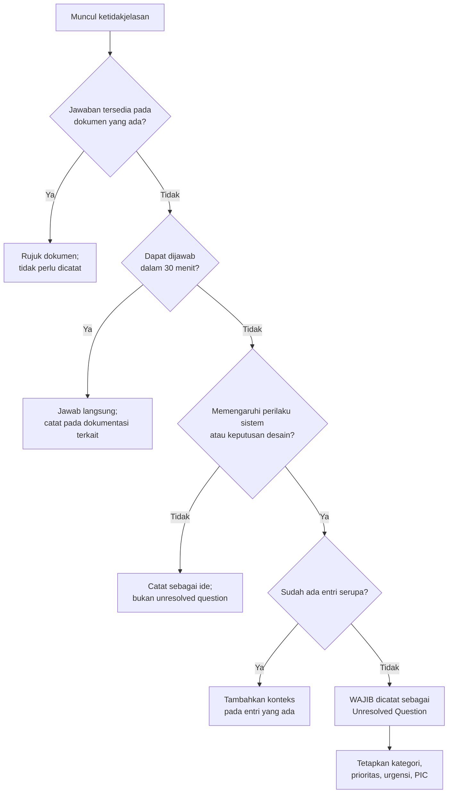
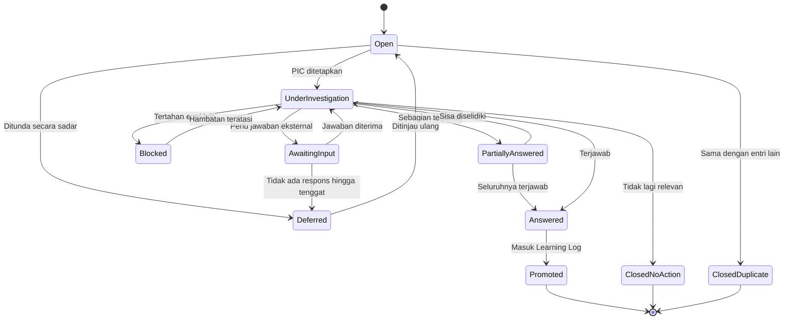
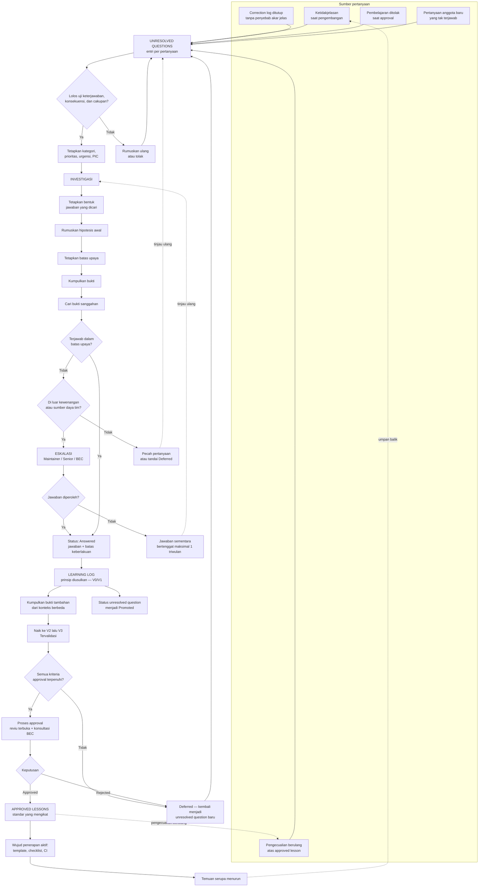

# Unresolved Questions

**Repositori Resmi Pertanyaan, Ketidakjelasan, dan Permasalahan yang Belum Terjawab**

| Atribut | Keterangan |
|---|---|
| Nama dokumen | `unresolved-questions.md` |
| Versi | 1.0 |
| Tanggal berlaku | 21 Juli 2026 |
| Pemilik dokumen | Repository Maintainer |
| Dokumen pasangan | `correction-log.md` v1.0, `learning-log.md` v1.0, `approved-lessons.md` v1.0 |
| Siklus peninjauan | Dwimingguan |
| Peninjauan berikutnya | 4 Agustus 2026 |
| Pembaca sasaran | AI Engineer, Developer, Repository Maintainer, Business Excellence Center (BEC), mahasiswa magang |
| Status | Backlog pengetahuan aktif |

> [!NOTE]
> Dokumen ini adalah **backlog pengetahuan**, bukan daftar tugas. Isinya adalah hal-hal yang belum kita ketahui, bukan pekerjaan yang belum kita kerjakan. Permintaan fitur, tugas teknis, dan pekerjaan terjadwal dikelola melalui mekanisme backlog pekerjaan yang terpisah.

> [!NOTE]
> Dokumen ini adalah standar pada tingkat repository. Dokumen ini **bukan** kebijakan resmi perusahaan dan tidak menggantikan pedoman, SOP, atau instruksi kerja yang diterbitkan oleh Business Excellence Center. Jika ada pertentangan dengan dokumen resmi BEC, dokumen resmi BEC yang berlaku.

---

## Daftar Isi

1. [Tujuan Unresolved Questions](#1-tujuan-unresolved-questions)
2. [Kapan Sebuah Pertanyaan Harus Dicatat](#2-kapan-sebuah-pertanyaan-harus-dicatat)
3. [Kriteria Pertanyaan yang Layak Dimasukkan](#3-kriteria-pertanyaan-yang-layak-dimasukkan)
4. [Kategori Pertanyaan](#4-kategori-pertanyaan)
5. [Tingkat Prioritas](#5-tingkat-prioritas)
6. [Tingkat Urgensi](#6-tingkat-urgensi)
7. [Status Penyelesaian](#7-status-penyelesaian)
8. [Proses Investigasi](#8-proses-investigasi)
9. [Proses Eskalasi](#9-proses-eskalasi)
10. [Hubungan dengan Dokumen Lain](#10-hubungan-dengan-dokumen-lain)
11. [Prosedur Pembaruan Status Pertanyaan](#11-prosedur-pembaruan-status-pertanyaan)
12. [Best Practice Pengelolaan](#12-best-practice-pengelolaan)
13. [Kesalahan yang Harus Dihindari](#13-kesalahan-yang-harus-dihindari)
14. [Template Dokumentasi Pertanyaan](#14-template-dokumentasi-pertanyaan)
15. [Daftar Unresolved Questions](#15-daftar-unresolved-questions)
16. [Rekapitulasi dan Keterlacakan](#16-rekapitulasi-dan-keterlacakan)
17. [Glosarium](#17-glosarium)

---

## 1. Tujuan Unresolved Questions

Unresolved questions adalah repositori resmi semua pertanyaan, ketidakjelasan, kebutuhan, dan permasalahan yang belum memiliki jawaban atau keputusan selama proses pengembangan AI Multi-Agent, Custom Skill Claude, dokumentasi, maupun repository.

Rangkaian empat dokumen dalam repository ini menjawab pertanyaan yang berbeda dan berurutan.

| Dokumen | Pertanyaan yang dijawab | Sifat |
|---|---|---|
| `unresolved-questions.md` | **Apa yang belum kita ketahui?** | Prospektif |
| `correction-log.md` | Apa yang salah dan bagaimana diperbaiki? | Reaktif |
| `learning-log.md` | Apa yang kita pelajari dan bagaimana mencegahnya? | Reflektif |
| `approved-lessons.md` | Apa yang wajib kita lakukan mulai sekarang? | Normatif |

Tujuan penyusunan unresolved questions adalah sebagai berikut.

1. **Menjadikan ketidaktahuan sebagai objek yang terkelola.** Pertanyaan yang tidak tercatat akan diselesaikan berulang kali oleh orang berbeda dengan jawaban yang berbeda pula.
2. **Mencegah keputusan diam-diam.** Ketika sebuah ketidakjelasan tidak dicatat, setiap anggota tim akan mengisinya dengan asumsi masing-masing, dan asumsi tersebut mengeras menjadi perilaku sistem tanpa pernah diputuskan.
3. **Memisahkan yang belum diketahui dari yang telah diputuskan.** Pembaca dokumen standar berhak mengetahui batas keberlakuan pengetahuan tim.
4. **Menetapkan kepemilikan atas pertanyaan.** Setiap ketidakjelasan memiliki penanggung jawab, sehingga tidak menggantung tanpa batas waktu.
5. **Menjadi pemasok utama bagi learning log.** Pertanyaan yang telah diselidiki dan terjawab adalah sumber pembelajaran yang paling terstruktur, karena hipotesisnya dirumuskan sebelum bukti dikumpulkan.
6. **Menyediakan bahan pembelajaran bagi anggota baru.** Pertanyaan terbuka menunjukkan batas terdepan pengetahuan tim, dan adalah titik masuk yang baik bagi mahasiswa magang.
7. **Menjadi dasar permintaan klarifikasi kepada pihak eksternal.** Pertanyaan yang jawabannya berada di luar kewenangan tim dapat diajukan secara terhimpun kepada BEC atau pemilik proses.
8. **Mencegah pengulangan investigasi.** Pertanyaan yang pernah diselidiki dan tidak membuahkan hasil tetap dicatat, sehingga tidak diselidiki ulang tanpa pendekatan baru.

> [!WARNING]
> Bahaya terbesar bukanlah pertanyaan yang belum terjawab, melainkan pertanyaan yang **dijawab secara diam-diam oleh asumsi**. Sebuah ketidakjelasan yang tidak tercatat tetap akan memengaruhi perilaku sistem, hanya saja tanpa jejak keputusan dan tanpa penanggung jawab.

---

## 2. Kapan Sebuah Pertanyaan Harus Dicatat

Pertanyaan **wajib** dicatat pada kondisi berikut.

- [ ] Dua anggota tim memiliki pemahaman berbeda mengenai cara kerja yang seharusnya, dan perbedaan tersebut tidak dapat diselesaikan melalui rujukan dokumen yang ada.
- [ ] Sebuah keputusan desain diambil berdasarkan asumsi yang belum diuji.
- [ ] Correction log ditutup namun penyebab akarnya belum sepenuhnya dipahami.
- [ ] Sebuah pembelajaran ditolak atau ditunda pada proses approval karena bukti belum memadai.
- [ ] Perilaku agent tidak dapat dijelaskan, meskipun keluarannya kebetulan benar.
- [ ] Ada pertentangan antar dokumen sumber yang penyelesaiannya berada di luar kewenangan tim.
- [ ] Muncul kebutuhan pengguna yang belum jelas cara pemenuhannya.
- [ ] Sebuah approved lesson menerima pengecualian berulang, sehingga rumusannya patut dipertanyakan.
- [ ] Metrik yang digunakan untuk menilai mutu tidak lagi dipercaya mencerminkan mutu sebenarnya.
- [ ] Anggota baru mengajukan pertanyaan mendasar yang tidak dapat dijawab dengan rujukan dokumen.

Pertanyaan **tidak perlu** dicatat pada kondisi berikut.

- Jawabannya tersedia pada dokumentasi resmi dan hanya belum dibaca.
- Pertanyaan bersifat permintaan fitur yang telah jelas cara pengerjaannya.
- Pertanyaan dapat dijawab dalam waktu kurang dari tiga puluh menit oleh anggota tim mana pun.
- Pertanyaan bersifat preferensi pribadi tanpa konsekuensi terhadap perilaku sistem.
- Pertanyaan mengenai teknologi yang tidak digunakan dan tidak sedang dipertimbangkan.

### Diagram Penentuan Pencatatan



---

## 3. Kriteria Pertanyaan yang Layak Dimasukkan

### 3.1 Kriteria Wajib

Sebuah pertanyaan layak dimasukkan jika memenuhi **semua** kriteria berikut.

- [ ] **Dapat dijawab pada prinsipnya.** Ada bentuk bukti atau keputusan yang, jika diperoleh, akan menutup pertanyaan ini.
- [ ] **Memiliki konsekuensi yang dapat dijelaskan.** Jelas apa yang berbeda jika jawabannya A dibandingkan jika jawabannya B.
- [ ] **Belum terjawab pada dokumen mana pun** dalam repository maupun dokumen resmi BEC.
- [ ] **Dirumuskan sebagai pertanyaan**, bukan sebagai keluhan atau pernyataan ketidakpuasan.
- [ ] **Cakupannya terbatas.** Dapat diselidiki dalam satuan waktu yang wajar, tidak bersifat pertanyaan filosofis tanpa batas.

### 3.2 Kriteria Penguat

- [ ] Ada hipotesis awal yang dapat diuji.
- [ ] Pertanyaan menghalangi pekerjaan yang sedang berjalan.
- [ ] Jawabannya berpotensi menghasilkan approved lesson.
- [ ] Pertanyaan muncul berulang dari pihak yang berbeda.
- [ ] Ada pihak yang bersedia menjadi PIC.

### 3.3 Kriteria Penolakan

| Kondisi | Alasan penolakan | Tindakan pengganti |
|---|---|---|
| Tidak ada bukti yang dapat menutupnya | Akan menggantung selamanya | Rumuskan ulang menjadi pertanyaan yang dapat diuji |
| Berupa keluhan, misalnya "mengapa sistem ini rumit" | Tidak dapat diselidiki | Ubah menjadi pertanyaan spesifik mengenai satu komponen |
| Jawabannya tidak mengubah tindakan apa pun | Investigasi tidak bernilai | Catat sebagai keingintahuan, bukan backlog |
| Adalah permintaan fitur terselubung | Mengaburkan backlog pengetahuan | Alihkan ke backlog pekerjaan |
| Cakupannya terlalu luas | Tidak dapat diselesaikan | Pecah menjadi beberapa pertanyaan yang lebih sempit |
| Duplikat entri yang telah ada | Menyebarkan konteks investigasi | Tambahkan konteks pada entri asal |

### 3.4 Uji Kelayakan Rumusan

Sebuah rumusan pertanyaan dianggap layak jika lolos ketiga uji berikut.

| Uji | Pertanyaan penguji | Contoh gagal | Contoh lolos |
|---|---|---|---|
| **Uji keterjawaban** | Bukti apa yang akan menutup pertanyaan ini? | "Apakah arsitektur kita sudah baik?" | "Apakah kedalaman delegasi tiga tingkat menurunkan ketepatan jawaban dibanding dua tingkat?" |
| **Uji konsekuensi** | Apa yang berbeda antara jawaban A dan B? | "Berapa banyak skill yang ideal?" | "Pada jumlah skill berapa tingkat pemanggilan yang tepat mulai menurun?" |
| **Uji cakupan** | Dapatkah diselidiki dalam satu siklus kerja? | "Bagaimana mengelola pengetahuan perusahaan?" | "Kriteria apa yang menentukan sebuah dokumen layak masuk folder sumber agent?" |

---

## 4. Kategori Pertanyaan

| Kode | Kategori | Cakupan |
|---|---|---|
| `ARC` | Arsitektur Multi-Agent | Pembagian peran, orkestrasi, kedalaman delegasi, batas tanggung jawab antaragent |
| `PRM` | Prompt & Persona | Perumusan instruksi, batasan wewenang, penanganan ambiguitas |
| `SKL` | Desain Skill | Granularitas skill, strategi pemanggilan, batas antar skill |
| `KNW` | Manajemen Pengetahuan | Kurasi dokumen sumber, versi, arsip, prioritas rujukan |
| `EVL` | Evaluasi & Pengujian | Metrik mutu, penyusunan kasus uji, penilaian keandalan |
| `DOC` | Dokumentasi | Struktur, cakupan, dan pemeliharaan dokumentasi |
| `PRC` | Proses & Kolaborasi | Alur kerja, kewenangan, pelaporan, onboarding |
| `TEC` | Teknis & Infrastruktur | Kinerja, biaya, integrasi, otomatisasi |
| `SAF` | Keamanan & Kepatuhan | Kerahasiaan, batas wewenang agent, kepatuhan kebijakan |
| `BEX` | Business Excellence | Keselarasan dengan proses bisnis, kewenangan proses, kepemilikan dokumen |
| `SBR` | Second Brain Perusahaan | Pengelolaan pengetahuan organisasi jangka panjang, retensi, dan aksesibilitas |

> [!NOTE]
> Kategori `BEX` dan `SBR` khusus memuat pertanyaan yang jawabannya **tidak sepenuhnya berada dalam kewenangan tim repository**. Pertanyaan pada kedua kategori ini umumnya memerlukan eskalasi kepada Business Excellence Center atau pemilik proses terkait.

---

## 5. Tingkat Prioritas

Prioritas menyatakan **seberapa besar konsekuensi** jika pertanyaan ini tetap tidak terjawab.

| Prioritas | Nama | Kriteria | Konsekuensi jika dibiarkan |
|---|---|---|---|
| `Q1` | **Kritis** | Menghalangi pekerjaan yang sedang berjalan, atau menyangkut keandalan informasi dan keamanan | Pekerjaan terhenti, atau sistem beroperasi dengan risiko yang tidak dipahami |
| `Q2` | **Tinggi** | Memengaruhi keputusan arsitektur atau standar yang akan segera ditetapkan | Keputusan diambil berdasarkan asumsi yang belum diuji |
| `Q3` | **Sedang** | Memengaruhi efisiensi, keterpeliharaan, atau pengalaman pengguna | Pemborosan upaya yang berulang |
| `Q4` | **Rendah** | Bersifat memperdalam pemahaman tanpa konsekuensi langsung | Kesempatan belajar yang tertunda |

## 6. Tingkat Urgensi

Urgensi menyatakan **seberapa cepat jawaban dibutuhkan**, dan bersifat terpisah dari prioritas.

| Urgensi | Nama | Kriteria | Target investigasi dimulai |
|---|---|---|---|
| `U1` | **Segera** | Ada pekerjaan yang tertahan menunggu jawaban | ≤ 1 hari kerja |
| `U2` | **Mendesak** | Jawaban dibutuhkan sebelum tonggak pekerjaan berikutnya | ≤ 5 hari kerja |
| `U3` | **Terjadwal** | Jawaban dibutuhkan dalam triwulan berjalan | ≤ 20 hari kerja |
| `U4` | **Tidak terikat waktu** | Tidak ada tenggat; diselidiki saat kapasitas tersedia | Tanpa target |

### 6.1 Matriks Prioritas terhadap Urgensi

Kombinasi keduanya menentukan perlakuan terhadap sebuah pertanyaan.

| | `U1` Segera | `U2` Mendesak | `U3` Terjadwal | `U4` Tidak terikat |
|---|---|---|---|---|
| **`Q1` Kritis** | Investigasi langsung; hentikan pekerjaan terkait | Investigasi terjadwal pekan ini | Tinjau ulang urgensi; kemungkinan salah nilai | Tinjau ulang prioritas; kemungkinan salah nilai |
| **`Q2` Tinggi** | Investigasi langsung | Investigasi pekan ini | Masuk rencana triwulan | Tinjau ulang urgensi |
| **`Q3` Sedang** | Investigasi ringkas; tetapkan jawaban sementara | Masuk rencana triwulan | Masuk rencana triwulan | Backlog terbuka |
| **`Q4` Rendah** | Tetapkan jawaban sementara; jangan selidiki penuh | Backlog terbuka | Backlog terbuka | Backlog terbuka |

> [!WARNING]
> Kombinasi `Q1` dengan `U3` atau `U4` adalah **tanda penilaian yang keliru**. Sebuah pertanyaan yang konsekuensinya kritis namun tidak dianggap mendesak biasanya menandakan bahwa risikonya belum benar-benar dipahami. Repository Maintainer wajib meninjau ulang setiap entri dengan kombinasi tersebut.

---

## 7. Status Penyelesaian

| Status | Arti | Siapa yang menetapkan |
|---|---|---|
| `Open` | Tercatat, belum ada PIC atau belum dimulai | Pencatat |
| `Under Investigation` | Sedang diselidiki secara aktif | PIC |
| `Awaiting Input` | Menunggu jawaban pihak eksternal, misalnya BEC atau pemilik proses | PIC |
| `Blocked` | Tertahan oleh pertanyaan atau pekerjaan lain | PIC |
| `Partially Answered` | Sebagian terjawab; sisa pertanyaan dipecah menjadi entri baru | PIC |
| `Answered` | Terjawab; menunggu pemindahan ke learning log | PIC |
| `Promoted` | Jawabannya telah menjadi entri learning log | Repository Maintainer |
| `Deferred` | Ditunda secara sadar disertai alasan dan waktu peninjauan ulang | Repository Maintainer |
| `Closed — No Action` | Ditutup karena tidak lagi relevan | Repository Maintainer |
| `Closed — Duplicate` | Sama dengan entri lain; dirujuk ke ID asal | Repository Maintainer |

### Diagram Siklus Status



> [!NOTE]
> Status `Deferred` adalah status yang **terhormat**, bukan kegagalan. Menunda secara sadar disertai alasan dan waktu peninjauan jauh lebih baik daripada membiarkan entri berstatus `Open` tanpa perkembangan selama berbulan-bulan.

---

## 8. Proses Investigasi

**Jawaban singkat:** investigasi dimulai dari perumusan bentuk bukti yang dicari, bukan dari pengumpulan data. PIC menetapkan terlebih dahulu jawaban seperti apa yang akan dianggap memadai.

### 8.1 Tahapan

1. **Tetapkan bentuk jawaban yang dicari.** Tuliskan sebelum menyelidiki: "pertanyaan ini tertutup jika kami memperoleh ...". Langkah ini mencegah investigasi yang berkepanjangan tanpa titik henti.
2. **Rumuskan hipotesis awal.** Hipotesis tidak wajib benar; hipotesis berfungsi mengarahkan pencarian bukti. Hipotesis wajib dicatat sebelum bukti dikumpulkan agar dapat dinilai kejujurannya di kemudian hari.
3. **Tetapkan batas upaya.** Tentukan alokasi waktu maksimal. Jika batas tercapai tanpa jawaban, entri dieskalasi atau ditunda, tidak diperpanjang tanpa keputusan.
4. **Kumpulkan bukti.** Sumber dapat berupa eksperimen terkendali, penelusuran correction log, evaluasi berkala, dokumen sumber, atau konsultasi pihak berwenang.
5. **Cari bukti yang membantah hipotesis.** Wajib dilakukan sebelum menyatakan pertanyaan terjawab.
6. **Catat perkembangan secara berkala.** Setiap perkembangan dicatat pada kolom catatan perkembangan disertai tanggal, termasuk perkembangan yang berupa kebuntuan.
7. **Rumuskan jawaban beserta batas keberlakuannya.** Jawaban tanpa batas keberlakuan akan disalahterapkan.
8. **Tetapkan status `Answered`** dan usulkan pemindahan ke learning log.

### 8.2 Checklist Investigasi

- [ ] Bentuk jawaban yang dicari telah dituliskan sebelum investigasi dimulai
- [ ] Hipotesis awal tercatat beserta tanggalnya
- [ ] Batas upaya telah ditetapkan
- [ ] Bukti dikumpulkan dari setidaknya dua sumber berbeda
- [ ] Pencarian bukti sanggahan telah dilakukan
- [ ] Perkembangan dicatat setidaknya sekali per dua pekan
- [ ] Jawaban disertai batas keberlakuan
- [ ] Hasil investigasi diperiksa oleh pihak selain PIC

### 8.3 Aturan Batas Upaya

| Prioritas | Batas upaya awal | Perpanjangan |
|---|---|---|
| `Q1` | 5 hari kerja | Dapat diperpanjang satu kali dengan persetujuan Repository Maintainer |
| `Q2` | 10 hari kerja | Dapat diperpanjang satu kali |
| `Q3` | 15 hari kerja | Tidak diperpanjang; ditunda atau dipecah |
| `Q4` | Tanpa batas | — |

> [!WARNING]
> Investigasi yang melampaui batas upaya tanpa keputusan formal adalah pemborosan yang paling sulit terdeteksi, karena tampak seperti pekerjaan yang sedang berjalan. Ketika batas tercapai, PIC **wajib** memilih salah satu: mengeskalasi, memecah pertanyaan, atau menunda dengan alasan tertulis.

---

## 9. Proses Eskalasi

Eskalasi dilakukan ketika pertanyaan tidak dapat diselesaikan dengan sumber daya atau kewenangan yang dimiliki tim.

### 9.1 Pemicu Eskalasi

- [ ] Batas upaya investigasi telah tercapai tanpa jawaban yang memadai.
- [ ] Jawaban memerlukan keputusan yang berada di luar kewenangan tim repository.
- [ ] Jawaban memerlukan akses terhadap dokumen atau data yang tidak dimiliki tim.
- [ ] Ada pertentangan antar dokumen resmi yang penyelesaiannya adalah kewenangan pemilik proses.
- [ ] Pertanyaan berstatus `Awaiting Input` lebih dari dua puluh hari kerja tanpa respons.
- [ ] Pertanyaan berprioritas `Q1` tidak menunjukkan perkembangan selama dua siklus peninjauan berturut-turut.

### 9.2 Jalur Eskalasi

| Tingkat | Tujuan eskalasi | Untuk pertanyaan kategori | Bentuk pengajuan |
|---|---|---|---|
| **Tingkat 1** | Repository Maintainer | Semua kategori | Pembahasan pada peninjauan dwimingguan |
| **Tingkat 2** | Anggota senior bidang terkait | `ARC`, `TEC`, `PRM`, `SKL`, `EVL` | Sesi pembahasan teknis terjadwal |
| **Tingkat 3** | Business Excellence Center | `BEX`, `SBR`, `SAF`, `KNW` | Permohonan klarifikasi tertulis |
| **Tingkat 4** | Pemilik proses atau manajemen terkait | Pertanyaan yang memerlukan keputusan kebijakan | Melalui BEC, bukan langsung |

> [!WARNING]
> Tim repository **tidak berwenang** memutuskan sendiri persoalan yang menyangkut substansi proses bisnis, kepemilikan dokumen, atau kebijakan perusahaan. Pertanyaan semacam ini wajib dieskalasi kepada Business Excellence Center, dan tim tidak boleh mengisi kekosongan jawaban dengan asumsi sendiri.

### 9.3 Aturan Pengajuan Eskalasi

Setiap pengajuan eskalasi wajib memuat unsur berikut.

1. Rumusan pertanyaan dalam satu kalimat.
2. Ringkasan investigasi yang telah dilakukan beserta hasilnya.
3. Penjelasan mengapa tim tidak dapat menyelesaikannya sendiri.
4. Pilihan jawaban yang mungkin, jika tersedia, beserta konsekuensi masing-masing.
5. Dampak jika pertanyaan tetap tidak terjawab.
6. Tenggat yang diharapkan beserta alasannya.

### 9.4 Jawaban Sementara

Jika eskalasi belum memperoleh jawaban sementara pekerjaan harus tetap berjalan, PIC dapat mengusulkan **jawaban sementara** kepada Repository Maintainer, dengan ketentuan berikut.

- [ ] Jawaban sementara ditandai secara eksplisit sebagai bersifat sementara pada semua dokumen yang merujuknya.
- [ ] Ditetapkan tanggal peninjauan ulang, maksimal satu triwulan.
- [ ] Dicatat konsekuensi yang harus dibatalkan jika jawaban resmi ternyata berbeda.
- [ ] Jawaban sementara **tidak boleh** diangkat menjadi approved lesson.

---

## 10. Hubungan dengan Dokumen Lain

Keempat dokumen membentuk satu daur pengetahuan yang tertutup.

| Aspek | Unresolved Questions | Correction Log | Learning Log | Approved Lessons |
|---|---|---|---|---|
| Isi | Yang belum diketahui | Kejadian salah | Prinsip yang diusulkan | Standar yang berlaku |
| Sifat | Prospektif | Reaktif | Reflektif | Normatif |
| Keterikatan | Tidak mengikat | Tidak mengikat | Anjuran | Wajib diikuti |
| Penanda kemajuan | `Open` hingga `Promoted` | `Open` hingga `Closed` | `V0` hingga `V4` | `Approved` hingga `Retired` |
| Peninjauan | Dwimingguan | Bulanan | Bulanan | Triwulanan |
| Volume ideal | Sedang dan terkendali | Banyak | Sedang | Sedikit dan terpilih |

**Aturan keterkaitan:**

1. Correction log yang ditutup tanpa penyebab akar yang jelas **wajib** melahirkan entri unresolved question.
2. Pembelajaran yang ditolak atau ditunda pada proses approval **wajib** dikembalikan sebagai unresolved question yang merumuskan bukti apa yang masih kurang.
3. Unresolved question yang terjawab **tidak** langsung menjadi approved lesson; jawabannya wajib melewati learning log terlebih dahulu.
4. Setiap entri learning log yang berasal dari investigasi **wajib** mencantumkan ID unresolved question asalnya.
5. Approved lesson yang menerima pengecualian tiga kali atau lebih **wajib** melahirkan unresolved question mengenai ketepatan rumusannya.
6. Unresolved question **tidak** memuat jawaban; begitu terjawab, isinya dipindahkan ke learning log dan entri ditandai `Promoted`.

### Diagram Alur Unresolved Questions → Investigation → Learning Log → Approved Lessons



---

## 11. Prosedur Pembaruan Status Pertanyaan

### 11.1 Peninjauan Dwimingguan

Repository Maintainer meninjau semua entri aktif setiap dua pekan dengan memeriksa butir berikut.

- [ ] Apakah setiap entri berstatus `Open` telah memiliki PIC?
- [ ] Apakah entri berstatus `Under Investigation` menunjukkan perkembangan sejak peninjauan terakhir?
- [ ] Apakah ada entri yang telah melampaui batas upaya tanpa keputusan?
- [ ] Apakah ada entri berstatus `Awaiting Input` lebih dari dua puluh hari kerja?
- [ ] Apakah ada kombinasi prioritas dan urgensi yang tidak wajar, misalnya `Q1` dengan `U4`?
- [ ] Apakah ada entri berstatus `Answered` yang belum dipindahkan ke learning log?
- [ ] Apakah ada entri yang telah menjadi tidak relevan?
- [ ] Apakah jumlah entri aktif masih terkendali?

### 11.2 Aturan Pembaruan

| Ketentuan | Aturan |
|---|---|
| Frekuensi pencatatan perkembangan | Setidaknya sekali per dua pekan untuk entri `Under Investigation` |
| Perubahan prioritas atau urgensi | Wajib disertai alasan tertulis pada catatan perkembangan |
| Perubahan PIC | Wajib disertai serah terima ringkasan investigasi |
| Entri tanpa perkembangan dua siklus | Wajib ditunda secara formal atau dieskalasi |
| Entri berstatus `Answered` | Wajib dipindahkan ke learning log dalam sepuluh hari kerja |
| Entri berstatus `Deferred` | Wajib memiliki tanggal peninjauan ulang |

### 11.3 Aturan Riwayat

- Entri yang ditutup **tidak boleh dihapus**; riwayat pertanyaan yang pernah diajukan bernilai bagi anggota baru.
- Catatan perkembangan bersifat menambah, bukan mengganti. Perkembangan lama tetap terbaca.
- Hipotesis awal **tidak boleh disunting** setelah bukti mulai dikumpulkan, agar ketepatan dugaan tim dapat dinilai secara jujur.
- Nomor ID tidak pernah digunakan ulang.

> [!WARNING]
> Menyunting hipotesis awal agar tampak sesuai dengan temuan akhir adalah bentuk pemalsuan catatan yang paling halus dan paling sering terjadi. Hipotesis yang keliru adalah catatan yang berharga, bukan aib yang perlu ditutupi.

---

## 12. Best Practice Pengelolaan

1. **Rumuskan pertanyaan, bukan keluhan.** "Mengapa pemanggilan skill tidak konsisten" dapat diselidiki; "skill ini bermasalah" tidak.
2. **Catat hipotesis sebelum menyelidiki.** Hipotesis yang dicatat belakangan selalu terlihat benar dan karenanya tidak bernilai.
3. **Tetapkan batas upaya sejak awal.** Investigasi tanpa titik henti akan menghabiskan kapasitas tanpa menghasilkan keputusan.
4. **Jaga jumlah entri aktif tetap terkendali.** Backlog yang memuat lebih dari tiga puluh entri aktif cenderung tidak dibaca. Tunda secara sadar entri berprioritas rendah.
5. **Catat kebuntuan sebagai perkembangan.** Mengetahui bahwa suatu pendekatan tidak membuahkan hasil menghemat waktu orang berikutnya.
6. **Pisahkan prioritas dari urgensi.** Menggabungkan keduanya menyebabkan pertanyaan penting namun tidak mendesak terabaikan selamanya.
7. **Tetapkan PIC untuk setiap entri.** Pertanyaan tanpa penanggung jawab adalah pertanyaan yang tidak akan pernah diselidiki.
8. **Eskalasikan lebih awal.** Menahan pertanyaan yang jelas berada di luar kewenangan tim hanya menunda jawabannya.
9. **Gunakan pertanyaan terbuka sebagai bahan onboarding.** Mahasiswa magang memperoleh pemahaman terbaik dengan menyelidiki entri berprioritas `Q3` atau `Q4`.
10. **Tandai jawaban sementara secara jelas.** Jawaban sementara yang tidak ditandai akan mengeras menjadi standar tanpa pernah diputuskan.
11. **Tinjau secara dwimingguan tanpa kecuali.** Backlog pengetahuan yang tidak ditinjau akan berubah menjadi arsip mati.
12. **Rujuk silang antar entri.** Pertanyaan sering saling terkait, dan jawaban atas satu entri kerap menutup entri lainnya.

---

## 13. Kesalahan yang Harus Dihindari

> [!WARNING]
> Praktik berikut membuat unresolved questions berubah menjadi tumpukan catatan yang tidak pernah dibuka.

| Kesalahan | Mengapa bermasalah | Yang seharusnya dilakukan |
|---|---|---|
| Membiarkan pertanyaan tidak tercatat | Ketidakjelasan tetap dijawab oleh asumsi, tanpa jejak keputusan | Catat setiap ketidakjelasan yang memengaruhi perilaku sistem |
| Merumuskan pertanyaan yang tidak dapat dijawab | Entri akan menggantung selamanya | Terapkan uji keterjawaban sebelum mencatat |
| Menyelidiki tanpa batas upaya | Kapasitas terkuras tanpa keputusan, dan tampak seperti kemajuan | Tetapkan batas upaya sejak awal |
| Mencatat hipotesis setelah bukti terkumpul | Menghilangkan kemampuan menilai ketepatan dugaan tim | Catat hipotesis sebelum menyelidiki, dan jangan disunting |
| Menumpuk entri tanpa penundaan sadar | Backlog menjadi terlalu panjang untuk dibaca | Tunda secara formal entri berprioritas rendah |
| Membiarkan entri tanpa PIC | Tidak ada yang merasa bertanggung jawab | Tetapkan PIC pada peninjauan dwimingguan |
| Menggabungkan prioritas dan urgensi | Pertanyaan penting namun tidak mendesak terabaikan | Nilai keduanya secara terpisah |
| Mengisi kekosongan jawaban dengan asumsi tim | Melampaui kewenangan, terutama untuk substansi proses bisnis | Eskalasikan kepada BEC; gunakan jawaban sementara yang ditandai |
| Menahan eskalasi karena merasa harus menyelesaikan sendiri | Menunda jawaban tanpa manfaat | Eskalasikan segera setelah pemicu terpenuhi |
| Membiarkan jawaban sementara tanpa tenggat | Jawaban sementara mengeras menjadi standar diam-diam | Tetapkan tanggal peninjauan maksimal satu triwulan |
| Mencampurkan permintaan fitur | Mengaburkan backlog pengetahuan dengan backlog pekerjaan | Alihkan ke mekanisme backlog pekerjaan |
| Menghapus entri yang ditutup | Menghilangkan riwayat; pertanyaan yang sama diajukan ulang | Tandai `Closed` disertai alasan; jangan dihapus |
| Memindahkan jawaban langsung ke approved lessons | Standar ditetapkan tanpa pembuktian yang memadai | Lewati learning log terlebih dahulu |
| Menutup entri hanya karena bosan menunggu | Pertanyaan akan muncul kembali dengan biaya lebih besar | Gunakan status `Deferred` disertai tanggal peninjauan |

---

## 14. Template Dokumentasi Pertanyaan

### 14.1 Aturan Penomoran ID

Format ID: `UQ-<KATEGORI>-<NNN>`

- `UQ` — penanda tetap *Unresolved Question*.
- `<KATEGORI>` — kode kategori tiga huruf (lihat Bagian 4).
- `<NNN>` — nomor urut tiga digit dalam kategori tersebut, dimulai dari `001`.

Contoh: `UQ-ARC-002` adalah pertanyaan kedua pada kategori Arsitektur Multi-Agent.

### 14.2 Template Ringkas (tabel registri)

```markdown
| ID Pertanyaan | Tanggal | Judul Pertanyaan | Latar Belakang | Deskripsi Permasalahan | Dampak terhadap Repository | Hipotesis Awal | Prioritas | Status | PIC | Target Penyelesaian | Referensi Terkait | Catatan Perkembangan |
|---|---|---|---|---|---|---|---|---|---|---|---|---|
| UQ-XXX-NNN | YYYY-MM-DD | Pertanyaan yang dapat diselidiki | Konteks yang melatarbelakangi | Ketidakjelasan yang dihadapi | Akibat jika tetap tidak terjawab | Dugaan awal atau "belum ada" | Q1/Q2/Q3/Q4 | Open / Under Investigation / ... | Peran-Inisial | YYYY-MM-DD | ID dokumen terkait | YYYY-MM-DD: perkembangan |
```

### 14.3 Template Rinci (wajib untuk prioritas `Q1` dan `Q2`)

```markdown
### UQ-XXX-NNN — <Judul Pertanyaan>

| Field | Isi |
|---|---|
| ID Pertanyaan | UQ-XXX-NNN |
| Tanggal dicatat | YYYY-MM-DD |
| Pencatat | Peran-Inisial |
| Kategori | ARC / PRM / SKL / KNW / EVL / DOC / PRC / TEC / SAF / BEX / SBR |
| Prioritas | Q1 / Q2 / Q3 / Q4 |
| Urgensi | U1 / U2 / U3 / U4 |
| Status | Open / Under Investigation / Awaiting Input / Blocked / Partially Answered / Answered / Promoted / Deferred / Closed |
| PIC | Peran-Inisial |
| Target penyelesaian | YYYY-MM-DD |
| Batas upaya | <jumlah hari kerja> |
| Referensi terkait | CL-XXX-YYYYMM-NNN / LL-XXX-YYYYMM-NNN / AL-XXX-NNN / UQ-XXX-NNN |

**Judul pertanyaan**
<Dirumuskan sebagai pertanyaan yang dapat diselidiki.>

**Latar belakang**
<Konteks yang diperlukan pembaca yang tidak terlibat langsung.>

**Deskripsi permasalahan**
<Ketidakjelasan yang dihadapi dan mengapa belum dapat dijawab dengan dokumen yang ada.>

**Dampak terhadap repository**
<Akibat konkret jika pertanyaan ini tetap tidak terjawab.>

**Hipotesis awal**
<Dugaan sebelum investigasi dimulai. Ditulis sebelum bukti dikumpulkan dan tidak boleh disunting kemudian. Tulis "belum ada" jika memang belum ada dugaan.>

**Bentuk jawaban yang dicari**
<Pertanyaan ini dinyatakan tertutup jika diperoleh ...>

**Rencana investigasi**
1.
2.
3.

**Catatan perkembangan**
| Tanggal | Perkembangan | Oleh |
|---|---|---|
| YYYY-MM-DD | <Perkembangan, termasuk kebuntuan.> | Peran-Inisial |
```

---

## 15. Daftar Unresolved Questions

Semua entri berikut adalah ilustrasi berdasarkan situasi umum pengembangan repository AI Multi-Agent, Custom Skill Claude, Business Excellence, Knowledge Management, dan Second Brain perusahaan. Entri ini bersifat **ilustratif** dan bukan catatan resmi.

### 15.1 Registri Ringkas

| ID Pertanyaan | Tanggal | Judul Pertanyaan | Latar Belakang | Deskripsi Permasalahan | Dampak terhadap Repository | Hipotesis Awal | Prioritas | Status | PIC | Target Penyelesaian | Referensi Terkait | Catatan Perkembangan |
|---|---|---|---|---|---|---|---|---|---|---|---|---|
| UQ-SKL-001 | 2026-06-15 | Pada jumlah skill berapa ketepatan pemanggilan mulai menurun secara berarti? | Jumlah custom skill bertambah dari tiga menjadi sembilan dalam satu triwulan | Belum diketahui apakah penurunan ketepatan bersifat bertahap atau memiliki titik patah tertentu, sehingga belum ada dasar membatasi jumlah skill | Penambahan skill dilakukan tanpa dasar; risiko penurunan mutu tidak terdeteksi hingga terlambat | Ketepatan menurun tajam setelah melampaui sekitar dua belas skill, terutama bila deskripsi beririsan | Q2 | Under Investigation | AI Engineer-RS | 2026-08-14 | AL-SKL-002, CL-SKL-202607-006 | 2026-07-08: pengujian pada 3, 6, dan 9 skill menunjukkan penurunan landai dari 96 ke 91 persen. 2026-07-18: penurunan tampak lebih berkaitan dengan irisan deskripsi daripada jumlah; hipotesis awal kemungkinan keliru |
| UQ-ARC-001 | 2026-06-22 | Berapa kedalaman delegasi maksimal sebelum ketepatan jawaban menurun? | Batas dua tingkat ditetapkan berdasarkan pertimbangan waktu jawab, bukan mutu | Belum diketahui apakah batas dua tingkat juga optimal dari sisi ketepatan, atau justru membatasi kasus yang memerlukan penelusuran lebih dalam | Batas arsitektur berlaku tanpa dasar mutu; kemungkinan terlalu longgar atau terlalu ketat | Ketepatan menurun mulai tingkat ketiga karena konteks permintaan asli memudar pada setiap penerusan | Q2 | Under Investigation | Developer-AP | 2026-08-07 | AL-ARC-001, AL-TEC-001 | 2026-07-14: pengujian tiga tingkat menunjukkan ketepatan turun 7 poin persen, namun ukuran sampel baru 20 permintaan sehingga belum meyakinkan |
| UQ-EVL-001 | 2026-06-29 | Metrik apa yang paling andal mencerminkan mutu jawabaan agent bagi pengguna nonteknis? | Penilaian mutu saat ini menggunakan ketepatan faktual dan tingkat pemanggilan skill | Kedua metrik tidak menangkap keterbacaan dan kesesuaian format, padahal keduanya paling sering dikeluhkan pengguna | Perbaikan mutu terarah pada aspek yang tidak dirasakan pengguna | Kesesuaian panjang jawaban terhadap jenis pertanyaan lebih berkorelasi dengan kepuasan dibanding ketepatan faktual, sepanjang ketepatan berada di atas ambang tertentu | Q2 | Awaiting Input | AI Engineer-RS | 2026-08-21 | AL-PRM-002, AL-EVL-001 | 2026-07-16: kuesioner ringkas diedarkan kepada 12 pengguna internal; menunggu pengembalian |
| UQ-KNW-001 | 2026-07-02 | Kriteria apa yang menentukan sebuah dokumen layak masuk folder sumber agent? | Folder sumber diisi oleh beberapa pihak tanpa kriteria tertulis | Belum ada kriteria yang membedakan dokumen rujukan, dokumen kerja, dan dokumen usang, sehingga folder bertambah tanpa kendali | Mutu jawaban menurun seiring bertambahnya dokumen yang tidak relevan; sulit menelusuri sumber jawaban | Dokumen layak masuk jika telah disahkan, masih berlaku, dan memiliki pemilik proses yang jelas | Q2 | Awaiting Input | Repo Maintainer-DL | 2026-08-28 | AL-KNW-001, CL-DAT-202607-004 | 2026-07-10: permohonan klarifikasi diajukan kepada BEC mengenai definisi dokumen yang telah disahkan |
| UQ-BEX-001 | 2026-07-06 | Siapa pemilik proses yang berwenang menyatakan sebuah dokumen internal telah tidak berlaku? | Ditemukan dua versi pedoman dengan isi berbeda pada folder sumber | Tim repository tidak berwenang menetapkan versi mana yang berlaku, dan belum diketahui pihak mana yang berwenang | Agent berpotensi mengutip dokumen yang tidak lagi berlaku; risiko informasi menyesatkan | Kewenangan berada pada pemilik proses masing-masing, dengan BEC sebagai pengelola daftar induk dokumen | Q1 | Awaiting Input | Repo Maintainer-DL | 2026-08-05 | UQ-KNW-001, CL-DAT-202607-004 | 2026-07-10: permohonan klarifikasi tertulis diajukan kepada BEC. 2026-07-20: belum ada respons; akan diingatkan pada pekan berikutnya |
| UQ-SAF-001 | 2026-07-09 | Sejauh mana agent boleh merangkum dokumen internal ke dalam keluaran yang dapat disalin pengguna? | Agent digunakan untuk membantu memahami dokumen proses bisnis | Belum jelas batas antara menjelaskan isi dokumen dan menyalin isi dokumen, terutama untuk dokumen berklasifikasi terbatas | Risiko penyebaran isi dokumen internal melampaui kelompok yang berhak; batas wewenang agent tidak dapat ditetapkan | Batas ditentukan oleh klasifikasi dokumen, bukan oleh panjang kutipan; dokumen terbatas hanya boleh dijelaskan, tidak dikutip | Q1 | Under Investigation | Repo Maintainer-DL | 2026-08-08 | AL-SAF-001, AL-SAF-002 | 2026-07-15: inventarisasi klasifikasi dokumen pada folder sumber dimulai; 3 dari 24 dokumen belum memiliki penanda klasifikasi |
| UQ-SBR-001 | 2026-07-11 | Bagaimana pengetahuan yang tersimpan pada repository ini dipertahankan ketika semua anggota tim berganti? | Repository dikembangkan oleh tim kecil dengan pengetahuan tersirat yang besar | Belum diketahui bagian pengetahuan mana yang benar-benar terdokumentasi dan bagian mana yang masih bergantung pada ingatan individu | Risiko kehilangan pengetahuan pada pergantian personel; kesinambungan second brain perusahaan tidak terjamin | Sekitar sepertiga pengetahuan operasional belum terdokumentasi, terutama alasan di balik keputusan yang ditolak | Q2 | Open | Repo Maintainer-DL | 2026-09-11 | AL-PRC-001 | 2026-07-11: dicatat setelah pembahasan kesinambungan tim; belum ada investigasi |
| UQ-SBR-002 | 2026-07-13 | Berapa lama sebuah entri pengetahuan layak dipertahankan sebelum ditinjau relevansinya? | Keempat dokumen pengetahuan repository terus bertambah tanpa mekanisme penyusutan | Belum ada dasar menentukan masa berlaku sebuah entri, sehingga dokumen berpotensi tumbuh melampaui kemampuan baca tim | Dokumen pengetahuan menjadi terlalu panjang dan ditinggalkan penggunanya | Masa tinjau yang berbeda per jenis dokumen lebih tepat dibanding masa berlaku tunggal, karena laju keusangan tiap jenis berbeda | Q3 | Open | Repo Maintainer-DL | 2026-09-30 | — | 2026-07-13: dicatat saat penyusunan siklus peninjauan; hipotesis belum diuji |
| UQ-PRM-001 | 2026-07-15 | Apakah penambahan larangan pada persona memiliki titik jenuh yang menurunkan kegunaan agent? | Larangan pada persona bertambah seiring temuan pada correction log | Belum diketahui apakah penumpukan larangan pada suatu titik membuat agent terlalu berhati-hati dan menolak menjawab pertanyaan yang sah | Persona berkembang tanpa dasar; risiko agent menjadi tidak berguna secara bertahap dan tidak terdeteksi | Ada titik jenuh, dan gejalanya berupa meningkatnya penolakan menjawab pada pertanyaan yang jawabannya tersedia | Q2 | Under Investigation | AI Engineer-RS | 2026-08-14 | AL-PRM-001, AL-PRM-002 | 2026-07-20: kasus uji kontrol diperluas dari 5 menjadi 20 pertanyaan untuk memantau penolakan berlebihan |
| UQ-TEC-001 | 2026-07-16 | Berapa biaya komputasi tambahan yang dapat diterima untuk setiap satu poin persen peningkatan ketepatan? | Peningkatan mutu umumnya diperoleh melalui penambahan agent atau pemanggilan berulang | Belum ada ambang yang disepakati, sehingga setiap usulan peningkatan mutu diperdebatkan kasus per kasus | Keputusan peningkatan mutu diambil tanpa dasar yang konsisten; perdebatan berulang pada setiap usulan | Ambang yang wajar berbeda menurut kategori pertanyaan; pertanyaan berisiko tinggi layak memperoleh anggaran lebih besar | Q3 | Open | Developer-AP | 2026-09-15 | AL-TEC-001, UQ-ARC-001 | 2026-07-16: dicatat setelah perdebatan mengenai usulan pemanggilan berulang; belum ada investigasi |
| UQ-DOC-001 | 2026-07-17 | Bagaimana mengukur apakah dokumentasi benar-benar dibaca dan digunakan? | Empat dokumen pengetahuan telah disusun dengan upaya besar | Belum ada cara mengetahui apakah dokumen dirujuk saat pengambilan keputusan, atau hanya disusun lalu ditinggalkan | Upaya penyusunan dokumentasi berpotensi sia-sia tanpa diketahui | Frekuensi penyebutan ID entri pada pembahasan reviu adalah penanda penggunaan yang lebih jujur dibanding survei | Q3 | Open | Repo Maintainer-DL | 2026-09-30 | AL-DOC-001 | 2026-07-17: dicatat pada peninjauan dwimingguan; usulan mencatat penyebutan ID pada notulen reviu |
| UQ-PRC-001 | 2026-07-19 | Sejauh mana mahasiswa magang dapat diberi kewenangan mengubah dokumen pengetahuan? | Mahasiswa magang berkontribusi mencatat hambatan onboarding | Belum jelas batas kewenangan mereka, terutama untuk menyunting entri yang telah ditutup atau disetujui | Kontribusi terhambat karena keraguan kewenangan, atau sebaliknya terjadi perubahan tanpa pengawasan memadai | Kewenangan menambah entri baru dapat diberikan penuh, sedangkan penyuntingan entri yang telah disetujui memerlukan pendampingan | Q3 | Deferred | Repo Maintainer-DL | 2026-10-01 | AL-PRC-001 | 2026-07-19: ditunda hingga gelombang magang berikutnya agar keputusan didasarkan pada pengamatan nyata |
| UQ-EVL-002 | 2026-07-20 | Apakah kasus uji yang disusun oleh pembuat persona memiliki bias yang menutupi kelemahan? | Kumpulan kasus uji disusun oleh AI Engineer yang juga menyusun persona | Belum diketahui apakah kasus uji tanpa sadar menghindari kelemahan yang diketahui penyusunnya | Evaluasi berpotensi memberi nilai lebih tinggi dari mutu sebenarnya | Ada bias; kasus uji yang disusun pihak lain akan menemukan kelemahan berbeda | Q2 | Open | Repo Maintainer-DL | 2026-08-28 | AL-EVL-001, UQ-EVL-001 | 2026-07-20: dicatat pada peninjauan dwimingguan; direncanakan uji banding dengan kasus uji yang disusun mahasiswa magang |

### 15.2 Entri Rinci — Prioritas `Q1`

#### UQ-BEX-001 — Siapa pemilik proses yang berwenang menyatakan sebuah dokumen internal telah tidak berlaku?

| Field | Isi |
|---|---|
| ID Pertanyaan | UQ-BEX-001 |
| Tanggal dicatat | 2026-07-06 |
| Pencatat | AI Engineer-RS |
| Kategori | BEX — Business Excellence |
| Prioritas | Q1 — Kritis |
| Urgensi | U2 — Mendesak |
| Status | Awaiting Input |
| PIC | Repo Maintainer-DL |
| Target penyelesaian | 2026-08-05 |
| Batas upaya | 5 hari kerja upaya tim; sisanya bergantung pada respons eksternal |
| Referensi terkait | UQ-KNW-001, CL-DAT-202607-004, AL-KNW-001 |

**Judul pertanyaan**

Siapa pemilik proses yang berwenang menyatakan bahwa sebuah dokumen internal telah tidak berlaku, dan melalui mekanisme apa pernyataan tersebut disampaikan kepada pengelola folder sumber agent?

**Latar belakang**

Pada 17 Juli 2026 ditemukan dua berkas pedoman proses bisnis dengan judul sama namun isi berbeda pada folder sumber agent, sebagaimana tercatat pada `CL-DAT-202607-004`. Perbaikan sementara dilakukan dengan memindahkan versi yang lebih lama ke folder arsip berdasarkan tanggal unggah. Namun tanggal unggah bukan penanda keberlakuan, melainkan sekadar penanda waktu masuk berkas ke dalam folder.

**Deskripsi permasalahan**

Tim repository memindahkan versi lama ke arsip berdasarkan penilaian sendiri. Penilaian tersebut melampaui kewenangan tim, karena penetapan berlaku atau tidaknya sebuah dokumen internal adalah kewenangan pemilik proses, bukan pengelola repository. Sampai saat ini belum diketahui pihak mana yang berwenang menyatakan sebuah dokumen tidak berlaku, dan belum diketahui pula apakah ada daftar induk dokumen yang memuat status keberlakuan.

Pertanyaan ini tidak dapat dijawab dari dokumen yang tersedia pada Project Knowledge, karena tidak ditemukan dokumen yang mengatur mekanisme pencabutan dokumen internal.

**Dampak terhadap repository**

Selama pertanyaan ini belum terjawab, agent berpotensi mengutip dokumen yang secara resmi telah dicabut namun masih tersimpan pada folder sumber. Risiko ini bersifat kritis karena pengguna nonteknis dapat mengutip isi dokumen tersebut dalam korespondensi resmi. Selain itu, tim repository saat ini menjalankan keputusan arsip berdasarkan asumsi, yang bertentangan dengan prinsip bahwa tim tidak berwenang menetapkan status dokumen resmi.

**Hipotesis awal**

*Dicatat pada 2026-07-06, sebelum investigasi dimulai. Tidak disunting.*

Kewenangan menyatakan dokumen tidak berlaku berada pada pemilik proses masing-masing, dengan Business Excellence Center bertindak sebagai pengelola daftar induk dokumen. Diduga daftar induk tersebut telah ada namun belum pernah dibagikan kepada tim repository.

**Bentuk jawaban yang dicari**

Pertanyaan ini dinyatakan tertutup jika diperoleh salah satu dari berikut: (a) penunjukan tertulis mengenai pihak yang berwenang beserta mekanisme penyampaiannya, atau (b) akses terhadap daftar induk dokumen yang memuat status keberlakuan, atau (c) pernyataan resmi bahwa mekanisme tersebut belum ada, sehingga tim dapat mengusulkan mekanisme sementara.

**Rencana investigasi**

1. Menelusuri semua dokumen pada Project Knowledge untuk mencari pengaturan mengenai pencabutan dokumen. *(Selesai; tidak ditemukan.)*
2. Menginventarisasi semua dokumen pada folder sumber beserta indikasi versinya. *(Selesai; 24 dokumen, 3 di antaranya berpotensi ganda.)*
3. Mengajukan permohonan klarifikasi tertulis kepada Business Excellence Center. *(Selesai; diajukan 2026-07-10.)*
4. Menunggu respons dan mengingatkan jika melampaui sepuluh hari kerja.
5. Jika tidak memperoleh respons hingga 2026-08-05, mengusulkan jawaban sementara berupa mekanisme penandaan status pada nama berkas, bertenggat satu triwulan.

**Catatan perkembangan**

| Tanggal | Perkembangan | Oleh |
|---|---|---|
| 2026-07-06 | Entri dicatat setelah penutupan `CL-DAT-202607-004`; hipotesis awal ditetapkan | AI Engineer-RS |
| 2026-07-08 | Penelusuran Project Knowledge selesai; tidak ditemukan dokumen yang mengatur pencabutan dokumen internal | AI Engineer-RS |
| 2026-07-09 | Inventarisasi folder sumber selesai; 24 dokumen, 3 berpotensi ganda, 3 tanpa penanda klasifikasi | AI Engineer-RS |
| 2026-07-10 | Permohonan klarifikasi tertulis diajukan kepada BEC; status diubah menjadi `Awaiting Input` | Repo Maintainer-DL |
| 2026-07-20 | Belum ada respons setelah delapan hari kerja; pengingat direncanakan pada 2026-07-24 | Repo Maintainer-DL |

### 15.3 Entri Rinci — Prioritas `Q2` dengan Hipotesis yang Terbantah

#### UQ-SKL-001 — Pada jumlah skill berapa ketepatan pemanggilan mulai menurun secara berarti?

| Field | Isi |
|---|---|
| ID Pertanyaan | UQ-SKL-001 |
| Tanggal dicatat | 2026-06-15 |
| Pencatat | AI Engineer-RS |
| Kategori | SKL — Desain Skill |
| Prioritas | Q2 — Tinggi |
| Urgensi | U2 — Mendesak |
| Status | Under Investigation |
| PIC | AI Engineer-RS |
| Target penyelesaian | 2026-08-14 |
| Batas upaya | 10 hari kerja |
| Referensi terkait | AL-SKL-001, AL-SKL-002, CL-SKL-202607-006, CL-SKL-202607-009 |

**Judul pertanyaan**

Pada jumlah custom skill berapa ketepatan pemanggilan otomatis mulai menurun secara berarti, dan apakah penurunan tersebut bersifat bertahap atau memiliki titik patah yang jelas?

**Latar belakang**

Jumlah custom skill pada repository bertambah dari tiga menjadi sembilan dalam satu triwulan. Penambahan dilakukan berdasarkan kebutuhan yang muncul, tanpa pertimbangan mengenai batas jumlah. Dua correction log, yaitu `CL-SKL-202607-006` dan `CL-SKL-202607-009`, mencatat pemanggilan yang tidak konsisten setelah jumlah skill melampaui enam.

**Deskripsi permasalahan**

Belum diketahui apakah penurunan ketepatan pemanggilan berkaitan dengan jumlah skill secara langsung, atau dengan tingkat irisan antar deskripsi skill. Tanpa pengetahuan ini, tim tidak memiliki dasar untuk menentukan kapan sebuah kebutuhan baru sebaiknya diwujudkan sebagai skill baru dan kapan sebaiknya digabungkan ke skill yang telah ada.

**Dampak terhadap repository**

Penambahan skill terus dilakukan tanpa dasar. Jika ada titik patah, penurunan mutu berpotensi tidak terdeteksi hingga melewati titik tersebut, dan pemulihannya akan menuntut penataan ulang semua skill. Pertanyaan ini juga menghalangi penetapan standar mengenai granularitas skill.

**Hipotesis awal**

*Dicatat pada 2026-06-15, sebelum investigasi dimulai. Tidak disunting.*

Ketepatan pemanggilan menurun secara tajam setelah jumlah skill melampaui sekitar dua belas, terutama jika ada deskripsi yang saling beririsan. Diduga ada titik patah, bukan penurunan bertahap.

**Bentuk jawaban yang dicari**

Pertanyaan ini dinyatakan tertutup jika diperoleh kurva hubungan antara jumlah skill dan ketepatan pemanggilan pada setidaknya empat titik pengukuran, disertai pemisahan pengaruh jumlah skill dari pengaruh irisan deskripsi.

**Rencana investigasi**

1. Mengukur ketepatan pemanggilan pada konfigurasi 3, 6, 9, dan 12 skill dengan kumpulan pertanyaan uji yang sama. *(Sebagian selesai; 12 skill belum diuji.)*
2. Mengulang pengukuran dengan deskripsi yang telah dibersihkan dari irisan, untuk memisahkan kedua pengaruh. *(Berjalan.)*
3. Menganalisis kasus pemanggilan yang keliru untuk mengetahui pola kesalahannya.
4. Merumuskan jawaban beserta batas keberlakuannya.

**Catatan perkembangan**

| Tanggal | Perkembangan | Oleh |
|---|---|---|
| 2026-06-15 | Entri dicatat setelah penambahan skill kesembilan; hipotesis awal ditetapkan | AI Engineer-RS |
| 2026-07-08 | Pengukuran pada 3, 6, dan 9 skill selesai dengan 40 pertanyaan uji; ketepatan 96, 94, dan 91 persen. Penurunan tampak landai, belum terlihat titik patah | AI Engineer-RS |
| 2026-07-18 | Pengukuran ulang dengan deskripsi yang telah dibersihkan dari irisan pada konfigurasi 9 skill menghasilkan 95 persen. Temuan ini menunjukkan bahwa **irisan deskripsi lebih menentukan daripada jumlah skill**, sehingga hipotesis awal kemungkinan keliru | AI Engineer-RS |
| 2026-07-21 | Rencana diperluas: pengukuran pada 12 skill tetap dilakukan, namun fokus pertanyaan digeser ke pengukuran tingkat irisan. Diusulkan pemecahan menjadi entri baru mengenai cara mengukur irisan deskripsi secara objektif | AI Engineer-RS |

> [!NOTE]
> Entri `UQ-SKL-001` adalah contoh investigasi yang **membantah hipotesis awalnya sendiri**. Hipotesis semula menduga jumlah skill sebagai penyebab utama, namun bukti mengarah pada irisan deskripsi. Hipotesis awal tetap dipertahankan apa adanya sesuai aturan pada Bagian 11.3, karena riwayat dugaan yang keliru adalah catatan yang berharga bagi tim.

---

## 16. Rekapitulasi dan Keterlacakan

### 16.1 Rekapitulasi Berdasarkan Kategori dan Prioritas

| Kategori | Q1 | Q2 | Q3 | Q4 | Total |
|---|---|---|---|---|---|
| ARC — Arsitektur Multi-Agent | 0 | 1 | 0 | 0 | 1 |
| PRM — Prompt & Persona | 0 | 1 | 0 | 0 | 1 |
| SKL — Desain Skill | 0 | 1 | 0 | 0 | 1 |
| KNW — Manajemen Pengetahuan | 0 | 1 | 0 | 0 | 1 |
| EVL — Evaluasi & Pengujian | 0 | 2 | 0 | 0 | 2 |
| DOC — Dokumentasi | 0 | 0 | 1 | 0 | 1 |
| PRC — Proses & Kolaborasi | 0 | 0 | 1 | 0 | 1 |
| TEC — Teknis & Infrastruktur | 0 | 0 | 1 | 0 | 1 |
| SAF — Keamanan & Kepatuhan | 1 | 0 | 0 | 0 | 1 |
| BEX — Business Excellence | 1 | 0 | 0 | 0 | 1 |
| SBR — Second Brain Perusahaan | 0 | 1 | 1 | 0 | 2 |
| **Total** | **2** | **7** | **4** | **0** | **13** |

### 16.2 Rekapitulasi Berdasarkan Status

| Status | Jumlah | Catatan |
|---|---|---|
| Open | 5 | Empat di antaranya belum dimulai; wajib ditetapkan rencana pada peninjauan berikutnya |
| Under Investigation | 4 | Seluruhnya menunjukkan perkembangan dalam dua pekan terakhir |
| Awaiting Input | 3 | Dua menunggu respons BEC; satu menunggu pengembalian kuesioner |
| Deferred | 1 | Ditunda secara sadar hingga gelombang magang berikutnya |
| Answered | 0 | — |
| Promoted | 0 | — |
| **Total aktif** | **13** | Masih dalam batas terkendali |

### 16.3 Rekapitulasi Berdasarkan Urgensi

| Urgensi | Jumlah | Entri |
|---|---|---|
| U1 — Segera | 0 | — |
| U2 — Mendesak | 6 | UQ-SKL-001, UQ-ARC-001, UQ-EVL-001, UQ-KNW-001, UQ-BEX-001, UQ-SAF-001 |
| U3 — Terjadwal | 6 | UQ-SBR-001, UQ-SBR-002, UQ-PRM-001, UQ-TEC-001, UQ-DOC-001, UQ-EVL-002 |
| U4 — Tidak terikat waktu | 1 | UQ-PRC-001 |

> [!NOTE]
> Tidak ada entri dengan kombinasi tidak wajar berupa `Q1` yang dipasangkan dengan `U3` atau `U4`. Kedua entri berprioritas `Q1`, yaitu `UQ-BEX-001` dan `UQ-SAF-001`, keduanya berurgensi `U2`.

### 16.4 Matriks Keterlacakan dengan Dokumen Lain

| Unresolved Question | Berasal dari | Berpotensi menghasilkan | Menyentuh approved lesson |
|---|---|---|---|
| UQ-SKL-001 | CL-SKL-202607-006, CL-SKL-202607-009 | Standar granularitas skill | AL-SKL-001, AL-SKL-002 |
| UQ-ARC-001 | Keputusan desain AL-ARC-001 | Penyempurnaan batas kedalaman delegasi | AL-ARC-001, AL-TEC-001 |
| UQ-EVL-001 | Umpan balik pengguna internal | Metrik mutu baru | AL-EVL-001, AL-PRM-002 |
| UQ-KNW-001 | CL-DAT-202607-004 | Kriteria kurasi dokumen sumber | AL-KNW-001 |
| UQ-BEX-001 | CL-DAT-202607-004 | Mekanisme status keberlakuan dokumen | AL-KNW-001 |
| UQ-SAF-001 | Peninjauan dokumen internal | Batas wewenang agent atas dokumen terbatas | AL-SAF-001, AL-SAF-002 |
| UQ-SBR-001 | Pembahasan kesinambungan tim | Standar dokumentasi pengetahuan tersirat | AL-PRC-001 |
| UQ-SBR-002 | Penyusunan siklus peninjauan | Mekanisme penyusutan dokumen pengetahuan | — |
| UQ-PRM-001 | Penumpukan larangan pada persona | Batas jumlah larangan pada persona | AL-PRM-001, AL-PRM-002 |
| UQ-TEC-001 | Perdebatan usulan pemanggilan berulang | Ambang biaya terhadap peningkatan mutu | AL-TEC-001 |
| UQ-DOC-001 | Peninjauan dwimingguan | Metrik penggunaan dokumentasi | AL-DOC-001 |
| UQ-PRC-001 | Kontribusi mahasiswa magang | Batas kewenangan kontributor | AL-PRC-001 |
| UQ-EVL-002 | Peninjauan dwimingguan | Standar penyusunan kasus uji oleh pihak independen | AL-EVL-001 |

### 16.5 Entri yang Sesuai untuk Mahasiswa Magang

Entri berikut dinilai sesuai untuk diselidiki oleh mahasiswa magang dengan pendampingan, karena cakupannya terbatas dan tidak menuntut kewenangan khusus.

- [ ] `UQ-DOC-001` — Mengukur apakah dokumentasi benar-benar dibaca dan digunakan
- [ ] `UQ-SBR-002` — Menentukan masa tinjau entri pengetahuan
- [ ] `UQ-EVL-002` — Menguji bias pada kasus uji, dengan menyusun kasus uji tandingan secara mandiri

> [!NOTE]
> `UQ-EVL-002` justru **paling tepat** diselidiki oleh mahasiswa magang, karena inti pertanyaannya adalah menguji bias penyusun kasus uji. Pihak yang belum mengetahui kelemahan persona berpeluang lebih besar menemukan celah yang terlewat oleh penyusunnya.

---

## 17. Glosarium

| Istilah | Penjelasan |
|---|---|
| **Unresolved question** | Pertanyaan, ketidakjelasan, atau permasalahan yang belum memiliki jawaban atau keputusan. |
| **Backlog pengetahuan** | Himpunan hal yang belum diketahui dan perlu diselidiki; berbeda dari backlog pekerjaan. |
| **Prioritas** | Ukuran besarnya konsekuensi jika sebuah pertanyaan tetap tidak terjawab. |
| **Urgensi** | Ukuran seberapa cepat jawaban dibutuhkan; dinilai terpisah dari prioritas. |
| **Batas upaya** | Alokasi waktu maksimal untuk menyelidiki sebuah pertanyaan sebelum diambil keputusan formal. |
| **Bentuk jawaban yang dicari** | Rumusan bukti atau keputusan yang, jika diperoleh, akan menutup pertanyaan. |
| **Hipotesis awal** | Dugaan yang dicatat sebelum bukti dikumpulkan; tidak boleh disunting setelahnya. |
| **Bukti sanggahan** | Bukti yang dicari secara sengaja untuk membantah hipotesis, sebagai pengaman terhadap bias konfirmasi. |
| **Eskalasi** | Pengalihan pertanyaan kepada pihak dengan kewenangan atau sumber daya yang lebih memadai. |
| **Jawaban sementara** | Jawaban bertenggat yang ditetapkan agar pekerjaan dapat berjalan, ditandai secara eksplisit sebagai belum final. |
| **Promoted** | Status entri yang jawabannya telah dipindahkan menjadi entri learning log. |
| **Deferred** | Status entri yang ditunda secara sadar disertai alasan dan tanggal peninjauan ulang. |
| **Second brain perusahaan** | Sistem pengelolaan pengetahuan organisasi yang bertujuan menyimpan dan mengalirkan pengetahuan lintas waktu dan lintas personel. |
| **Pemilik proses** | Pihak yang berwenang atas substansi dan keberlakuan sebuah proses bisnis beserta dokumennya. |
| **Multi-agent** | Arsitektur yang menggunakan beberapa agen AI dengan peran berbeda dan saling berkoordinasi. |
| **Custom skill** | Kemampuan khusus yang ditambahkan pada Claude, dipanggil otomatis berdasarkan kecocokan konteks dengan deskripsinya. |
| **Irisan deskripsi** | Kondisi ketika dua deskripsi skill mencakup konteks yang sama, sehingga pemanggilan menjadi tidak menentu. |

---

## Catatan Penutup

Kekuatan dokumen ini terletak pada kejujurannya. Sebuah repository yang tidak memiliki satu pun pertanyaan terbuka hampir pasti bukan repository yang telah memahami segalanya, melainkan repository yang berhenti bertanya.

Sebaliknya, backlog yang terlalu panjang menandakan tim mencatat tanpa menyelidiki. Repository Maintainer dianjurkan menjaga jumlah entri aktif pada kisaran yang masih dapat ditinjau seluruhnya dalam satu sesi peninjauan dwimingguan, dan menunda secara sadar entri yang belum dapat ditangani.

Pengguna dokumen ini wajib mematuhi kebijakan keamanan dan kerahasiaan informasi yang berlaku ketika mencatat pertanyaan yang bersumber dari dokumen internal.

---

*Versi 1.0 — 21 Juli 2026 — Repository Maintainer*
*Dokumen pasangan: `correction-log.md` v1.0, `learning-log.md` v1.0, `approved-lessons.md` v1.0*
*Peninjauan berikutnya: 4 Agustus 2026*
